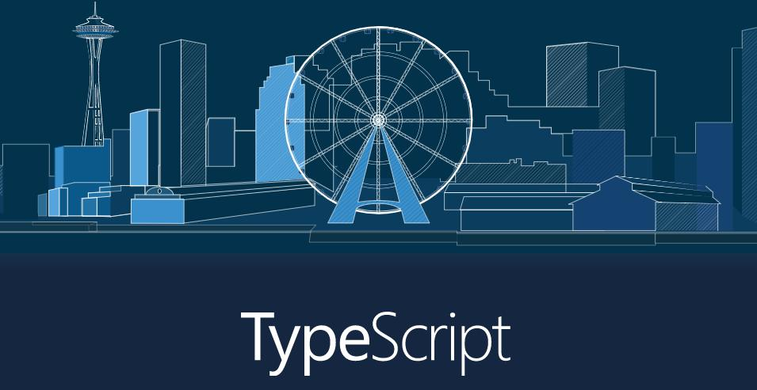

## TypeScript 介绍

TypeScript 是微软开发 JavaScript 的超集，TypeScript 兼容 JavaScript，可以载入 JavaScript 代码然后运行。

## 与 JavaScript 比较

TypeScript 与 JavaScript 相比较进步的地方包括：加入注释，让编译器理解所支持的对象和函数，编译器会移除注释，不会增加开销；增加一个完整的类结构，使之更像是传统的面向对象语言。

## 语法特性

- 类 Classes
- 接口 Interfaces
- 模块 Modules
- ... 等等

## 安装

### npm 安装

```bash
npm install -g typescript
```

### Yarn 安装

```bash
yarn global add typescript
```

执行上面命令会在全局下安装 **tsc** 命令，安装完成就可以在任何地方执行 **tsc** 命令了。

编译一个 typescript 文件：

```bash
tsc hello.ts
```

### ts-node

使用 **tsc** 命令运行 ts 文件需要编译，把 ts 文件转换成 js 文件再运行， 这样很麻烦，可以通过 **ts-node** 这个包来运行 ts 代码，这样就无需编译就可以运行了。
安装 **ts-node**：

#### npm 安装

```bash
npm install -g ts-node
```

#### Yarn 安装

```bash
yarn global add ts-node
```

#### 运行

```bash
ts-node hello.ts
```
