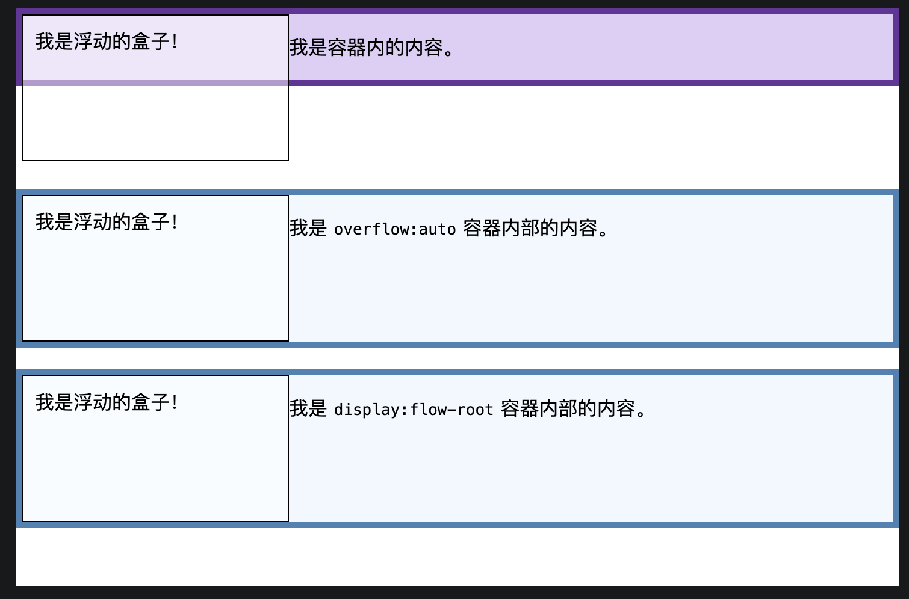
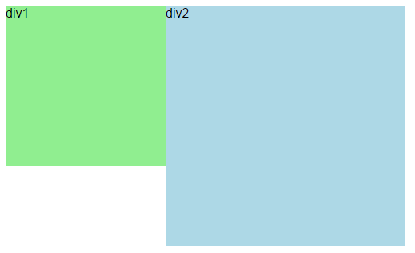

# Css 必知

## 模块化与方法论

### BEM

BEM 命名规范，是块（block）、元素（element）、修饰符（modifier）的缩写，由 Yandex 团队提出的一种前端 CSS 命名方法论。即`block__element--modifier`。当然这个不是必须，需要根据每个团队的风格来决定，如：`block-element-modifier`、`block_element_modifier`等。

- 块（block）：页面中的独立部分，一个块可以包含多个元素，块本身也可以嵌套其他块
- element：块中的组成部分，元素必须依赖于块存在。
- modifier：块或元素的不同状态或样式。
  BEM 命名规范的主要优点是：
- 命名清晰、明确，避免命名冲突和混淆。
- 便于维护和扩展，可以轻松地添加、删除或修改块、元素和修饰符。
- 便于代码复用，可以轻松地重用块、元素和修饰符，减少代码冗余。
- 便于团队协作，可以确保团队成员遵循相同的命名规范，提高代码质量和协作效率。
  BEM 命名规范的主要缺点是：
- 命名较长，可能会导致代码冗余和重复。
- 命名规范可能过于复杂，对于新手来说可能难以理解和使用。

### CSS Modules

CSS Modules 是一种 CSS 模块化解决方案，它允许你将 CSS 文件拆分成多个模块，并在 JavaScript 文件中导入和使用这些模块。CSS Modules 的主要优点是：

- 避免全局命名冲突，每个模块都有自己的作用域，不会与其他模块的样式发生冲突。
- 可以使用 JavaScript 的模块化机制来管理 CSS，例如使用 ES6 的 import 和 export 语法。
- 可以使用 CSS 预处理器（如 Sass、Less 等）来编写 CSS，并使用 JavaScript 的模块化机制来管理预处理器生成的 CSS 文件。

```jsx
import styles from "./App.module.css";

function App() {
  return (
    <div className={styles.App}>
      <h1 className={styles.title}>Hello, CSS Modules!</h1>
    </div>
  );
}

export default App;
```

```css
// App.module.css
.App {
  text-align: center;
}

.title {
  color: red;
}
```

### CSS-in-JS

CSS-in-JS 是一种将 CSS 样式直接嵌入到 JavaScript 代码中的技术，它允许你使用 JavaScript 的模块化机制来管理 CSS。
比较出名的 css-in-js 库有：styled-components、emotion 等。

```jsx
import React from "react";
import styled from "styled-components";

const Title = styled.h1`
  color: red;
  font-size: 24px;
`;

function App() {
  return (
    <div>
      <Title>Hello, CSS-in-JS!</Title>
    </div>
  );
}

export default App;
```

## 重排重绘（回流重绘）

### 重排

DOM 元素的几何属性变化（尺寸、位置、结构），浏览器需重新计算布局并重建渲染树，这个过程称为重排（Reflow）。
如：元素增删、内容变化、尺寸修改、窗口缩放、激活 CSS 伪类（如:hover）

### 重绘

元素可见样式变化（颜色、背景、边框色），但不影响布局，浏览器只需重新绘制外观，这个过程称为重绘（Repaint）。
如：颜色、背景、边框色、透明度、阴影、背景图等属性的修改。

### 重排和重绘的区别

重排和重绘是两个不同的概念，它们之间有明显的区别：

- 重排会导致浏览器重新计算元素的布局和位置，因此会消耗更多的计算资源和时间。
- 重绘只会重新绘制元素的样式，不会影响元素的布局和位置，因此消耗的计算资源较少。
- 重排和重绘都会导致浏览器重新渲染页面，但重排会导致浏览器重新计算元素的布局和位置，而重绘只会重新绘制元素的样式。
- 重排必然触发重绘，重绘不一定触发重排

### 优化策略

1. 批量操作，尽量减少重排和重绘的次数，例如使用`DocumentFragment`或`requestAnimationFrame`来批量处理 DOM 操作。
2. 使用 CSS3 的`transform`和`opacity`等属性由 GPU 处理，不触发重排
3. 避免频繁操作样式，可以将样式集中到一个 class 中，然后通过修改 class 来实现样式的变化。

## BFC

BFC（Block Formatting Context）是页面中一块独立的渲染区域，具有特定的布局规则，内部元素与外部完全隔离。

### BFC 的主要特性

- BFC 内部的元素会按照从上到下的顺序进行排列，不会发生重叠。
- BFC 内部的元素会按照其父元素的宽度进行布局，不会超出父元素的边界。
- BFC 内部的元素不会受到浮动元素的影响，浮动元素会环绕在 BFC 内部的元素周围。

### 触发条件（任一即可）：

- 根元素 `<html>`
- 浮动元素（float 不为 none）
- 绝对/固定定位（position: absolute/fixed）
- display: inline-block / table-cell / flex / grid 等
- overflow 不为 visible（常用 hidden/auto）

### 应用场景

- 清除浮动
  
- 防止 margin 重叠
  
- 实现两栏布局
  

## CSS 变量

CSS 变量（也称为自定义属性）是 CSS 中的一种新的特性，它允许你定义一组可重用的样式值，并在整个 CSS 文件中使用。CSS 变量的主要优点是：

- 可以在全局范围内定义样式值，并在整个 CSS 文件中使用，提高代码的可维护性和可重用性。
- 可以使用 JavaScript 来动态修改 CSS 变量的值，实现样式的动态变化。
- 可以将样式值分组在一起，便于管理和维护。

```css
:root {
  --primary-color: #ff0000;
  --secondary-color: #00ff00;
}

body {
  color: var(--primary-color);
}

h1 {
  color: var(--secondary-color);
}
```

### 作用域

CSS 变量具有作用域的概念，它们的作用域取决于它们定义的位置。在`:root`中定义的变量是全局变量，可以在整个 CSS 文件中使用。在局部作用域中定义的变量只能在局部作用域中使用。

#### 全局作用域

```css
:root {
  --primary-color: #ff0000;
}

body {
  color: var(--primary-color);
}

section {
  --primary-color: #00ff00;
  color: var(--primary-color);
}
```

#### 元素级作用域

```css
/* 定义 */
.card {
  --card-bg: #f0f0f0;
  --card-padding: 16px;
}

/* 使用 */
.card {
  background: var(--card-bg);
  padding: var(--card-padding);
}

.card-header {
  padding: var(--card-padding); /* 可以继承 */
}
```

### css 嵌套语法

css 可以像其`sass`、`less`一样进行嵌套。

```css
.nav {
  --nav-height: 60px;

  display: flex;
  height: var(--nav-height);

  &-item {
    padding: 0 16px;

    &:hover {
      background: rgba(0, 0, 0, 0.1);
    }

    &.active {
      font-weight: bold;
    }
  }

  @media (max-width: 768px) {
    flex-direction: column;
    --nav-height: auto;
  }
}
```

## :has()

`:has()` 是一个 CSS 伪类，用于选择具有特定子元素的元素。它允许你根据元素的子元素来选择父元素，从而实现更灵活的样式选择。

```css
/* 选择具有 <a> 子元素的 <div> 元素 */
div:has(a) {
  background-color: yellow;
}

/* 选择具有 <input> 子元素的 <form> 元素 */
form:has(input) {
  border: 1px solid red;
}
```

## :is()
用于选择一组元素。它允许你根据元素的类型或类名来选择元素。

```css
/* 选择 <h1>、<h2>、<h3>、<h4>、<h5>、<h6> 元素 */
:is(h1, h2, h3, h4, h5, h6) {
  font-weight: bold;
}

/* 选择具有 .active 类的 <button> 元素 */
:is(button.active) {
  background-color: blue;
}
```

## :where()
用于选择一组元素。它允许你根据元素的类型或类名来选择元素。
与`:is()`不同的是，`:where()`的优先级为0，不会影响选择器的优先级。

```css
/* 选择 <h1>、<h2>、<h3>、<h4>、<h5>、<h6> 元素 */
:where(h1, h2, h3, h4, h5, h6) {
  font-weight: bold;
}

/* 选择具有 .active 类的 <button> 元素 */
:where(button.active) {
  background-color: blue;
}
```

## :not()
用于选择不符合指定条件的元素。它允许你根据元素的类型或类名来排除元素。

```css
/* 选择所有不是 <h1> 元素的元素 */
:not(h1) {
  color: red;
}

/* 选择所有不是具有 .active 类的 <button> 元素 */
:not(button.active) {
  background-color: yellow;
}
```

## 媒体查询
媒体查询是一种在 CSS 中根据不同的设备特性（如屏幕宽度、分辨率等）来应用不同的样式的方法。它允许你根据设备的特性来定制页面的布局和样式，从而提高用户体验。

```css
/* 基本语法 */
@media (max-width: 768px) {
  body {
    background-color: lightblue;
  }
}

/* 多个条件 */
@media (min-width: 768px) and (max-width: 1024px) {
  body {
    background-color: lightgreen;
  }
}
```

## 容器查询

`@container` 它让元素可以根据自身所在容器的大小而非整个视口来响应式变化，是真正的组件级响应式设计。

```css
/* 查询名为 card-container 的容器 */
@container card-container (min-width: 300px) {
  .card {
    display: flex;
    flex-direction: row;
  }
}

/* 不指定名称，查询最近的祖先容器 */
@container (min-width: 400px) {
  .card {
    padding: 24px;
  }
}
```