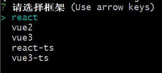
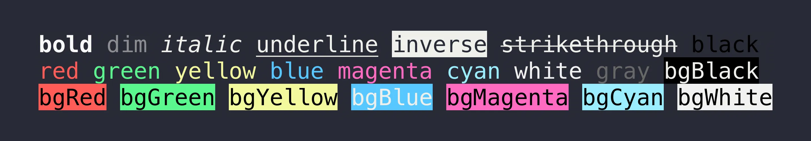

# 脚手架
## 初始化
<font style="background-color:rgb(255,245,235);">window系统推荐用git命令行，有些命令window命令行不支持。</font>

```bash
npm init -y
```

创建目录bin，并且添加index.js。

```javascript
#! /usr/bin/env node
console.log(123);
```

`#! /usr/bin/env node` 的意思是告诉操作系统使用哪个解释器来执行脚本。

## 添加命令
在**package.json**中有一个 **bin**字段，该字段是一个对象，**key **是全局变量名称，**value **是触发全局变量时要执行的文件路径。

```json
{
  "name": "lc-cli",
  "version": "1.0.0",
  "main": "ruels.config.js",
  "bin": {
    "lc-cli": "./bin/cli.js"
  },
  "scripts": {
    "test": "echo \"Error: no test specified\" && exit 1"
  },
  "keywords": [],
  "author": "",
  "license": "ISC",
  "description": ""
}
```

## 指定代码都是 EsModule
需要在package.json中添加一行 `**"type": "module"**`**。**

```json
{
  "name": "lc-cli",
  "version": "1.0.0",
  "main": "ruels.config.js",
  "type": "module",
  "bin": {
    "lc-cli": "./bin/cli.js"
  },
  "scripts": {
    "test": "echo \"Error: no test specified\" && exit 1"
  },
  "keywords": [],
  "author": "",
  "license": "ISC",
  "description": ""
}
```

## Link 到本地
```bash
npm link
```

Npm link 是把当前包链接到本地环境中 npm中。然后就可以执行 lc-cli 的命令了。

```bash
lc-cli
```

此时就会打印123。

## 配置交互命令
使用 `commander`来配置交互命令，比如`--version`，`--help`。或者常用的`create`和`init`。

```bash
npm i commander
```

```javascript
#! /usr/bin/env node

import { Command } from "commander";
import config from "../package.json" assert { type: "json" };

const program = new Command();

// 定义创建命令
program
  .command("create <projectName>") // 创建命令
  .description("create a new project") // 命令描述
  .action((name) => {
    console.log("执行 create 命令", name);
  });

// 定义当前版本
program
  .version(`${config.version}`, "-v, --version")
  // 说明使用方式
  .usage("<command [option]");

// 解析用户执行命令传入的参数
program.parse(process.argv);
```

此时 执行 `lc-cli -v` 或者 `--version` 或输出 1.0.0。

```bash
lc-cli -v
1.0.0
```

 此时执行 `lc-cli create project` 输出结果是 “执行create 命令，project”

```bash
lc-cli create project
执行 create 命令 project
```

## 创建模版命令
使用`inquirer` 在 shell 命令行中提供交互。例如问答，选择等功能。

**inquirer**字段描述：

+ **type**: 问题类型，可以是 **input**（输入框）、**list**（列表选择框）、**confirm**（二选一选择框）等
+ **name**: 问题名称，用于标识答案对象中对应的属性名
+ **message**: 问题描述，将会作为问题提示信息展示给用户
+ **choices**: 选项列表，只有当问题类型为 list 时才需要提供

```bash
npm i inquirer
```

```json
import { Command } from "commander";
import inquirer from "inquirer";
import config from "../package.json" assert { type: "json" };

const program = new Command();

// 定义创建命令
program
.command("create <projectName>") // 创建命令
.description("create a new project") // 命令描述
.action(async (name) => {
  const { framework } = await inquirer.prompt({
  type: "list",
  name: "framework",
  message: "请选择框架",
  choices: ["react", "vue2", "vue3", "react-ts", "vue3-ts"],
});
console.log("选择的框架", framework);
});

// 定义当前版本
program
.version(`${config.version}`, "-v, --version")
// 说明使用方式
.usage("<command [option]");

// 解析用户执行命令传入的参数
program.parse(process.argv);
```

此时执行 `create` 命令可以得到一个选择列表。

<!-- 这是一张图片，ocr 内容为： -->


选择完之后会`console`输出 “选择的框架 react-ts”

## 根据框架选择下载对应的模板
```javascript
// 根据框架选择下载对应的模板
const repo = {
  react: "https://github.com/7mus1c/react-template.git",
  vue2: "https://github.com/7mus1c/vue2-template.git",
  vue3: "https://github.com/7mus1c/vue3-template.git",
  "react-ts": "https://github.com/7mus1c/react-ts-template.git",
  "vue3-ts": "https://github.com/7mus1c/vue3-ts-template.git",
};
```

## 实现下载模板
下载模板就使用 [**<font style="color:rgb(216,57,49);">download-git-rep</font>**](https://link.juejin.cn/?target=https%3A%2F%2Fwww.npmjs.com%2Fpackage%2Fdownload-git-repo), 不过它只支持 github、gitlab、Bitbucket。

```bash
npm i download-git-repo
```

```javascript
import { Command } from "commander";
import inquirer from "inquirer";
import config from "../package.json" assert { type: "json" };
import download from "download-git-repo";

const program = new Command();

// 定义创建命令
program
  .command("create <projectName>") // 创建命令
  .description("create a new project") // 命令描述
  .action(async (name) => {
    // 选择框架
    const { framework } = await inquirer.prompt({
      type: "list",
      name: "framework",
      message: "请选择框架",
      choices: ["react", "vue2", "vue3", "react-ts", "vue3-ts"],
    });

    // 根据框架选择下载对应的模板
    const repo = {
      react: "https://github.com/7mus1c/react-template.git",
      vue2: "https://github.com/7mus1c/vue2-template.git",
      vue3: "https://github.com/7mus1c/vue3-template.git",
      "react-ts": "https://github.com/7mus1c/react-ts-template.git",
      "vue3-ts": "https://github.com/7mus1c/vue3-ts-template.git",
    };

    // 下载项目模板
    download(repo[framework], "目标文件夹", function (err) {
      if (err) {
        console.log("下载失败", err);
      } else {
        console.log("下载成功");
      }
    });

  });

// 定义当前版本
program
  .version(`${config.version}`, "-v, --version")
  // 说明使用方式
  .usage("<command [option]");

// 解析用户执行命令传入的参数
program.parse(process.argv);
```

默认会拉取**master**分支的代码，如果想从其他分支拉取代码，可以在git地址后面添加`#branch`选择分支。

# 配置模板放置路径
通过`process.cwd()`方法来获取用户执行命令行所在的目录位置

```javascript
import { Command } from "commander";
import inquirer from "inquirer";
import config from "../package.json" assert { type: "json" };
import download from "download-git-repo";
import path from "path";

const program = new Command();

// 定义创建命令
program
  .command("create <projectName>") // 创建命令
  .description("create a new project") // 命令描述
  .action(async (name) => {
    // 选择框架
    const { framework } = await inquirer.prompt({
      type: "list",
      name: "framework",
      message: "请选择框架",
      choices: ["react", "vue2", "vue3", "react-ts", "vue3-ts"],
    });

    // 根据框架选择下载对应的模板
    const repo = {
      react: "https://github.com/7mus1c/react-template.git",
      vue2: "https://github.com/7mus1c/vue2-template.git",
      vue3: "https://github.com/7mus1c/vue3-template.git",
      "react-ts": "https://github.com/7mus1c/react-ts-template.git",
      "vue3-ts": "https://github.com/7mus1c/vue3-ts-template.git",
    };

    // 设置模板放置的路径
    const targetPath = path.resolve(process.cwd(), name);

    // 下载项目模板
    download(repo[framework], targetPath, function (err) {
      if (err) {
        console.log("下载失败", err);
      } else {
        console.log("下载成功");
      }
    });
  });

// 定义当前版本
program
  .version(`${config.version}`, "-v, --version")
  // 说明使用方式
  .usage("<command [option]");

// 解析用户执行命令传入的参数
program.parse(process.argv);
```

## 添加下载时的loading
`ora`插件可以实现 loading 效果。

```bash
npm install ora
```

```javascript
import { Command } from "commander";
import inquirer from "inquirer";
import config from "../package.json" assert { type: "json" };
import download from "download-git-repo";
import path from "path";
import ora from "ora";

const program = new Command();

// 定义创建命令
program
  .command("create <projectName>") // 创建命令
  .description("create a new project") // 命令描述
  .action(async (name) => {
    // 选择框架
    const { framework } = await inquirer.prompt({
      type: "list",
      name: "framework",
      message: "请选择框架",
      choices: ["react", "vue2", "vue3", "react-ts", "vue3-ts"],
    });

    // 根据框架选择下载对应的模板
    const repo = {
      react: "https://github.com/7mus1c/react-template.git",
      vue2: "https://github.com/7mus1c/vue2-template.git",
      vue3: "https://github.com/7mus1c/vue3-template.git",
      "react-ts": "https://github.com/7mus1c/react-ts-template.git",
      "vue3-ts": "https://github.com/7mus1c/vue3-ts-template.git",
    };

    // 设置模板放置的路径
    const targetPath = path.resolve(process.cwd(), name);

    // 定义loading
    const loading = ora("正在下载模版...");
    // 开始loading
    loading.start();

    // 下载项目模板
    download(repo[framework], targetPath, function (err) {
      if (err) {
        loading.fail("创建模版失败：" + err.message); // 失败loading
      } else {
        loading.succeed("创建模版成功!"); // 成功loading
      }
    });
  });

// 定义当前版本
program
  .version(`${config.version}`, "-v, --version")
  // 说明使用方式
  .usage("<command [option]");

// 解析用户执行命令传入的参数
program.parse(process.argv);
```

# 定义帮助命令
帮助命令可以使用 chalk 来实现美化颜色。具体值就在图片里。

```bash
npm i chalk
```

<!-- 这是一张图片，ocr 内容为： -->


```javascript
import { Command } from "commander";
import chalk from "chalk";
import inquirer from "inquirer";
import config from "../package.json" assert { type: "json" };
import download from "download-git-repo";
import path from "path";
import ora from "ora";

const program = new Command();

// 定义创建命令
program
  .command("create <projectName>") // 创建命令
  .description("create a new project") // 命令描述
  .action(async (name) => {
    // 选择框架
    const { framework } = await inquirer.prompt({
      type: "list",
      name: "framework",
      message: "请选择框架",
      choices: ["react", "vue2", "vue3", "react-ts", "vue3-ts"],
    });

    // 根据框架选择下载对应的模板
    const repo = {
      react: "https://github.com/7mus1c/react-template.git",
      vue2: "https://github.com/7mus1c/vue2-template.git",
      vue3: "https://github.com/7mus1c/vue3-template.git",
      "react-ts": "https://github.com/7mus1c/react-ts-template.git",
      "vue3-ts": "https://github.com/7mus1c/vue3-ts-template.git",
    };

    // 设置模板放置的路径
    const targetPath = path.resolve(process.cwd(), name);

    // 定义loading
    const loading = ora("正在下载模版...");
    // 开始loading
    loading.start();

    // 下载项目模板
    download(repo[framework], targetPath, function (err) {
      if (err) {
        loading.fail("创建模版失败：" + err.message); // 失败loading
      } else {
        loading.succeed("创建模版成功!"); // 成功loading
      }
    });
  });

// 定义帮助命令
program.on("--help", () => {
  console.log(chalk.green("Commands:"));
  console.log();
  console.log(chalk.green("  $ create <projectName> 创建一个新项目"));
  console.log;
});

// 定义当前版本
program
  .version(`${config.version}`, "-v, --version")
  // 说明使用方式
  .usage("<command [option]");

// 解析用户执行命令传入的参数
program.parse(process.argv);
```

## 高亮模板下载错误信息
```javascript
download(repo[framework], targetPath, function (err) {
  if (err) {
    loading.fail("创建模版失败：" + chalk.red(err.message)); // 失败loading
  } else {
    loading.succeed("创建模版成功!"); // 成功loading
  }
});
```

## 从命令行传入模板参数
`commander` 也支持命令行参数。通过 `.option` 方法来定义。

```javascript
import { Command } from "commander";
import chalk from "chalk";
import inquirer from "inquirer";
import config from "../package.json" assert { type: "json" };
import download from "download-git-repo";
import path from "path";
import ora from "ora";

const program = new Command();

// 定义创建命令
program
  .command("create <projectName>") // 创建命令
  .option("-t, --template <type>", "指定框架模板") // 指定框架
  .description("create a new project") // 命令描述
  .action(async (name, options) => {
    let template = options.template;

    // 如果没有传入模板命令就手动选择框架
    if (!template) {
      const { framework } = await inquirer.prompt({
        type: "list",
        name: "framework",
        message: "请选择框架",
        choices: ["react", "vue2", "vue3", "react-ts", "vue3-ts"],
      });
      template = framework;
    }

    // 根据框架选择下载对应的模板
    const repo = {
      react: "https://github.com/7mus1c/react-template.git",
      vue2: "https://github.com/7mus1c/vue2-template.git",
      vue3: "https://github.com/7mus1c/vue3-template.git",
      "react-ts": "https://github.com/7mus1c/react-ts-template.git",
      "vue3-ts": "https://github.com/7mus1c/vue3-ts-template.git",
    };

    // 设置模板放置的路径
    const targetPath = path.resolve(process.cwd(), name);

    // 定义loading
    const loading = ora("正在下载模版...");
    // 开始loading
    loading.start();
    console.log(repo[template]);

    // 下载项目模板
    download(repo[template], targetPath, function (err) {
      if (err) {
        loading.fail("创建模版失败：" + chalk.red(err.message)); // 失败loading
      } else {
        loading.succeed("创建模版成功!"); // 成功loading
      }
    });
  });
// 定义帮助命令
program.on("--help", () => {
  console.log(chalk.green("Commands:"));
  console.log();
  console.log(chalk.green("  $ create <projectName> 创建一个新项目"));
  console.log;
});

// 定义当前版本
program
  .version(`${config.version}`, "-v, --version")
  // 说明使用方式
  .usage("<command [option]");

// 解析用户执行命令传入的参数
program.parse(process.argv);
```

此时就可以使用

```bash
lc-cli create project -t react
# 或者
lc-cli create project --template react
```

## 覆盖原文件
如果创建的项目名称存在，应该提示是否覆盖原文件。为了删除原文件方便，使用 `fs-extra`。

使用`inquirer` 来进行询问时候原文件。

```bash
npm i fs-extra
```

```javascript
const fs = require('fs-extra') // 引入fs-extra

// ... 省略其他代码

// 设置模板放置的路径
const targetPath = path.resolve(process.cwd(), name);

// 判断当前路径下是否已经存在同名文件夹
if (fs.existsSync(targetPath)) {
  // 如果存在同名文件夹，则询问用户是否继续
  const { isContinue } = await inquirer.prompt({
    type: "confirm",
    name: "isContinue",
    message: "当前路径下已经存在同名文件夹，是否继续？",
  });

  // 如果用户选择继续，则删除同名文件夹, 否则退出程序
  isContinue ? fs.removeSync(targetPath) : process.exit(1);
}
```

## 添加模板创建后引导操作
```javascript
// 下载项目模板
download(repo[template], targetPath, function (err) {
  if (err) {
    loading.fail("创建模版失败：" + chalk.red(err.message)); // 失败loading
  } else {
    loading.succeed("创建模版成功!"); // 成功loading
    console.log(chalk.blue(`\n cd ${name}`));
    console.log();
    console.log(chalk.blue("\n npm i"));
    console.log(chalk.blue("\n npm start"));
  }
});
```

## 通过接口获取模板地址
可以通过 GitHub 提供的 api：https://api.github.com/users/${username}/repos 获取github上存储的所有仓库。

新建 lib/api.js 来定义获取接口的方法。

```javascript
import https from "https";

export const getTemplateUrl = async (username) => {
  return new Promise((resolve, reject) => {
    https
      .get(
        `https://api.github.com/users/${username}/repos`,
        {
          headers: {
            "User-Agent": username,
          },
        },
        (res) => {
          let data = "";
          res.on("data", (chunk) => {
            data += chunk;
          });
          res.on("end", () => {
            const list = JSON.parse(data);
            resolve(
              list.map((item) => {
                return {
                  name: item.name,
                  value: `https://github.com:${username}/${item.name}`,
                };
              })
            );
          });
        }
      )
      .on("error", (err) => {
        reject(err);
      });
  });
};
```

```javascript
import { Command } from "commander";
import chalk from "chalk";
import inquirer from "inquirer";
import config from "../package.json" assert { type: "json" };
import download from "download-git-repo";
import path from "path";
import ora from "ora";
import fs from "fs-extra";
import { getTemplateUrl } from "../lib/api.js";

const program = new Command();

// 定义创建命令
program
  .command("create <projectName>") // 创建命令
  .option("-t, --template <type>", "指定框架") // 指定框架
  .description("create a new project") // 命令描述
  .action(async (name, options) => {
    let template = options.template;

    // 设置模板放置的路径
    const targetPath = path.resolve(process.cwd(), name);

    // 判断当前路径下是否已经存在同名文件夹
    if (fs.existsSync(targetPath)) {
      // 如果存在同名文件夹，则询问用户是否继续
      const { isContinue } = await inquirer.prompt({
        type: "confirm",
        name: "isContinue",
        message: "当前路径下已经存在同名文件夹，是否继续？",
      });

      // 如果用户选择继续，则删除同名文件夹, 否则退出程序
      isContinue ? fs.removeSync(targetPath) : process.exit(1);
    }

    // 动态获取模板地址
    const repo = await getTemplateUrl("7mus1c");

    // 如果没有传入模板命令就手动选择框架
    if (!template) {
      const { framework } = await inquirer.prompt({
        type: "list",
        name: "framework",
        message: "请选择框架",
        choices: repo,
      });
      template = framework;
    }

    // 定义loading
    const loading = ora("正在下载模版...");
    // 开始loading
    loading.start();

    // 下载项目模板
    download(template, targetPath, function (err) {
      if (err) {
        loading.fail("创建模版失败：" + chalk.red(err.message)); // 失败loading
      } else {
        loading.succeed("创建模版成功!"); // 成功loading
        console.log(chalk.blue(`\n cd ${name}`));
        console.log();
        console.log(chalk.blue("\n npm i"));
        console.log(chalk.blue("\n npm start"));
      }
    });
  });

// 定义帮助命令
program.on("--help", () => {
  console.log(chalk.green("Commands:"));
  console.log();
  console.log(chalk.green("  $ create <projectName> 创建一个新项目"));
  console.log;
});

// 定义当前版本
program
  .version(`${config.version}`, "-v, --version")
  // 说明使用方式
  .usage("<command [option]");

// 解析用户执行命令传入的参数
program.parse(process.argv);
```

到这里，一个基础功能完整的**cli****脚手架**就开发好了，可以发布到**公共****npm**或公司自己**npm私有库**上面进行使用了。

## 发布到npm
创建 README.md

```markdown
# 安装

## 全局安装

$ npm install -g lc-cli

# or yarn

$ yarn global add lc-cli

## 借助 npx

创建模版
$ npx create lc-cli <projectName> [-t | --template]
示例
$ npx create lc-cli hello-cli -template react-ts-template

## 使用

创建模版
$ lc-cli create <projectName> [-t | --template]
示例
$ lc-cli create hello-cli -t react-ts-template
```

## 登录
```bash
npm login
```

## 检查
发布之前先在 npmjs 上检查一下 lc-cli 存在不存在 如果存在就需要换一个名字了。

目前检查完是存在的 所以需要把 lc-cli 全局更换成 lic-cli。

## 发布
```bash
npm publish
```

