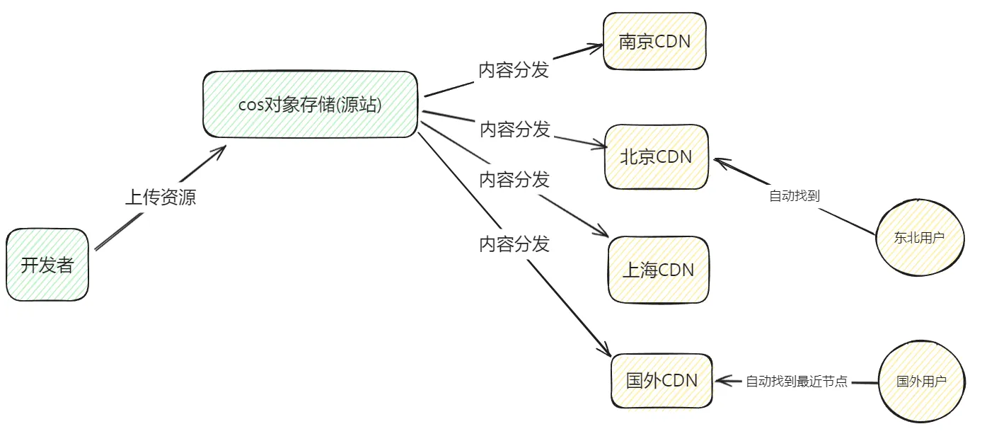
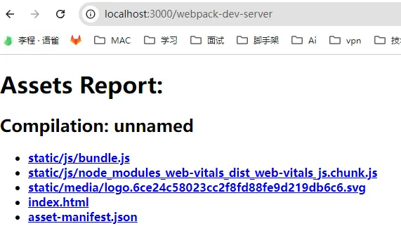
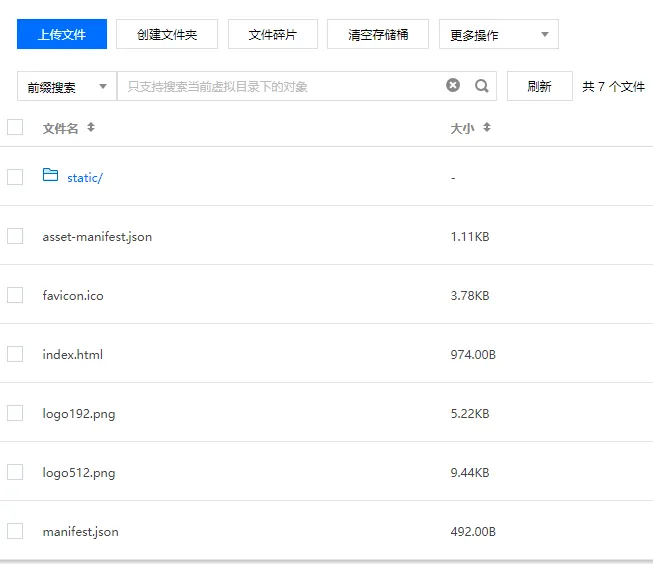
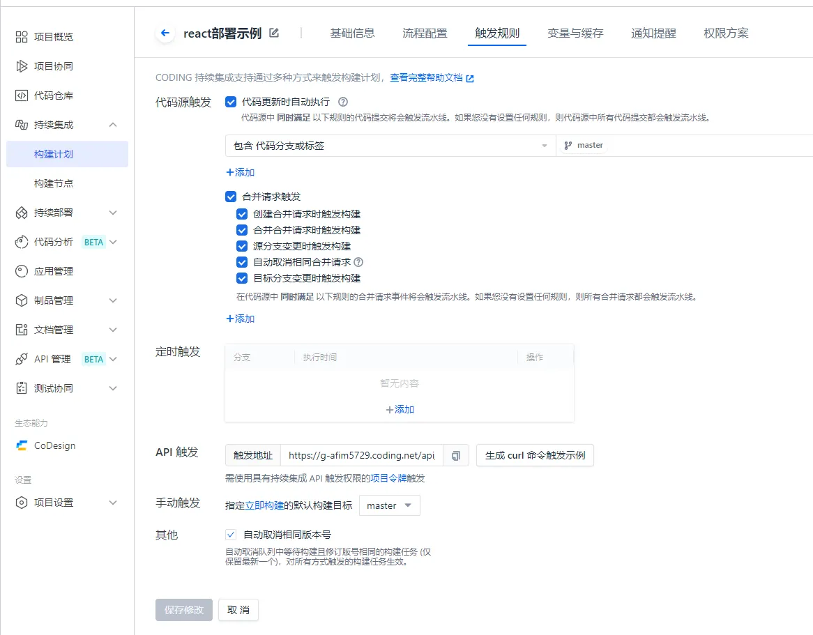
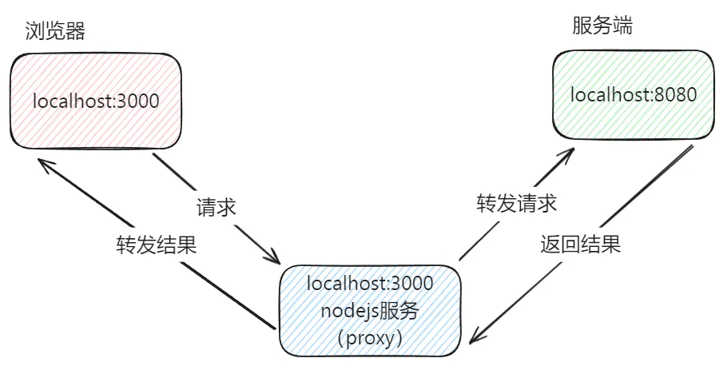
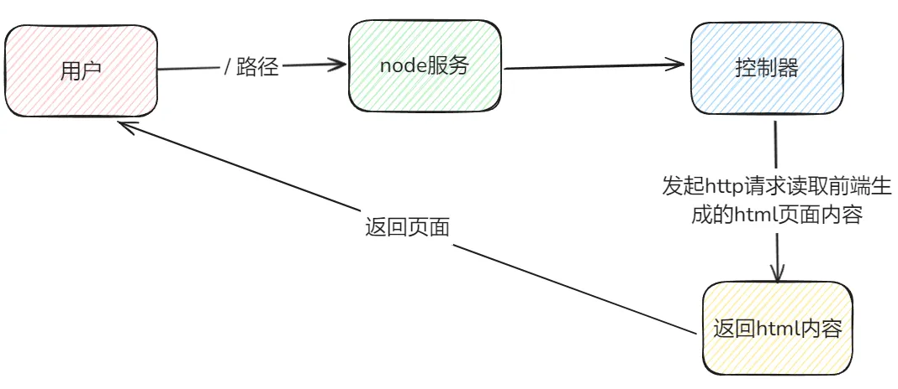

# 项目部署和 CI/CD
## 前端部署到底部署什么？
对于前端而言部署的就是打包出来的静态资源。

因为 build 之后的所有文件都属于静态资源。

对于 node 项目而言，部署的是可执行代码，是服务。

Node 的服务代码可打包可不打包，前提是 node 得认识代码，比如 ts 就需要先编译再部署。

## 静态资源部署在哪里？(前端项目)
通常静态资源是需要部署在云服务，俗称“云上”。

通常是阿里云、腾讯云等。

静态资源推荐是腾讯云，便宜。

## Nodejs 部署在哪里？
nodejst服务通常有人在面试中讲PM2进行部署，实际上真实项目中已经很少用PM2了。

现在大部分企业也是选择了“上云”，花钱解决问题，按量计费。成本低性能好。

PM2已经是过去式了，一般PM2的方案是在自建机房中部署会用到，成本极其高，不好扩展。

Node服务更推荐使用阿里云，更专业，文档详细，坑少。

## 部署之后如何访问？
一般项目都在本地开发，于是 localhost:8080 访问前端页面，或者调试 Nodejs 的接口。

但是项目需要发布上线，是需要部署在域名下的。

比如通过 https://www.baidu.com 进行访问。

因为想要玩好自动化部署，前提需要把主流云提供的产品玩会。

## 腾讯云cos对象存储服务
COS 是一种存储海量文件的分布式存储服务。它具有高扩展性、低成本、可靠安全等优点。

说白了对象存储就是私人网盘，上传静态资源，就可以生成一个链接直接下载或查看。

例如：https://lc-react-web-static-1302623844.cos.ap-beijing.myqcloud.com/2.png

建议选择公有读，私有写。

## 什么是 CDN？
CND（内容分发网络）它是一种用于加速内容分发的网络服务。它通过将内容分发到遍布全球的边缘节点服务器上，是用户可以就近访问内容，提高访问速度和用户体验。

大白话：CND也是一种网盘。

## CDN 和 COS对象存储(源站)的关系？
把资源直接放在源站有两个问题：

1. 偏远地区用户访问很慢，新疆访问南京很慢
2. 当用户量很大的时候，服务器可能顶不住

它们之间的关系：

<!-- 这是一张图片，ocr 内容为： -->


## 为什么访问http://localhost:3000/可以显示页面
<!-- 这是一张图片，ocr 内容为： -->


webpack内部启动了一个静态资源服务。

html想要发布到线上，实际上只需要一个服务，能够访问我们的文件就可以实现前端项目的部署。

## 生成文件
直接打包的 dist 目录 html 是跑不起来的，因为路径是绝对路径，html访问不到资源。

通过 publicpath改成 ./ 或者 源站地址 https://lc-react-web-static-1302623844.cos.ap-beijing.myqcloud.com

改成 ./ 就可以本地访问静态资源，改成源站地址就可以远程访问。

```plain
"scripts": {
    "start": "react-scripts start",
    "build": "cross-env PUBLIC_URL=./ react-scripts build",
    "test": "react-scripts test",
    "eject": "react-scripts eject"
  },
```

## 纯前端手动部署远程访问
把打包好的 dist 目录上传到存储桶中，就可以同意远程访问。

<!-- 这是一张图片，ocr 内容为： -->


## 自动化静态资源部署
手动步骤

1. npm run build 
2. 生成 build 文件夹
3. 把文件上传到腾讯云的 cos 对象存储目录
4. 访问 html

自动

1. 触发自动
    1. 代码提交到仓库触发
    2. 点击某个按钮
2. 自动上述 1 2 3流程
3. 访问

### 步骤
1. 首先在 https://coding.net/ 创建项目，
2. 然后创建 git 仓库
3. 再创建构建计划
4. 配置触发规则

<!-- 这是一张图片，ocr 内容为： -->


1. 然后设置变量与缓存

<!-- 这是一张图片，ocr 内容为： -->


修改流水线配置之后，不要点重启构建，要点立即构建，否则流水线配置走的是之前的老配置

## 前端代理本地解决跨域
<!-- 这是一张图片，ocr 内容为： -->


## 对象存储没有webpack环境，所以无法代理
直接把 html 放在 node 服务器，放在8080端口，直接就可以访问了。

真实的项目部署中，前端的 html 一定要放在后端提供的静态资源目录中，要保证和服务端域名符合同源策略。

## 部署Node项目
使用阿里云的函数计算FC （serverless）。

1. 先进函数 FC 控制台
2. 创建 nest 应用
3. 关联代码仓库 

## 解决手动获取 html
1. 写一个脚本获取前端流水线生产的 html 插入到 public 中
2. 在 node 接口的控制器中`“路径 / ”`返回前端生成的 html

<!-- 这是一张图片，ocr 内容为： -->


### 控制器发起请求
1. 下载 node 发起 http 请求的库 superagent

```bash
npm i superagent
```

1. 编写代码

```js
import { Controller, Get } from '@nestjs/common';
import { AppService } from './app.service';
const superagent = require('superagent');

@Controller('/')
export class HtmlController {
  constructor(private readonly appService: AppService) {}

  @Get()
  getHtml() {
    const res = await superagent.get('https://lc-react-web-static-1302623844.cos.ap-beijing.myqcloud.com/index.html');
    return res.text;
  }
}
```

### 通过脚本获取html
1. 在 node 项目中创建脚本

```js
// createHtml.js
const superagent = require('superagent');
const path = require('path');
const fs = require('fs');

const viewPath = path.join(__dirname, './public/index.html');

async function createHtml() {
  const res = await superagent.get('https://lc-react-web-static-1302623844.cos.ap-beijing.myqcloud.com/index.html');
  const text = res.text;
  
  fs.writeFileSync(viewPath, text);
}

createHtml();
```

1. 修改 package.json

```json
"scripts": {
  "build": "node ./createHtml.js && nest build"
}
```

在 node 项目中有一个阿里云提供的脚本文件 build.sh 会执行 build 命令，所以可以修改build命令让多执行一个脚本。

注意：在 node 中，`fs.writeFileSync`写入文件，如果文件不存在会创建文件。但是阿里云FC `fs.writeFileSync`可能创建文件是有问题的(报错并且不创建文件)，所以如果遇到问题，那么就创建一个空 html。

### 两种方案对比
脚本：在构建过程中拉取 html 下载到 public 目录，每次前端更新，后端即使没有改代码，也要触发一次后台触发流水线。

控制器：在 nodejs 路由中，当用户访问时，每次都要去动态拉取 html 的内容。

**推荐选择控制器：**

1. **开发方便**
2. **性能影响并没有那么大**

什么时候选择脚本？

1. 项目对网络加载速度要求极高
2. 开发不怕麻烦

## 域名绑定
1. 进入阿里云，域名管理。
2. 添加域名
3. 路由配置： 
    1. 设置路径 /* 
    2. 选择服务器名称: aliyun-nest-be 
    3. 选择函数名称: aliyun-nest-be 
    4. 选择版本别名
4. 点击创建

