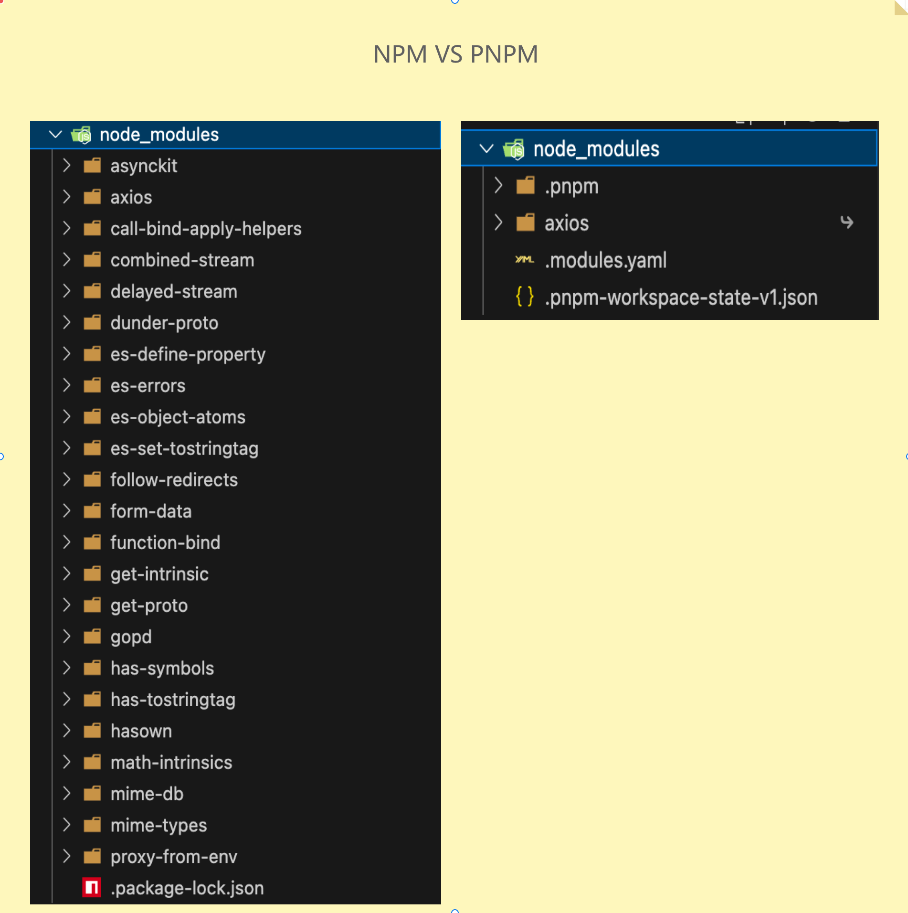

# PNPM

pnpm 是一个包管理工具，就像 npm 和 yarn 一样，但它的设计目标是更高效地管理项目依赖。

[【中文官网】](https://pnpm.io/zh/)

## 解决的问题

### 节省磁盘空间

pnpm 通过硬链接和符号链接的方式，将相同的依赖包存储在全局 store 中，避免了重复安装。


```bash
# 传统情况：每个项目都复制一份依赖
project-A/node_modules (200MB)
project-B/node_modules (200MB)  # 大量重复文件

# PNPM：全局存储 + 硬链接
project-A/node_modules (硬链接)
project-B/node_modules (硬链接)
└── 指向全局 store (同一份文件)
```

### 依赖关系混乱

依赖关系混乱是 npm3 和 yarn 的一大问题。pnpm 通过硬链接和符号链接的方式，确保了依赖关系的清晰和一致性。
假设项目 A 的 package.json 声明依赖 lodash@4.17.0，而 lodash 自身依赖 underscore@1.10.0。按照理想的依赖关系，目录结构应是嵌套的：

```bash
node_modules/
└── lodash/          # 项目直接依赖
    ├── node_modules/
    │   └── underscore/  # lodash 的间接依赖
    └── package.json
```

但传统包管理器（如 npm v3+ 和 yarn）为了避免嵌套过深（早期 Windows 系统对路径长度有限制），会将间接依赖「提升」到顶层 node_modules：

```bash
node_modules/
├── lodash/          # 直接依赖（保留）
└── underscore/      # 间接依赖被提升到顶层
```

此时项目的依赖树与 package.json 中声明的依赖关系不符，导致依赖关系混乱。并且会造成两个问题：

1. 幽灵依赖：由于间接依赖被提升到顶层，项目中未在 package.json 中声明的依赖，可能被意外引用。
2. 依赖冲突：若项目依赖 package-a@1.0.0（其依赖 lodash@4.0.0）和 package-b@1.0.0（其依赖 lodash@3.0.0），传统包管理器会：
   - 将其中一个版本的 lodash 提升到顶层，另一个版本嵌套在对应包的 node_modules 中。
   - 此时，项目中直接引用 lodash 会指向顶层版本（可能与预期不符），导致版本冲突难以排查。

就拿 `axios` 举例，npm 和 pnpm 的依赖树如下：


#### 幽灵依赖

```js
import _ from "underscore";
```

项目并没有声明依赖 `underscore`，但项目中却引用了 `underscore`，并且还不报错，这就是幽灵依赖。

#### 依赖冲突

```bash
# package.json
{
  "dependencies": {
    "package-a": "^1.0.0",
    "package-b": "^1.0.0"
  }
}

# 当 package-a 依赖 lodash@4.0.0，package-b 依赖 lodash@3.0.0 时：
# node_modules
├── lodash@4.0.0
├── package-a@1.0.0
├── package-b@1.0.0
├── lodash@3.0.0
└── package-a/node_modules/lodash@4.0.0 ← A 的版本
```

结果就是，项目中引用 lodash 时，会优先使用 node_modules 顶层的 lodash@3.0.0，而不是 A 依赖的 lodash@4.0.0，导致版本冲突。

#### pnpm 解决方法

pnpm 通过硬链接和符号链接的方式，确保了依赖关系的清晰和一致性。在 pnpm 中，依赖关系会按照 package.json 中声明的顺序进行解析，并按照嵌套结构进行存储，从而避免了依赖关系混乱的问题。

```bash
# PNPM 解决方案：
node_modules/
├── .pnpm/ #← pnpm 的内部存储区，硬链接自全局仓库
│   ├── lodash@4.17.21/
│   │   └── node_modules/lodash
│   ├── lodash@3.10.1/
│   │   └── node_modules/lodash
│   ├── package-a@1.0.0/
│   │   └── node_modules/
│   │       ├── package-a -> ../../package-a@1.0.0 # 符号链接
│   │       └── lodash -> ../../lodash@4.17.21/node_modules/lodash # 符号链接
│   └── package-b@1.0.0/
│       └── node_modules/
│           ├── package-b -> ../../package-b@1.0.0 # 符号链接
│           └── lodash -> ../../lodash@3.10.1/node_modules/lodash # 符号链接
├── package-a -> .pnpm/package-a@1.0.0/node_modules/package-a # 符号链接
└── package-b -> .pnpm/package-b@1.0.0/node_modules/package-b # 符号链接
```

#### 核心机制

- 所有包都存储在 .pnpm 目录下
- 使用符号链接（symlinks）连接到项目
- 每个包只能访问自己明确声明的依赖
- 依赖关系清晰，没有幽灵依赖和版本冲突

### 提高安装速度

传统的安装过程：

1. 读取 package.json
2. 解析依赖树（递归查询 registry）
3. 生成 package-lock.json
4. 下载所有 tarball 
5. 解压并构建 node_modules 
   

pnpm 的安装过程：

1. 读取 package.json 和 pnpm-lock.yaml 
2. 检查全局存储（跳过已存在的包）
3. 并行下载缺失的包
4. 创建硬链接到 node_modules
   


## 使用方法

### 安装
```bash
npm install -g pnpm
```

### 初始化

```bash
pnpm init
```

### 安装所有依赖

```bash
pnpm install
```

### 添加依赖

```bash
pnpm add
```

### 更新依赖

```bash
pnpm update
```

### 删除依赖

```bash
pnpm remove  # 别名 rm
```

### 运行脚本

```bash
pnpm run
```

### 其他命令

```bash
pnpm list # 查看已安装的包
pnpm outdated # 查看可更新的包
```