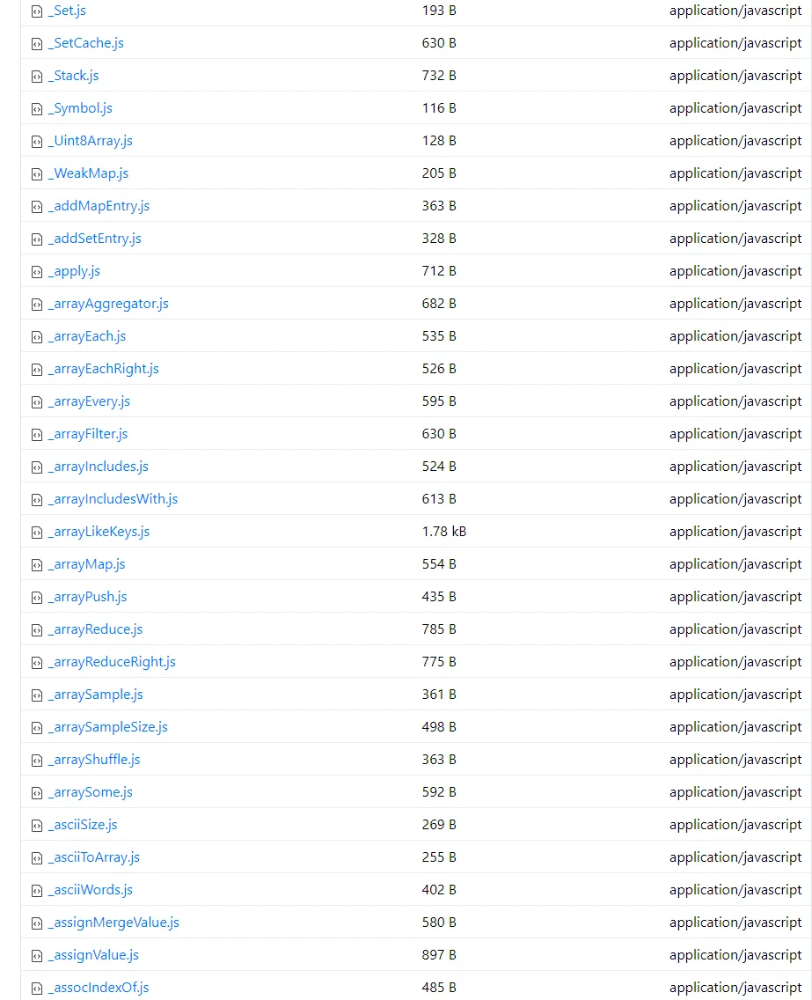
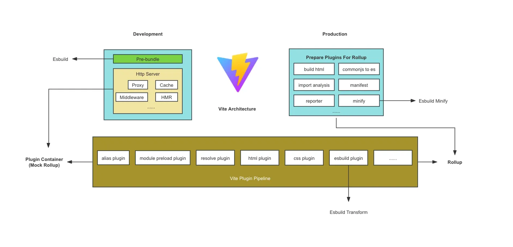

# Vite
## 创建项目
```bash
npm create vite@latest
```

## 插件
```javascript
// vite.config.jsimport 
vue from '@vitejs/plugin-vue'

export default {
  plugins: [vue()],
}
```

## 类型引入
```typescript
/// <reference types="vite/client" />
```

Vite 内部定义的一些全局的类型定义， 比如对 css、图片等资源的处理

## Scss 和 Less
Vite 默认支持了 scss 和 less。直接下载就可以使用

```bash
# .scss and .sass
npm add -D sass

# .less
npm add -D less

# .styl and .stylus
npm add -D stylus
```

## postcss 插件
Vite 原生就自带 postcss

所以只需要配置插件就行

```javascript
import { defineConfig } from 'vite';
import vue from '@vitejs/plugin-vue';
import postCssPxToRem from 'postcss-pxtorem';

export default defineConfig({
  plugins: [vue()],
  css: {
    postcss: {
      plugins: [
        postCssPxToRem({
          rootValue: 75, // 75 表示 750 设计稿，37.5 表示 375 设计稿
          propList: '*', // 需要转换的属性，这里选择全部都进行转换
          selectorBlackList: ['.van'] // 过滤掉以.van 开头的 class，不进行 rem 转换
        })
      ]
    }
  }
});
```

## lightningcss
它是新一代css编译工具，基于 rust。

https://lightningcss.dev/

## 静态资源处理
它会把静态资源自动处理成路径，vite会自动处理。

```javascript
import imgUrl from './img.png'
```

`imgUrl` 在开发时会是 `/img.png`，在生产构建后会是 `/assets/img.2d8efhg.png`

Css 中的图片地址也是如此。

## 设置别名
```javascript
import { defineConfig } from 'vite';
import vue from '@vitejs/plugin-vue';
import { resolve } from 'path';

// https://vitejs.dev/config/
export default defineConfig({
  plugins: [vue()],
  resolve: {
    alias: {
      '@': resolve(__dirname, './src')
    }
  }
});
```

## 依赖预构建
vite 默认会对第三方依赖包做预构建。

### 目的
目的是为了兼容 commonjs 和 umd， 合并多个请求为一个，提升网络性能。

1. 兼容性：它在开发阶段将所有代码视为 ESM，所以会将 commonjs 和 umd 依赖通过 ESbuild 转换为 ESM。
2. 性能：通过预构建将多个内部模块的 ESM 依赖关系合并成一个，从而减少网络请求，提高页面加载速度。

### 构建之前
当使用代码 `import { debounce } from 'lodash-es'`时，这些包都会通过http请求加载，浏览器同时发出 600 多个 HTTP 请求。

<!-- 这是一张图片，ocr 内容为： -->


### 构建之后
他们会合并成一个 lodash-es.js 文件。 

## 双引擎架构
开发环境：使用 ESbuild，速度很快。。

生产环境：使用 rollup 打包。

[Vite: 双构建引擎 - Esbuild和Rollup_vite的esbuild和rollup-CSDN博客](https://blog.csdn.net/Tyro_java/article/details/139998177)

### 架构图
<!-- 这是一张图片，ocr 内容为： -->


### Esbuild
Esbuild 在提供了预构建的功能，因为速度很快。

但是也有一些缺点，例如：

1. 不支持es5，无法兼容低版本浏览器。
2. 他对代码拆分支持有限，不支持自定义分包策略。
3. 对一些特殊的语法不支持。

#### 不参与类型检查
Vite 只会对 .ts 文件进行转议，但是不进行类型检查。因为这跟 vite 的思想违背，类型检查是需要全量的（了解整个模块图），并非单个文件，而 vite 是在每个文件的基础上进行转议，与 vite 的思想一致，如果进行类型检查就损耗了 vite 的性能。

#### 参与压缩
由于 esbuild 的性能非常的快，所以 vite 在压缩 js 和 css 代码时，使用它进行了压缩。最要是 esbuild 本身是 golang写的，可以并行处理，并且 AST 共享。webpack 的 babel 与 terser 的 AST 不共享， 需要多次解析。

### rollup
rollup打包有两个优秀的方面：

1. Css 代码分割。某个异步模块引入了一些 css 代码，vite 会自动抽离 css 成单独文件，提高缓存复用率。
2. 自动预加载。vite 会自动为入口的 Chunk 的依赖生成预加载标签 `<link rel="modulepreload" href="/assts/vendor.293dca09.js">`

## 打包
### Vue-tsc
主要作用是用来做 ts 类型检测。因为在开发环境 vite 不会对类型进行检查，所以要在开发环境进行检查。

### 分包
Vite 可以把第三方包打成一个 vendor。

```javascript
import { defineConfig } from 'vite';

export default defineConfig({
  build: {
    rollupOptions: {
      output: {
        manualChunks: (id) => {
          // 所有文件的绝对路径中包含 'node_modules' 的，单独打包成 'vendor' 包
          if (id.includes('node_modules')) { 
            return'vendor'; 
          }
        }
      }
    }
  }
});
```

也可以提取打出来多个包

```javascript
manualChunks: {
  'react-vendor': ['react','react-dom'], 
    'lodash': ['lodash-es'], 
    'library': ['antd', '@arco-design/web-react']
}
```

### Css 提取
Vite 在开发环境 css 会被 js 变成 style 标签插入到页面中。相当于 style-loader。

生产环境会把 css 提取出来成 css 独立的文件。

1. 把css打进js，就是会太大
2. 因为独立的 css 文件不会影响页面的阻塞。
3. 可以利用缓存优化，hash 没有变化就不需要重新加载。

### 入口文件
Vite 的入口文件依赖于 index.html 里面的 `<script>`。一个 script 是单入口，两个就是多入口。

```html
<!doctype html>
<html lang="en">
  <head>
    <meta charset="UTF-8" />
    <link rel="icon" type="image/svg+xml" href="/vite.svg" />
    <meta name="viewport" content="width=device-width, initial-scale=1.0" />
    <title>Vite + Vue</title>
  </head>
  <body>
    <div id="app"></div>
    <script type="module" src="/src/main.js"></script>
  </body>
</html>
```

### Tree shaking（树摇）
Vite 会在打包时自动 tree shaking。删除无用的代码。

### 输出设置
```javascript
build: {
  target: 'modules', // 浏览器兼容目标
    outDir: 'dist', // 打包出来的文件夹名字
    assetsDir: 'assets', // 静态资源文件夹
    assetsInlineLimit: 4096, // 小于4k的静态资源将被转换为base64
    sourcemap: true, // 是否生成sourcemap文件
    cssCodeSplit: true // css代码拆分,false后所有css会提取成一个css文件
}
```

### 低版本浏览器兼容
#### babel插件
编译时：@babel/preset-env 和 @babel/plugin-transform-runtime

运行时：core-js 和 regenerator-runtime

Core-js 里面有成千上万种高版本的 js 方法。

#### babel的一些配置
```json
{
  "preset":[
    "@babel/preset-env",
    {
      // 指定兼容的浏览器版本
      "targets": {
        "ie": 11
      },
      // 基础库 core-js 的版本
      "corejs": 3,
      // polyfill 注入策略， useage 按需注入 entry 全量注入
      "useBuiltIns": "useage",
      // 不将 es 模块语法转换为其他模块语法
      "module": false
    }
  ]
}
```

#### 一些常用的 target 的配置
https://zhuanlan.zhihu.com/p/618578523

1. 现代浏览器： 

Last 2 versions and since 2018 and > 0.5%

1. 兼容低版本 pc 浏览器

  IE >= 11, > 0.5%, not dead

2. 兼容低版本移动端浏览器

  ios >= 9, android >= 4.4 last 2 versions, > 0.2%, not dead

#### Preset-env的局限性
1. 如果使用新特性，往往是通过基础库 core-js 往全局环境添加 polyfill，如果是开发没问题，如果是开发第三方的库，那可能会造成**全局空间污染。**
2. 很多函数实现的代码，会在很多文件中重复出现，造成**文件体积冗余。**

比如说引入了 lodash 它也用了 core-js，那么会重复且有可能会有冲突。

#### Transform-runtime
它的出现就是解决 @babel/preset-env 的种种局限性。

安装

```bash
npm i @babel/runtime-corejs3 -D
npm i @babel/plugin-transform-runtime -D
```

配置

```json
{ 
  "plugin": [
    // 添加 transform-runtime
    "@babel/plugin-transform-runtime",
    {
      "corejs": 3
    }
  ],
  "preset":[
    "@babel/preset-env",
    {
      // 指定兼容的浏览器版本
      "targets": {
        "ie": 11
      },
      // 基础库 core-js 的版本
      "corejs": 3,
      // 关闭 @babel/preset-env 默认的 polyfill 注入
      "useBuiltIns": false,
      // 不将 es 模块语法转换为其他模块语法
      "module": false
    }
  ]
}
```

#### vitejs/plugin-legacy 兼容
vite在打包中，没有对 es6 的代码进行任何的降级处理。但是提供了一个插件 @vitejs/plugin-legacy。

```javascript
// vite.config.js
import legacy from '@vitejs/plugin-legacy'

export default {
  plugins: [
    legacy({
      targets: ['defaults', 'not IE 11'],
    }),
  ],
}
```

Defaults是：`[<u>last 2 versions and not dead, > 0.3%, Firefox ESR</u>](https://browsersl.ist/#q=last+2+versions+and+not+dead%2C+%3E+0.3%25%2C+Firefox+ESR)`

所以它的 targets 就是跟 babel 的是一样的。 

他打包出来的的代码分为两种：

1.  一种是 type=module 
2. 还有一种 nomodule（会提前注入 polyfill.js ）

如果是现在浏览器就会走 type=module 的代码

如果是老版本浏览器 就走 nomodule的代码

Nomodule 的代码会先加载 polyfill， 然后再加载正式的代码。

