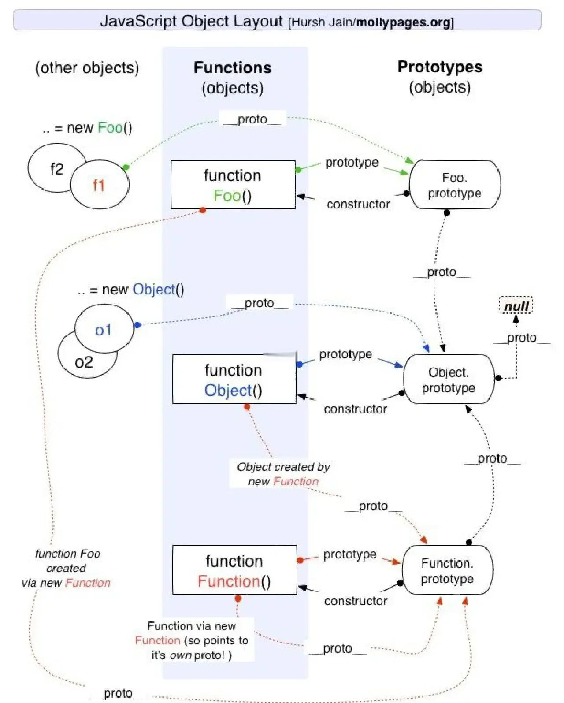

# JavaScript 必知概念

## 变量与数据类型

过于基础都不提了。

### 变量提升

```js
console.log(a); // undefined
var a = 1;
```

因为变量提升，变量声明会被提升到作用域的顶部，但赋值不会被提升。

### 块级作用域

```js
if (true) {
  var a = 1;
  let b = 2;
  const c = 3;
}
console.log(a); // 1
console.log(b); // ReferenceError: b is not defined
console.log(c); // ReferenceError: c is not defined
```

因为`let`和`const`是块级作用域，而`var`是函数作用域。var 会有变量提升，而 let 和 const 没有。只在它当前的代码块中有效。

### 暂时性死区

```js
if (true) {
  console.log(a); // ReferenceError: a is not defined
  let a = 1;
}
```

在块级作用域中，变量在声明之前都是不可用的，称为“暂时性死区”。

### 重复声明

```js
var a = 1;
var a = 2;
console.log(a); // 2

let b = 1;
let b = 2; // SyntaxError: Identifier 'b' has already been declared
```

`let`和`const`不允许在同一个作用域内，重复声明同一个变量。

### 数据类型

- 基本类型：`number`、`string`、`boolean`、`null`、`undefined`、`symbol`、`bigint`
- 引用类型：`object`、`array`、`function`

### 类型判断

- `typeof`：基本类型和函数，`typeof null`是`object`
- `instanceof`：判断一个实例是否属于某个构造函数
- `Object.prototype.toString.call()`：判断一个实例的类型，返回`[object Type]`
- `Array.isArray()`：判断一个实例是否是数组
- `constructor`：判断一个实例的构造函数
- `Object.prototype.isPrototypeOf()`：判断一个实例的原型链上是否有某个原型
- `__proto__`：判断一个实例的原型链上是否有某个原型

## 流程控制

### 条件语句

- `if`：条件判断
- `switch`：多条件判断

### 循环语句

- `for`：循环
- `while`：循环
- `do...while`：循环
- `for...in`：遍历对象的可枚举属性
- `for...of`：遍历可迭代对象
- `forEach`：遍历数组

### 循环控制

- `break`：跳出循环, `for／for-in／for-of／while／do-while / switch`
- `continue`：跳过当前循环，进入下一次循环 `or／for-in／for-of／while／do-while`

## 函数

### 函数声明

```js
function add(a, b) {
  return a + b;
}
```

### 函数表达式

```js
const add = function (a, b) {
  return a + b;
};
```

### 箭头函数

```js
const add = (a, b) => a + b;
```

### 函数参数

- 默认参数：`function add(a = 1, b = 2) { return a + b; }`，默认参数必须放在最后
- 剩余参数：`function add(...args) { return args.reduce((a, b) => a + b, 0); }`，将所有参数放入一个数组中
- 展开运算符：`const arr = [1, 2, 3]; console.log(...arr);`，将数组展开成多个参数
- arguments：函数内部的特殊对象，包含了函数的所有参数

### 函数作用域和作用域链

- 全局作用域：函数外部的变量
- 局部作用域：函数内部的变量。
- 作用域链：当函数内部需要访问一个变量时，会先在函数内部查找，如果没有找到，就会在函数外部查找，直到全局作用域，这就是作用域链

### 闭包

闭包是指函数内部的作用域被保存到了外部，使得函数外部也可以使用函数内部的变量。
应用场景：模块化，数据私有化
缺点：内存泄漏

```js
function outer() {
  const a = 1;
  function inner() {
    console.log(a);
  }
  return inner;
}
const fn = outer();
fn(); // 1
```

### 立即执行函数

立即执行函数是指函数在声明后立即执行。

```js
(function () {
  console.log("立即执行函数");
})();
```

## 对象

### 对象的创建

- 字面量：`const obj = { name: "Tom", age: 18 };`
- 构造函数：`function Person(name, age) { this.name = name; this.age = age; } const person = new Person("Tom", 18);`
- Object.create：`const obj = Object.create({ name: "Tom", age: 18 });`

### 对象的属性

- 属性名：`const obj = { name: "Tom", age: 18 }; obj.name`，`obj["age"]`
- 属性值：`const obj = { name: "Tom", age: 18 }; obj.name = "Jerry"; obj["age"] = 20;`
- 属性删除：`const obj = { name: "Tom", age: 18 }; delete obj.name; delete obj["age"];`
- 属性遍历：`for (const key in obj) { console.log(key, obj[key]); }`
- 属性判断：`const obj = { name: "Tom", age: 18 }; Object.prototype.hasOwnProperty.call(obj, 'age');`

### 对象的方法

方法就是函数：`const obj = { name: "Tom", age: 18, sayHello: function () { console.log("Hello, my name is " + this.name); } }; obj.sayHello();`

### this

`this`指向调用函数的对象，如果没有调用对象，则指向全局对象。

```js
const obj = {
  name: "Tom",
  age: 18,
  sayHello: function () {
    console.log("Hello, my name is " + this.name);
  },
};
obj.sayHello(); // Hello, my name is Tom
```

#### new 调用

```js
const obj = new Foo(); // Foo 里的 this === obj
```

#### 显式绑定

call / apply / bind 直接告诉你 this 是谁

```js
foo.call(obj, 1, 2); // this === obj
const bar = foo.bind(obj);
bar(); // this 永远是 obj
```

#### 隐式绑定

```js
obj.fn(); // this === obj
```

#### 默认绑定

```js
function foo() {
  console.log(this);
}
foo(); //undefined
```

#### 箭头函数

this 在定义时就捕获外层词法作用域，不可被 call/apply/new 修改

```js
const obj = {
  a: 1,
  fn: () => console.log(this.a), // 外层 window，永远拿不到 1
};
```

#### 优先级

new > 显式 > 隐式 > 默认；箭头函数只认词法。

## 原型和原型链

### 原型

#### 三个核心概念

1. `prototype`（显式原型）：函数 特有的属性，指向该函数的原型对象
2. `__proto__`（隐式原型）：所有对象 都有的属性，指向该对象的构造函数的原型对象
3. `constructor`：原型对象的属性，指回构造函数本身

```js
function Person(name) {
  this.name = name;
}
Person.prototype.say = function () {};

const p = new Person("Tom");

// 原型链：p → Person.prototype → Object.prototype → null
p.__proto__ === Person.prototype; // true
Person.prototype.__proto__ === Object.prototype; // true
Object.prototype.__proto__ === null; // true（终点）
```

#### 一句话总结

JS 通过 `__proto__` 连接对象与原型，prototype 连接函数与原型，形成链式查找机制，实现继承与共享。
原型链顶端是 `Object.prototype.__proto__ = null`。



### New 背后的原理

1. 创建一个空对象
2. 将空对象的 `__proto__` 指向构造函数的 `prototype`
3. 将构造函数的 `this` 新对象，执行构造函数的代码
4. 如果构造函数显式返回对象，则返回该对象，否则返回新对象

```js
function myNew(Constructor, ...args) {
  // 1. 创建空对象，并链接原型
  const obj = Object.create(Constructor.prototype);

  // 2. 绑定this并执行构造函数
  const result = Constructor.apply(obj, args);

  // 3. 返回结果（处理构造函数返回对象的情况）
  return result !== null && typeof result === "object" ? result : obj;
}

// 使用示例
function Person(name) {
  this.name = name;
}
Person.prototype.say = function () {};

const p = myNew(Person, "Tom"); // 等价于 new Person('Tom')
```

## class

ES6 引入了 class 关键字，用于定义类。class 是语法糖，本质还是函数。

```js
class Person {
  constructor(name, age) {
    this.name = name;
    this.age = age;
  }

  sayHello() {
    console.log(`Hello, my name is ${this.name}`);
  }
}

const p = new Person("Tom", 18);
p.sayHello(); // Hello, my name is Tom
```

### constructor

构造函数，用于初始化对象。在创建对象时自动调用。

### 实例方法

在类中定义的方法，称为实例方法。实例方法只能在实例对象上调用。

### 静态方法

在类中定义的静态方法，称为静态方法。静态方法只能在类上调用，实例对象无法调用。

```js
class Person {
  constructor(name, age) {
    this.name = name;
    this.age = age;
  }

  sayHello() {
    // 实例方法
    console.log(`Hello, my name is ${this.name}`);
  }

  static sayGoodbye() {
    // 静态方法
    console.log(`Goodbye, my name is ${this.name}`);
  }
}

const p = new Person("Tom", 18);
p.sayHello(); // Hello, my name is Tom
Person.sayGoodbye(); // Goodbye, my name is undefined
```

### 继承 extends

ES6 引入了 extends 关键字，用于实现类的继承。

```js
class Student extends Person {
  constructor(name, age, grade) {
    super(name, age); // 调用父类的构造函数
    this.grade = grade;
  }

  sayHello() {
    // 重写父类的方法
    console.log(
      `Hello, my name is ${this.name} and I'm in grade ${this.grade}`
    );
  }
}

const s = new Student("Tom", 18, 3);
s.sayHello(); // Hello, my name is Tom and I'm in grade 3
```

### super

super 关键字用于调用父类的构造函数或方法。在子类的构造函数中，必须先调用 super()，才能使用 this 关键字。

```js
class Student extends Person {
  constructor(name, age, grade) {
    super(name, age); // 调用父类的构造函数
    this.grade = grade;
  }
}
```

## 事件循环 EventLoop

事件循环就是 js 的整体执行顺序，包括同步代码和异步代码。

### 调用栈 call stack

调用栈是 JavaScript 引擎用来管理函数调用的一种数据结构。当函数被调用时，它会被压入调用栈，当函数执行完毕后，它会从调用栈中弹出。
它遵循先进后出的原则。

### 微任务 microtask queue

微任务队列是 JavaScript 引擎用来存储微任务的一种数据结构。微任务包括 Promise 的回调函数、MutationObserver 的回调函数等。当调用栈为空时，JavaScript 引擎会从微任务队列中取出回调函数并执行。
微任务有:
| 类型 | 说明 | 示例 |
| -------------------------------- | -------------------- | -------------------------------------------- |
| **`Promise.then/catch/finally`** | Promise 链式调用的回调 | `Promise.resolve().then(() => {})` |
| **`MutationObserver`** | DOM 变化监听 | `new MutationObserver(() => {}).observe()` |
| **`queueMicrotask()`** | 手动添加微任务 | `queueMicrotask(() => console.log('micro'))` |
| **`process.nextTick`** | **Node.js 特有**，优先级最高 | `process.nextTick(() => {})` |

### 宏任务 macrotask queue

宏任务队列是 JavaScript 引擎用来存储宏任务的一种数据结构。宏任务包括 setTimeout、setInterval、I/O 操作等。当调用栈为空时，JavaScript 引擎会从宏任务队列中取出回调函数并执行。
宏任务有：
| 类型 | 说明 | 浏览器 | Node.js |
| --------------------------------- | --------- | ------- | ------- |
| **`setTimeout/setInterval`** | 定时器回调 | ✅ | ✅ |
| **`setImmediate`** | 立即执行回调 | ❌（IE 支持） | ✅ |
| **`script` 整体代码** | 首次执行的主代码块 | ✅ | ✅ |
| `I/O 操作` | 文件、网络请求回调 | ✅ | ✅ |
| `UI 渲染` | 页面重绘和回流 | ✅ | ❌ |
| `requestAnimationFrame` | 浏览器重绘前调用 | ✅ | ❌ |
| `MessageChannel` | 跨页面通信 | ✅ | ❌ |
| `postMessage` | 窗口间通信 | ✅ | ❌ |

### 事件循环 EventLoop

事件循环是 JavaScript 引擎用来管理异步操作的一种机制。它包括调用栈、消息队列、微任务队列和宏任务队列。当调用栈为空时，JavaScript 引擎会从消息队列、微任务队列和宏任务队列中取出回调函数并执行。

执行顺序是：

1. 执行全局同步代码

- 程序开始时，所有同步代码会依次压入 调用栈。
- 同步任务（例如普通函数调用、变量声明、for 循环等）按照顺序执行。
- 在执行过程中，可能会注册异步任务（例如 setTimeout、fetch、Promise.then）。

2. 调用栈清空

- 当同步代码执行完毕后，调用栈为空。
- 此时事件循环开始“调度”下一个要执行的任务。

3. 执行所有微任务（Microtasks）

- 微任务的优先级高于宏任务。
- 所有已排入 微任务队列 的任务（例如 Promise.then、queueMicrotask）都会 依次全部执行完。
- 在执行微任务过程中，如果产生了新的微任务（例如一个 then 里又返回了一个 Promise），会继续加入队列，直到全部清空。

4. 取出一个宏任务（Macrotask / Message）执行

- 当微任务队列完全清空后，事件循环会从 宏任务队列（消息队列） 中取出 一个 任务执行。
- 典型的宏任务包括：
  - setTimeout / setInterval
  - 浏览器事件（如 click）
  - 网络请求的回调（如 XHR、fetch）
  - postMessage 等
- 宏任务被取出后，会放入调用栈执行（因此宏任务执行时可以产生新的同步代码和微任务）。

5. 执行完一个宏任务后

- 调用栈再次清空。
- 然后 再次执行微任务队列（直到清空）。
- 再次从 宏任务队列 取出下一个任务执行。
- 如此循环往复。

```js
┌──────────────────────────────┐
│      调用栈 (Call Stack)      │
│  ──────────────────────────  │
│  | 执行同步代码、函数调用 |      │
│  ──────────────────────────  │
└──────────────┬───────────────┘
               │
               ▼
      （当调用栈清空后）
               │
               ▼
┌──────────────────────────────┐
│       微任务队列 (Microtasks)  │
└──────────────┬───────────────┘
               │
       先全部执行完微任务
               │
               ▼
┌──────────────────────────────┐
│       宏任务队列 (Macrotasks)  │
└──────────────┬───────────────┘
               │
      取出一个宏任务 → 推入调用栈
               │
               ▼
  ┌──────────────────────────┐
  │   重复循环 (Event Loop)   │
  └──────────────────────────┘

```

## 回调函数

回调函数是作为参数传递给另一个函数的函数，该函数在适当的时候被调用。

```js
function callbackFunction() {
  console.log("Hello, I'm a callback function!");
}

function executeCallback(callback) {
  console.log("Before executing callback");
  callback();
  console.log("After executing callback");
}

executeCallback(callbackFunction);
```

### 回调地狱

回调地狱是指在一个函数中嵌套多个回调函数，导致代码难以阅读和维护。

```js
function firstCallback(callback) {
  console.log("First callback");
  callback();
}

function secondCallback(callback) {
  console.log("Second callback");
  callback();
}

function thirdCallback(callback) {
  console.log("Third callback");
  callback();
}

firstCallback(function () {
  secondCallback(function () {
    thirdCallback(function () {
      console.log("End of callback hell");
    });
  });
});
```

### Promise

Promise 是一种用于处理异步操作的 JavaScript 对象。它有三种状态：pending（进行中）、fulfilled（已成功）和 rejected（已失败）。

```js
console.log("1. 开始");

const p = new Promise((resolve, reject) => {
  console.log("2. Promise 构造函数同步执行");

  if (a === 1) {
    resolve("成功");
  } else {
    reject("失败");
  }

  console.log("3. resolve 后仍继续同步执行");
});

p.then((value) => {
  console.log("5. then 回调是异步的（微任务）");
})
  .catch((error) => {
    console.log("5. catch 回调是异步的（微任务）");
  })
  .finally(() => {
    console.log("6. finally 回调是异步的（微任务）");
  });

console.log("4. 同步代码结束");

// 实际输出顺序：
// 1 → 2 → 3 → 4 → 5 → 6
```

#### Promise.all

并行执行多个 Promise，全部成功返回结果数组，一个失败整体立即失败。

```js
// 成功
Promise.all([
  Promise.resolve(1),
  2, // 非Promise自动转换
  new Promise((resolve) => setTimeout(() => resolve(3), 100)),
]).then((results) => {
  console.log(results); // [1, 2, 3]
  // 顺序与输入一致，不受完成时间影响
});

// 失败
Promise.all([
  Promise.resolve(1),
  Promise.reject("错误"), // 立即触发整体失败
  Promise.resolve(3), // 被忽略
])
  .then(() => console.log("不会执行"))
  .catch((error) => console.log(error)); // '错误'
```

Promise.all 是"一票否决制"：全部成功才成功，一个失败就整体失败，结果按顺序返回，适用于"要么全要，要么不要"的并发场景。

#### Promise.race

多个 Promise 竞速，最先完成的（无论成功或失败）决定整体结果。

```js
Promise.race([
  new Promise((resolve) => setTimeout(() => resolve("慢"), 100)),
  Promise.resolve("快"), // 立即完成
  new Promise((resolve) => setTimeout(() => resolve("更慢"), 200)),
]).then((result) => {
  console.log(result); // '快'
});

Promise.race([
  new Promise((_, reject) => setTimeout(() => reject("错误A"), 50)),
  new Promise((resolve) => setTimeout(() => resolve("成功"), 100)),
  new Promise((_, reject) => setTimeout(() => reject("错误B"), 200)),
])
  .then(() => console.log("不会执行"))
  .catch((error) => console.log(error)); // '错误A'
```

Promise.race 是"先到先得"：谁最先完成就用谁的结果，常用于超时控制，但要注意无法取消其他未完成的 Promise。

## async/await

async/await 是基于 Generator 的语法糖，用于简化异步代码的编写，用同步方式写异步代码。

```js
async function asyncFunction() {
  try {
    const result = await someAsyncOperation(); // 等待异步操作完成
    console.log(result);
  } catch (error) {
    console.error(error);
  }
}

asyncFunction();
```

### 错误处理

错误处理必须用 try/catch 包裹，否则会直接抛出错误。

```js
// ❌ 错误：未处理拒绝
async function fetchData() {
  const data = await fetch("/api"); // 如果失败，函数直接中断
  return data.json();
}

// ✅ 正确：包裹 try/catch
async function fetchData() {
  try {
    const res = await fetch("/api");
    return await res.json();
  } catch (error) {
    console.error("请求失败:", error);
    return null; // 或抛出更有意义的错误
  }
}
```

### async 的返回

async 函数总是返回 Promise，如果返回值不是 Promise，会自动包装成 Promise。

```js
async function foo() {
  return 1; // 等价于 return Promise.resolve(1)
}

console.log(foo()); // Promise {<fulfilled>: 1}
foo().then(console.log); // 1
```

### set

set 是 ES6 引入的一种新的数据结构，类似于数组，但是成员的值都是唯一的，没有重复的值。

```js
const set = new Set([1, 2, 3, 4, 5]);
console.log(set.size); // 5
console.log(set.has(3)); // true
console.log(set.has(6)); // false
set.add(6); // 添加元素
set.delete(3); // 删除元素
console.log(set.size); // 5
console.log(set.has(3)); // false
console.log(set.has(6)); // true
```

### set 去重

```js
const arr = [1, 2, 2, 3, 4, 4, 5];
const uniqueArr = [...new Set(arr)];
console.log(uniqueArr); // [1, 2, 3, 4, 5]
```

## Map

Map 是 ES6 引入的一种新的数据结构，类似于对象，但是成员的键可以是各种类型的值。

```js
const map = new Map();
map.set("name", "Alice");
map.set("age", 25);
console.log(map.get("name")); // Alice
console.log(map.get("age")); // 25
console.log(map.has("name")); // true
console.log(map.has("gender")); // false
map.delete("age");
console.log(map.has("age")); // false
```

## weakMap

weakMap 是 ES6 引入的一种新的数据结构，类似于 Map，但是成员的键只能是对象，而且这些对象都是弱引用，即垃圾回收机制不考虑 WeakMap 对该对象的引用，也就是说，如果其他对象都不再引用该对象，那么垃圾回收机制会立刻回收该对象所占用的内存，不考虑该对象还存在于 WeakMap 之中。

```js
const wm = new WeakMap();
const key = { id: 1 };
wm.set(key, "Alice");
console.log(wm.get(key)); // Alice
key = null; // 垃圾回收机制会自动回收 key 所占用的内存
```

## weakSet

weakSet 是 ES6 引入的一种新的数据结构，类似于 Set，**但是成员只能是对象**，而且这些对象都是弱引用，即垃圾回收机制不考虑 WeakSet 对该对象的引用，也就是说，如果其他对象都不再引用该对象，那么垃圾回收机制会立刻回收该对象所占用的内存，不考虑该对象还存在于 WeakSet 之中。

```js
const ws = new WeakSet();
const key = { id: 1 };
ws.add(key);
console.log(ws.has(key)); // true
key = null; // 垃圾回收机制会自动回收 key 所占用的内存
```

## Proxy

Proxy 是 ES6 引入的一种新的对象，用于定义基本操作的自定义行为（如属性查找、赋值、枚举、函数调用等）。

```js
const target = {
  name: "Alice",
  age: 25,
};

const handler = {
  get: function (obj, prop) {
    console.log(`Getting ${prop}`);
    return obj[prop];
  },
  set: function (obj, prop, value) {
    console.log(`Setting ${prop} to ${value}`);
    obj[prop] = value;
  },
};
const proxy = new Proxy(target, handler);

console.log(proxy.name); // Getting name, Alice
proxy.age = 30; // Setting age to 30
console.log(proxy.age); // Getting age, 30
```

## Reflect

Reflect 是 ES6 引入的一种新的对象，它提供了一种新的方式来操作对象，它和 Proxy 一样。

```js
const obj = {
  name: "Alice",
  age: 25,
};

console.log(Reflect.get(obj, "name")); // Alice
Reflect.set(obj, "age", 30);
console.log(obj.age); // 30
console.log(Reflect.has(obj, "name")); // true
Reflect.ownKeys(object1); // ["name", "age"]
```

## Iterator

Iterator 是 ES6 引入的一种新的遍历机制，它是一种接口，为各种不同的数据结构提供统一的访问机制。任何数据结构只要部署了 Iterator 接口，就可以完成遍历操作。

```js
const arr = [1, 2, 3, 4, 5];
const iterator = arr[Symbol.iterator]();
console.log(iterator.next().value); // 1
console.log(iterator.next().value); // 2
console.log(iterator.next().value); // 3
```

## Generator

Generator 是 ES6 引入的一种新的函数类型，它可以在函数执行过程中多次返回，并且可以在返回时携带数据。

```js
function* generator() {
  yield 1;
  yield 2;
  yield 3;
}

const iterator = generator();
console.log(iterator.next().value); // 1
console.log(iterator.next().value); // 2
console.log(iterator.next().value); // 3
```

## IntersectionObserver

IntersectionObserver 是 ES2017 引入的一种新的 API，用于异步观察目标元素与其祖先元素或顶级文档视窗（viewport）交叉状态的变化。

```js
const options = {
  root: null, // 顶级文档视窗
  rootMargin: "0px",
  threshold: 0.5, // 交叉比例达到 50% 时触发回调
};

const observer = new IntersectionObserver((entries) => {
  entries.forEach((entry) => {
    if (entry.isIntersecting) {
      console.log("元素进入视窗");
    } else {
      console.log("元素离开视窗");
    }
  });
}, options);

const target = document.querySelector("#target");
observer.observe(target);
```

### 懒加载

```jsx
// <!-- 用data-src存真实图片地址，src放占位图 -->
;

// 初始化观察者
const lazyObserver = new IntersectionObserver((entries) => {
  entries.forEach((entry) => {
    // 当图片进入视口
    if (entry.isIntersecting) {
      const img = entry.target;
      img.src = img.dataset.src; // 加载真实图片
      lazyObserver.unobserve(img); // 加载后停止监听
    }
  });
});

// 给所有懒加载图片添加监听
document.querySelectorAll(".lazy-img").forEach((img) => {
  lazyObserver.observe(img);
});
```

### 无限滚动

```jsx
const options = {
  root: null,
  rootMargin: "0px",
  threshold: 1.0,
};

const observer = new IntersectionObserver((entries) => {
  entries.forEach((entry) => {
    if (entry.isIntersecting) {
      // 加载更多数据
      loadMoreData();
    }
  });
}, options);

const target = document.querySelector("#target");
observer.observe(target);
```

## URL + URLSearchParams

```js
const url = new URL("https://example.com/search?q=javascript&sort=desc");
const params = new URLSearchParams(url.search);
console.log(params.get("q")); // javascript
console.log(params.get("sort")); // desc
params.set("q", "typescript");
console.log(url.toString()); // https://example.com/search?q=typescript&sort=desc
```