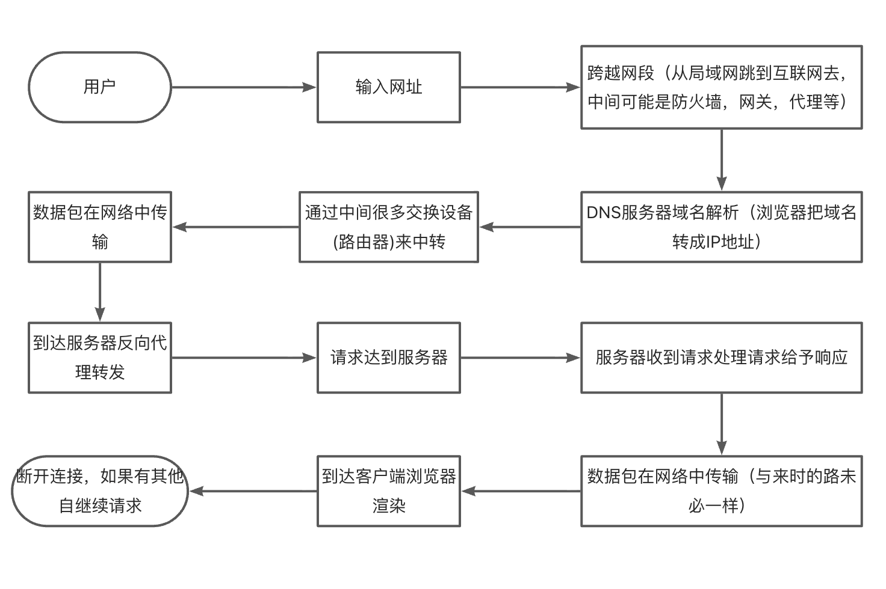
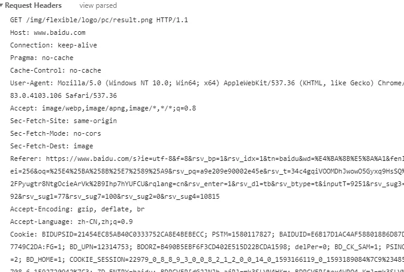
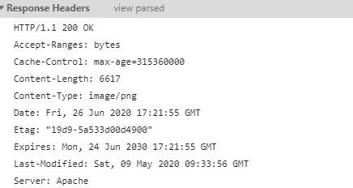
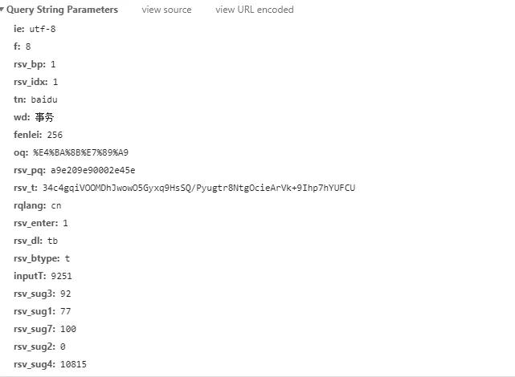
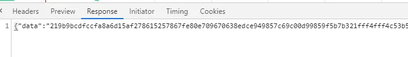
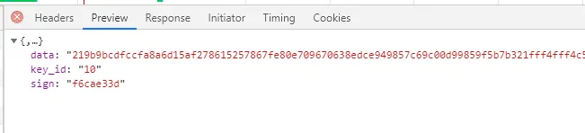
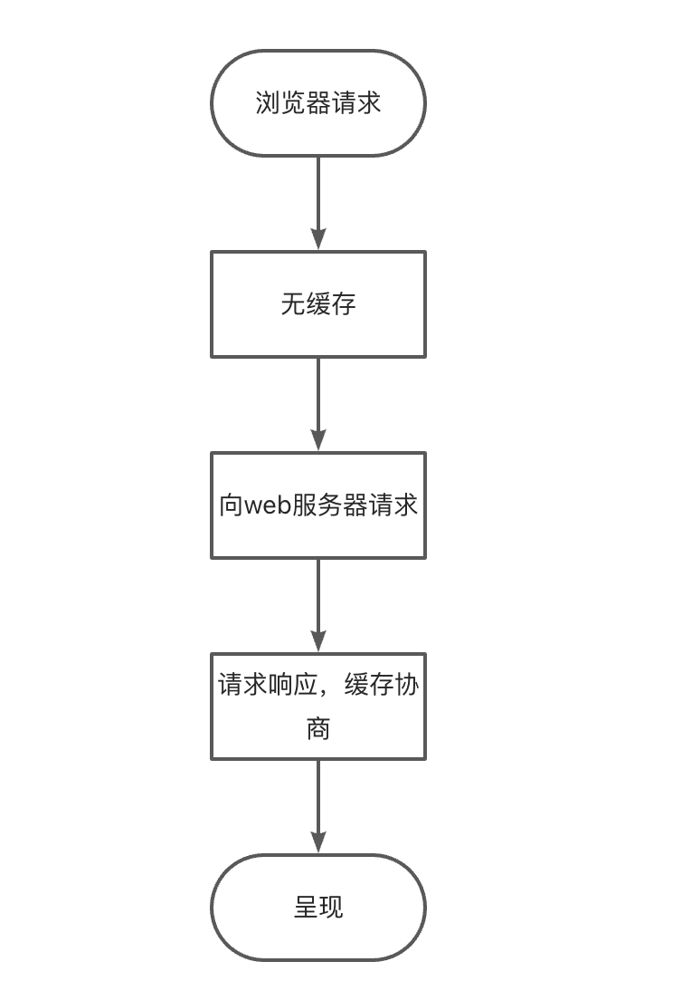
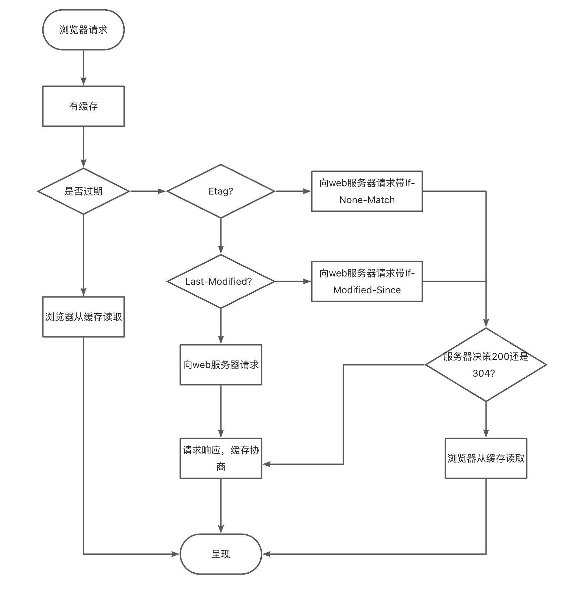
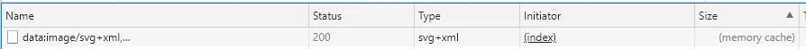

# HTTP协议 上

http请求的时候就是一进一出，客户端发生请求到服务端，服务端接到请求，发送响应到客户端。

## 当我们输入网址后发生了什么

1. 输入网址并回车
2. 解析域名
3. 浏览器发送HTTP请求
4. 服务器处理请求
5. 服务器返回HTML响应
6. 浏览器处理HTML页面
7. 继续请求其他资源

## HTTP协议详解

### 什么是HTTP协议

HTTP是超文本协议，因为传输的不仅仅是文本，有可能是图片，css、js文件、视频、音频等。

HTTP协议是 从客户端到服务器的请求和从服务器到客户端的响应一种约束和规范。

HTTP的发展 1991年/0.9 -> 1996年/1.0 -> 1999/1.1 -> 2015/2

HTTP3 对于 1和2 是一种全新的协议，更换了底层的协议，1和2是TCP协议 3是UDP协议。UDP能解决很多性能上的问题，和传输效率的问题。

HTTP默认端口号是80，HTTPS的默认端口号443

## 了解TCP/IP协议栈

首先为什么叫栈，是因为它是分层的。它的结构和数据结构中的栈结构很像。协议栈的数据通信是一层一层的往下传的，回来的时候也是一层一层的向上传的。和栈的方式很像。

|   **ISO协议**   | **TCP/IP协议(事实协议)** |
| :-------------: | :----------------------: |
|     应用层      |          应用层          |
|     表示层      |                          |
|     会话层      |                          |
| 传输层(TCP/UDP) |     传输层(TCP/UDP)      |
|     网络层      |        网络层(IP)        |
|   数据链路层    |        网络接口层        |
|     物理层      |                          |

ISO协议是标准组织定义的协议，事实协议其实在一开始都是逐步发展起来的并不完善。后来发现TCP/IP设计的比较粗糙。随着软件复杂度的增加发现一个应用层是不够的，掺杂了大量的东西导致结构很混乱，网络接口层内部还包含数据链路层并不合理。所以才重新制定了ISO协议来完善。

### TCP/IP协议

1. 应用层
   1. 为用户提供服务，如HTTP协议、FTP协议、SSH协议、DNS协议、SMTP协议等
2. 传输层
   1. 给应用层实体提供端到端的通信，保证数据传送及完整
   2. 该层主要有两个协议：传输控制协议（TCP）、用户数据报协议（UDP）
3. 网络层
   1. 主要解决主机到主机的通信问题。IP协议是国际互连层的重要协议
4. 网络接口层
   1. 负责监视数据在主机和网络之间的交换
   2. 其中还包含了数据链路层

### ISO协议

1. 应用层
   1. 给软件提供服务 HTTP、FTP、SSH 等
2. 表示层
   1. 用于处理在两个通信系统中交换信息的表示方法，主要包括数据格式变换、数据加密与解密、数据压缩与恢复等功能。
3. 会话层
   1. 负责两个节点之间的传输连接，以便确保点到点传输不中断，以及管理数据交换等功能。比如封装HTTPS 密钥交换等。
4. 传输层
   1. 有两个重要的协议，TCP 和 UDP
   2. TCP是面向连接的协议、UDP是无连接的协议
5. 网络层
   1. 也叫IP层，IP地址就是在网络层分配的。比如去ping一个机器的时候，那个时候的包叫 ICMP 协议
   2. ICMP协议也在网络层上，但是这一层最重要的还是IP协议
6. 数据链路层
   1. 涉及网卡（MAC地址）
7. 物理层
   1. 实际上指的是硬件、网线等等

### TCP/IP协议工作过程

比如请求一个数据，请求的参数通过应用层塞到HTTP协议里面进行封装，然后到传输层经过TCP协议再封装HTTP，封装好以后再往下传到网络层再封装成原始数据报，再往下到传输然后封装成串行传输协议。再往下传就是光电信号了，走光缆就是光信号，走电话线就是电信号。然后就是通过电缆或者光缆就传出去了。另外一端也是相同的套路，收到以后先把光电信号进行转化，转化成数组信号，数字信号转化出来以后就是串行传输协议了。然后往上传，转化成原始数据报，再揭开 TCP，TCP再解开就是HTTP，HTTP解开以后服务器就可以使用了。

### ISO协议工作过程

与TCP/IP原理相同，只是多了两个层级而已。

### HTTP工作工程

一次HTTP操作称为一个事物，工作过程可以分为四步：

（事物是什么？当一次工作时，并不能一下子就完成，要分成若干步骤，每个步骤依赖上一个步骤当然也可            以没有依赖性，但是在执行当中，若有一个步骤失败，整个流程都算失败了。事物就如果失败了就需要回            滚，那么所有的操作都恢复成原始状态，如果有操作数据的话那么数据也要恢复成原始状态。）

1. 客户机与服务器建立连接，创建HTTP连接，经过三次握手，然后创建TCP链路 这样才可以发请求
2. 客户机 发送HTTP请求，格式：URL、协议版本号、MIME信息(基础信息，头信息，和发送的数据等)
3. 服务器响应，格式：状态行（成功或错误的代码）、协议版本号、MIME信息(基础信息，头信息，返回的数据等)。
4. 客户端把数据进行渲染，断开连接。

这里的事务回滚其实就是建立连接，获取内存，释放内存，断开连接。

### 请求与响应

HTTP请求组成：请求行、消息报头、请求正文。(get的时候是没有请求正文的)

HTTP响应组成：状态行、消息报头、响应正文。

请求行组成：以一个方法符号开头，后面跟着请求的URI和协议的版本号

状态行组成：服务器HTTP协议的版本号，服务器返回的响应状态代码和状态代码的文本描述

#### 请求的协议规则

|              请求方法               | 空格 | URL |  空格  | 协议版本 | 回车符 | 换行符 |
| :---------------------------------: | :--: | :-: | :----: | :------: | :----: | :----: |
|             头部字段名              |  :   | 值  | 回车符 |          | 换行符 |
| ....      很多类似key: value 的文本 |      |     |        |          |        |        |
|             头部字段名              |  :   | 值  | 回车符 |          | 换行符 |
|               回车符                |      |     | 换行符 |
|          ...   请求的数据           |      |     |        |          |        |        |

为什么有回车跟换行这两个符号？因为历史遗留的问题，根据最古老打字机的时候回车是复位，换行才是下一行。所以不必纠结。

#### 响应的协议规则

其实是跟请求的差不多，只不过请求行和相应行不一样而已。

#### 请求方法(http 1.1)

- GET: 请求获取Request-URI所标识的资源
- POST: 在Request-URI所标识的资源后附加新的数据
- HEAD: 请求获取由Request-URI所标识的资源的响应消息报头
- PUT: 请求服务器存储一个资源，并用Request-URI作为其标识
- DELETE: 请求服务器删除Request-URI所标识的资源
- TRACE :请求服务器回送收到的请求信息，主要用于测试或诊断
- CONNECT: HTTP/1.1协议中预留给能够将连接改为管道方式的代理服务器。
- OPTIONS: 请求查询服务器的性能，或者查询与资源相关的选项和需求

#### HTTP状态码

- 1xx：指示信息--表示请求已接收，继续处理
- 2xx：成功--表示请求已被成功接收、理解、接受
- 3xx：重定向--要完成请求必须进行更进一步的操作
- 4xx：客户端错误--请求有语法错误或请求无法实现
- 5xx：服务器端错误--服务器未能实现合法的请求

从图片来看

#### General

General 是综合信息展示，里面有请求的信息也有响应的信息

####

#### Request Headers

Request Headers 是请求头信息

第一行 是请求行：方法、请求路径(URI)、协议版本号

之后是请求报头和报文本

#### Response Headers

Response Headers 是响应头信息

第一行 这个是状态行：协议版本号、状态码、描述响应状态码的文本

#### 最后一段(请求体)

这里其实是解析的参数，解析的URL参数或者是POST的参数，这里可以是 Form Data、也可以是 Query String Parameters，也可以是 Request Payload。

#### 响应体

响应体其实是在Response里面。当然这样看并不清晰，所以在Preview就会有JSON格式的。这里面就是服务器响应体里面的内容。

#### 常用的请求报头

- Accept：用于指定客户端接受哪些类型的信息，比如：
  - Accept：image/gif 图片的格式类型
  - Accept：text/htmlAccept-Charset 接受的字符集
  - Accept-Encoding：gzip 服务器规定数据是否压缩(节省带宽，提升传输速度)，浏览器会给解压缩，不需要关心
  - Accept：application/json 传输JSON
  - Accept-Language：告诉服务器浏览器的语言是什么，一般用于多语言包的自动化推送
- connection：keep-alive 长连接 就是向服务器发送一个协商 是否支持长连接策略
- Cookie：把本地cookie拿出来通过key=value；的形式拼接起来
- Host：域名
- Referer：来源，访问当前页面的上一页是谁，一般可以防止盗链，做一些简单的反爬虫
- User-Agent：浏览器的信息

#### 常用的响应头

- Connection：对应请求头的Connection 返回是否支持发送过去的长连接策略
- Content-Encoding：gzip 是和 Accept-Encoding 对应 是否压缩
- Content-Type：text/html;charset=utf-8响应体的格式 字符集编码
- Date 和 Expires 是和缓存相关的
- Server：web服务器是什么
- Set-Cookie：设置cookie，逐条设置，会有很多 Set-Cookie , 它会有5个字段，常用的是key=value; path=/ 生效的路径;domain=.baidu.com; 对哪个域生效

## Cookie与Session

Cookies是保存在客户端的文本内容，它一般产生服务器端，浏览器也能生成。随客户端每一个请求发送该url下的所有ciikies到服务器端。

Session它生成在服务器，保存在服务器端，通过唯一值的SessionId来区别每一个用户。SessionId随每个请求发送到服务器，服务器根据SessionId来识别客户端，再通过session的key获取值。有的时候它被放到缓存里边做共享。

### Cookie和session配合使用

HTTP是无状态协议，服务器不会维持客户端的连接协议，它是建立再TCP之上的，HTTP的特点是请求响应。交互结束之后TCP就断开了连接。如果使用的是keep-alive模式可以进行多次请求和多次响应之后再断开连接，但是都是会断开连接，不会一直保持连接不断开。

所以需要通过Session来生成cookie。然后配合使用，如何配合呢？

发送请求，检查是否存在携带cookie，如果带cookie那就去找一个ID，那么服务器就会在自己里面去找这个ID，如果不带ID，服务器就要产生一个新的session，然后在session里边生成这个ID，然后下发到浏览器。通过Set-Cookie保存起来。再次访问的时候，服务器还是会检查这个ID，如果有这个字段的值拿过来，在session里边去找，如果存在，就有后续一系列操作，如果不存在，那就说明这个session过期了。过期一段时间之后session会被删掉。这样就可以维持住浏览器的状态了，比如登陆状态。

## HTTP缓存机制

缓存有浏览器缓存也有服务器缓存还有网络设备的缓存，比如代理服务器也可以做缓存。数据库的缓存，内存行缓存。

浏览器缓存其实是为了防止速度慢的设备来拖慢整个系统的速度，其实是加速用的。

网络其实是相当慢的，所以一些需要反复请求的东西，都可以放在缓存里面，下次请求的时候不再通过网络来请求，直接从缓存拿出来。从而提高速度，降低成本。

在使用缓存的时候实际上是协议当中规定好的，浏览器和服务器是对这种规定的实现。

### 缓存的优点

- 减少加载延迟
- 减少带宽消耗

### 缓存的流程

1. 发送请求
2. 返回响应
3. 再次请求
4. 服务器检查请求头缓存设定，检查相关缓存协商策略，发现请求资源不需要再次推送，返回304。意味着这个资源未发生任何改变，不需要重新推送。
5. 浏览器收到304，就会去缓存内部拿取响应资源。

### 缓存具体机制

#### 首次请求流程

#### 非首次请求流程

### 两种缓存策略

- 强制缓存 服务器通知浏览器一个缓存时间，在缓存时间内直接使用缓存，不在时间内执行比较缓存
- 比较缓存 把缓存信息中Etag和Last-Modified两种策略发给服务器，由服务器校验，返回304，浏览器使用缓存

强制缓存： Exprires，Date

Etag/If-None-Match策略 是哈希值，跟资源名字无关，主要对应内容，只要内容一直就走缓存

Last-Modified/If-Modified-Since策略 比较的是生成资源的时间戳，只要时间戳不变就走缓存

为什么优先 Etag，有可能资源的时间戳改变，但是内容没有变。为什么呢？因为有可能是服务器重新部署了资源还是有可能旧资源，但是Last-Modified发现时间戳改变了就会资源重推，这就造成了带宽消耗。所以优先 Etag，只要内容没变，那么就不会重推资源依然走缓存。

还有特殊情况，走了缓存了但是状态码是200并非304：

状态码是200，但是Size是（memory cache）这里就走了缓存

状态码是200，但是Size是（disk cache）这里也走了缓存

memory cache：这个资源是直接从内存中拿到的，**不会请求服务器，**一般已经加载过该资源且缓存在了内存当中，当关闭该页面时，此资源就被内存释放掉了，再次重新打开相同页面时不会出现from memory cache的情况

disk cache：这个资源是从磁盘当中取出的，也是在已经在之前的某个时间加载过该资源，**不会请求服务器，**但是此资源不会随着该页面的关闭而释放掉，因为是存在硬盘当中的，下次打开仍会from disk cache

ServiceWorker：这个资源是从代理服务器中取出的，**不会请求服务器，**Service Worker 只能被使用在 https 或者本地的 localhost 环境下。

#### 统计表

| 状态码 | Size          | 说明                                                               |
| ------ | ------------- | ------------------------------------------------------------------ |
| 200    | memory cache  | 不请求网络资源，资源在内存当中，一般脚本、字体、图片会存在内存当中 |
| 200    | disk cache    | 不请求网络资源，在磁盘当中，一般非脚本会存在内存当中，如css等      |
| 200    | ServiceWorker | 代理服务器缓存，必定会每24小时被下载一次                           |
| 200    | 数值          | 从服务器下载最新资源                                               |
| 304    | 请求报文大小  | 请求服务端发现资源没有更新，使用本地资源                           |
