# 衡量前端行能

## 核心性能指标

- [LCP（最大内容绘制）](https://web.dev/articles/lcp?hl=zh-cn)
- [CLS（累积布局偏移）](https://web.dev/articles/cls?hl=zh-cn)
- [INP（交互延迟）](https://web.dev/articles/inp?hl=zh-cn)

### LCP （Largest Contentful Paint）

定义：从用户请求网址到页面内最大**文本块**或**图片**或者**视频**渲染所需的时间。也就是最大内容的渲染。这体现了加载性能。
意义：直接反映页面的主要内容何时对用户可见。LCP 越快，用户感觉页面加载速度越快。LCP 的值应该小于等于 2.5。
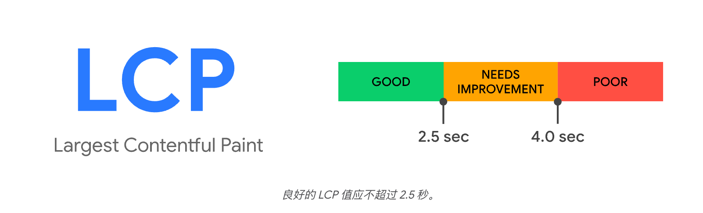

### CLS （Cumulative Layout Shift）

定义：页面整个生命周期内发生的非预期布局偏移的累积分数。这体现了视觉稳定性。
意义：CLS 越低，用户体验越好。例如，用户正要点击一个按钮，但该按钮突然下移，导致用户误点了广告。这用户体验就非常差。
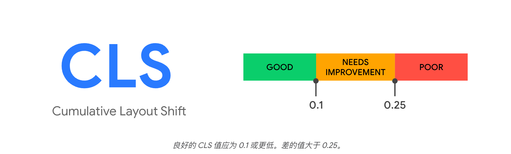

### INP （Interaction to Next Paint）

定义：观测网页在用户访问期间发生的所有点击、点按和键盘互动的延迟时间。这代表了交互体验。
意义：从用户触发交互到浏览器下一次绘制被阻塞的时间，低的 INP 值意味着页面能快速响应用户的操作，避免卡顿感。
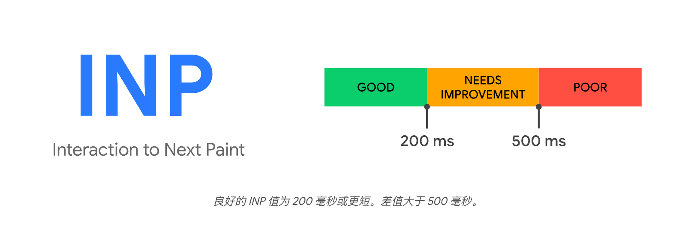

## 辅助性能指标

- [TTFB (第一字节时间)](https://web.dev/articles/ttfb?hl=zh-cn)
- [FCP (首次内容绘制)](https://web.dev/articles/fcp?hl=zh-cn)
- [TTI (可交互时间)](https://web.dev/articles/tti?hl=zh-cn)

### TTFB（Time To First Byte）

定义：从发起请求到接收到来自服务器的第一个字节所消耗的时间。
意义：TTFB 是衡量服务器响应速度的重要指标，较低的 TTFB 值意味着服务器响应速度快，用户可以更快地看到页面内容。

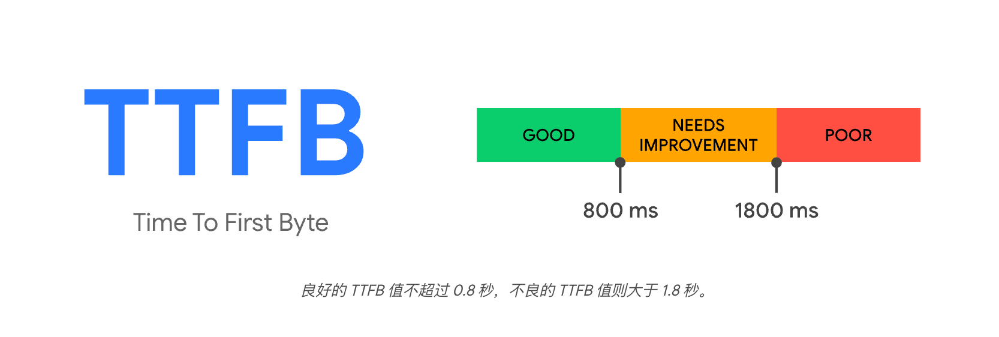

### FCP（First Contentful Paint）

定义：从页面开始加载到页面内容的任何一个部分在屏幕上渲染完成的时间。
意义：这是用户感知“页面开始加载”的第一个信号。首次内容绘制时间和最大内容绘制时间 (LCP)，后者旨在衡量网页的主要内容何时加载完毕，这个是首个内容。
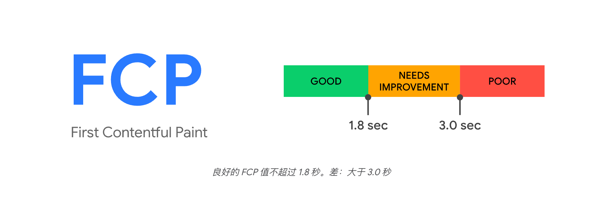

### TTI（Time To Interactive）

定义：从页面开始加载到页面变为可交互状态的时间，即页面上的所有资源都加载完成，并且页面可以响应用户操作的时间。
意义：TTI 是衡量页面加载完成后的可交互性的重要指标，较低的 TTI 值意味着页面加载速度更快，用户可以更快地与页面进行交互。

## 如何测量这些指标？

### Lighthouse

- [Lighthouse](https://developers.google.com/web/tools/lighthouse)集成在 Chrome DevTools 中的工具，这款工具针对性能、无障碍、SEO 等方面的评估网站，并给出优化建议。
  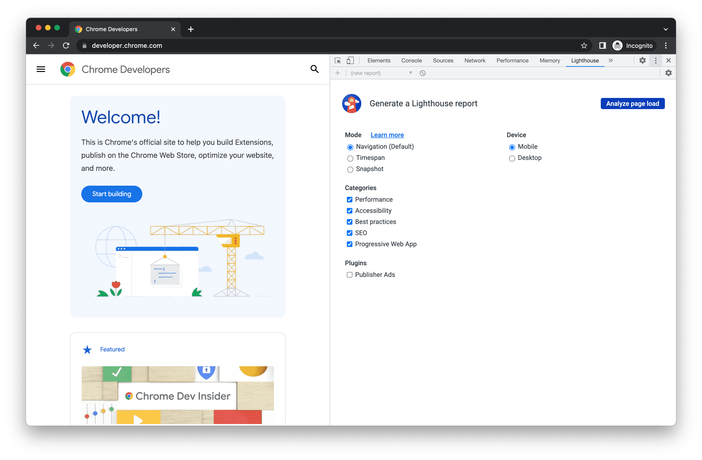
  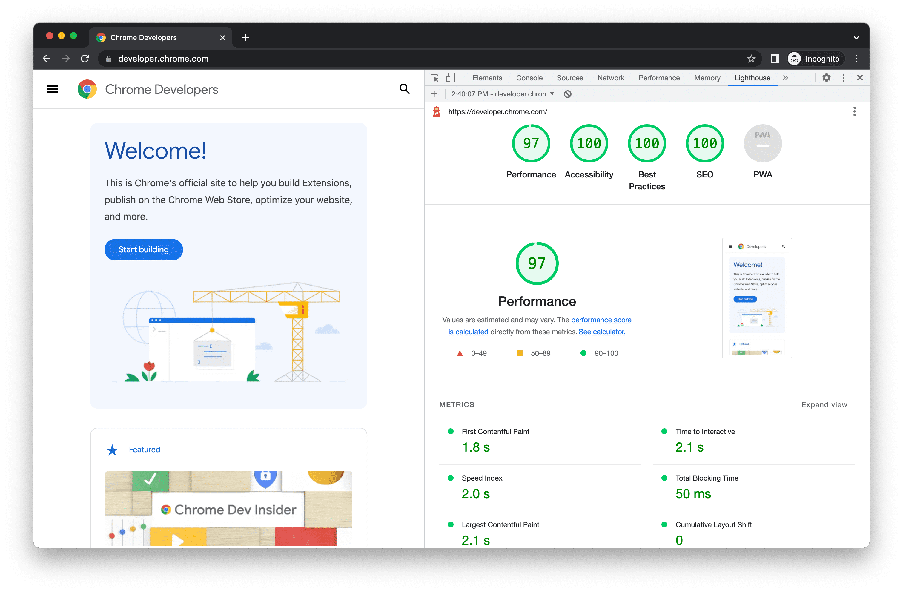

- [Chrome DevTools Performance 面板](https://developer.chrome.com/docs/devtools/performance/overview?hl=zh-cn)也集成在 Chrome DevTools 中，可以查看性能指标。
  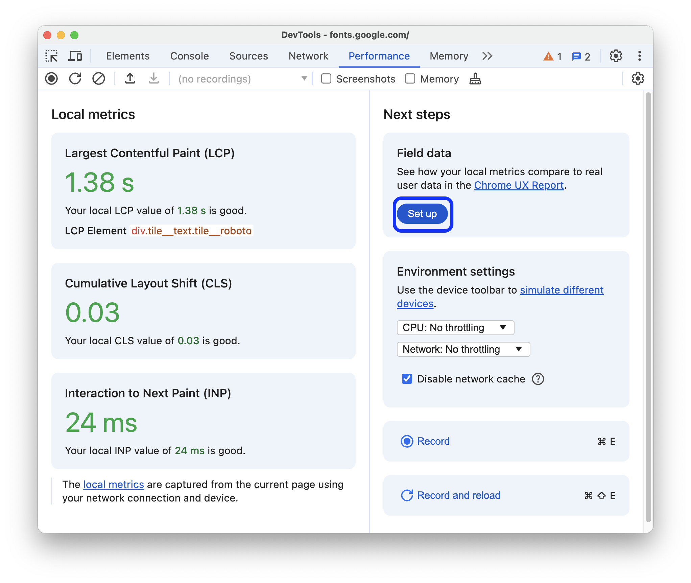
- [WebPageTest](https://www.webpagetest.org/) 通过在页面的搜索框输入网址就会自动进行性能测试，并给出详细的性能报告。
  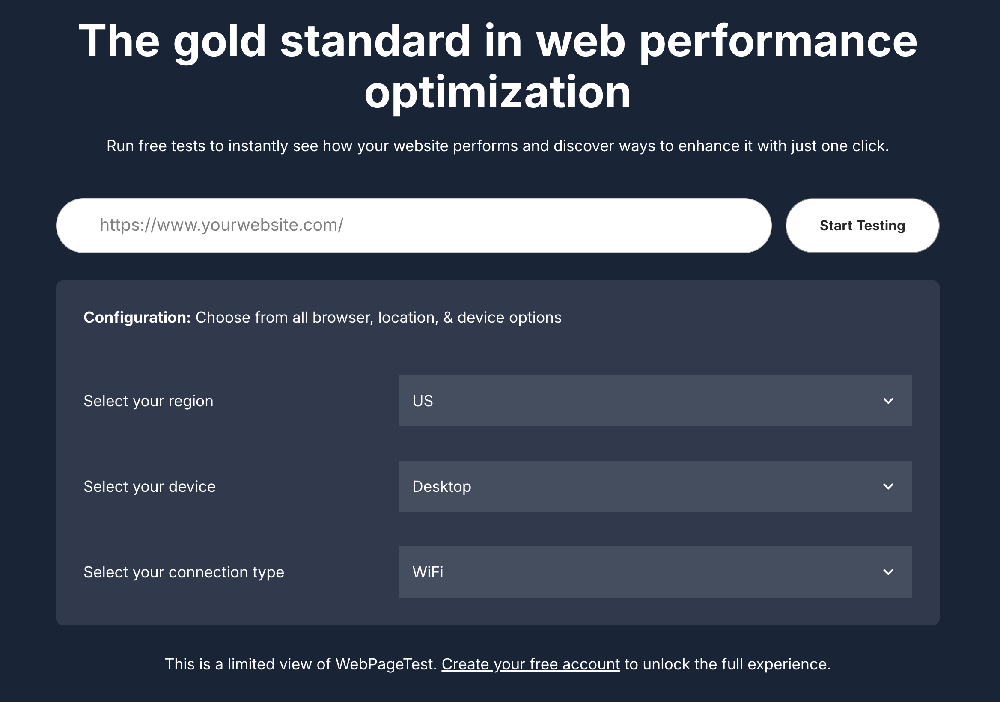

- [Sentry](https://sentry.io/for/javascript/) 是一个开源的实时性能与埋点、错误追踪工具，可以集成到前端项目中，实时监控前端错和性能等，并给出报告。

## 加载时间

浏览器提供了 `performanceNavigationTiming`对象，从页面导航开始一直到 load 事件结束，中间经历过程的耗时信息。
比如：`performanceNavigationTiming.domInteractive` 可以获取到 DOM 解析完成的时间，`performanceNavigationTiming.loadEventEnd` 可以获取到页面加载完成的时间。下面图中
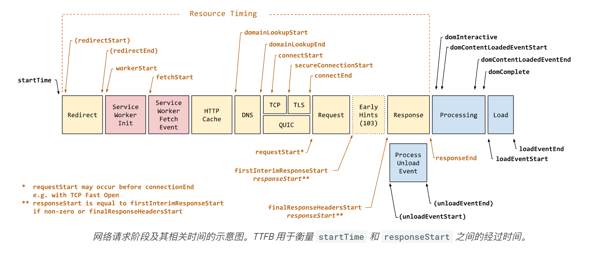

```js
const performanceTiming = performance.getEntriesByType("navigation")[0];
const ttfb = performanceTiming.responseStart - performanceTiming.fetchStart; // TTFB (首字节时间)
const domInteractive =
  performanceTiming.domInteractive - performanceTiming.fetchStart; // DOM解析完成时间
const loadEventEnd =
  performanceTiming.loadEventEnd - performanceTiming.fetchStart; // 页面加载完成时间
```

`performance.getEntriesByType('navigation')[0]` 返回了一个对象，包含了从页面开始加载到页面加载完成所经历的时间，包括 DNS 查询、TCP 连接、请求、响应、解析、渲染等。

### 关键时间点

| 属性                       |                                       解释                                        |         对应阶段          |
| :------------------------- | :-------------------------------------------------------------------------------: | :-----------------------: |
| startTime                  |                          开始加载的时间点（基本都是 0）                           |        加载刚开始         |
| fetchStart                 |                 浏览器开始请求资源（发起请求或者读取缓存）的时间                  |       网络请求开始        |
| domainLookupStart          |                              开始进行 DNS 查询的时间                              |       DNS 查询开始        |
| domainLookupEnd            |                                DNS 查询结束的时间                                 |       DNS 查询结束        |
| connectStart               |                              开始建立 TCP 连接的时间                              |     TCP/TLS 连接开始      |
| connectEnd                 |                              TCP 连接建立完成的时间                               |     TCP/TLS 连接结束      |
| requestStart               |                        浏览器发送 HTTP 请求给服务器的时间                         |         发送请求          |
| responseStart              |               浏览器接收到服务器响应的第一个字节的时间（对应 TTFB）               |      接收响应 (TTFB)      |
| responseEnd                |                浏览器接收到最后一个字节的时间（或 HTTP 连接关闭）                 |         响应结束          |
| domLoading                 |                          浏览器开始解析 HTML 文档的时间                           |      解析 HTML 开始       |
| domInteractive             | DOM 树构建完成，但图片、CSS 等子资源仍在加载的时间点（DOMContentLoaded 事件触发前 |        DOM 可交互         |
| domContentLoadedEventStart |                 DOM 解析完成，并触发 DOMContentLoaded 事件的时间                  | DOMContentLoaded 事件触发 |
| domContentLoadedEventEnd   |                          DOMContentLoaded 事件结束的时间                          | DOMContentLoaded 事件结束 |
| domComplete                |    页面所有资源（图片、CSS、JS 等）都已加载完成的时间点（onload 事件触发前）。    |       DOM 解析完成        |
| loadEventStart             |                       页面加载完成，并触发 load 事件的时间                        |       load 事件开始       |
| loadEventEnd               |                       页面加载完成，并触发 load 事件的时间                        |       load 事件结束       |

### 关键时间点计算

| 指标             |                计算                 |
| :--------------- | :---------------------------------: |
| DNS 查询耗时     | domainLookupEnd - domainLookupStart |
| TCP 连接耗时     |       connectEnd-connectStart       |
| TTFB 首字节时间  |      responseStart-fetchStart       |
| 内容传输耗时     |      responseEnd-requestStart       |
| DOM 解析耗时     |     domInteractive-responseEnd      |
| 解析 HTML 耗时   |     domComplete-domInteractive      |
| 白屏时间         |       responseStart-startTime       |
| 首屏时间         |       loadEventEnd-startTime        |
| DOM Ready 时间   | domContentLoadedEventEnd-startTime  |
| 页面完全加载时间 |       loadEventEnd-startTime        |

## 页面卡顿

比如页面有一个长时间任务，比如渲染一个超长列表，会导致页面卡顿，这时候就需要使用 PerformanceObserver 观察 event type 为 `longtask` 的性能数据，从而判断页面是否卡顿。

```js
const observer = new PerformanceObserver((list) => {
  for (const entry of list.getEntries()) {
    console.log(entry);
    // 设定卡顿阈值：执行时长大于 500 ms
    if (entry.duration > 500) {
      console.log("执行的长任务耗时：", entry.duration);
    }
  }
});

observer.observe({ entryTypes: ["longtask"] });
```

## Perfomance 面板

在开启 Performance 面板之前最好是在无痕浏览器，尽可能减少浏览器插件和缓存对页面的影响。

当打开 Performance 面板时，它会立即捕获并显示页面的 LCP、CLS，当和页面产生交互后，就会触发 INP。
在这三个指标卡片下方，有捕获的 LCP 的 DOM，CLS 的 dom 以及 INP 的交互元素，点击这些元素，会跳转到对应的 DOM ，方便我们查看这些元素。
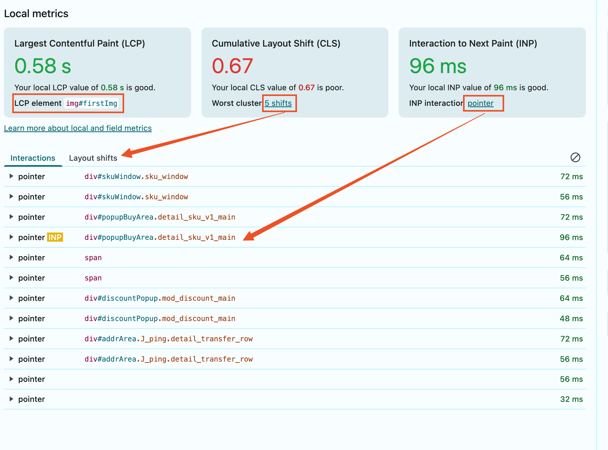

### 记录运行时性能

1. 点击左上角录制图标开始录制。
2. 在录制过程中，你可以与页面进行交互，比如点击按钮、滚动页面等。
3. 录制完成后，点击左上角停止图标结束录制。
4. 在 Performance 面板中，你可以看到录制期间的性能数据，包括 FPS、CPU 使用率、内存使用情况等。

### 记录加载性能

1. 点击左上角的刷新图标，页面会刷新并且等待几秒。
2. 在页面加载过程中，Performance 面板会自动捕获并显示性能数据。
3. 页面加载完成后，你可以查看加载性能数据。

记录完成后 DevTools 会自动放大录制中活动最频繁的部分。
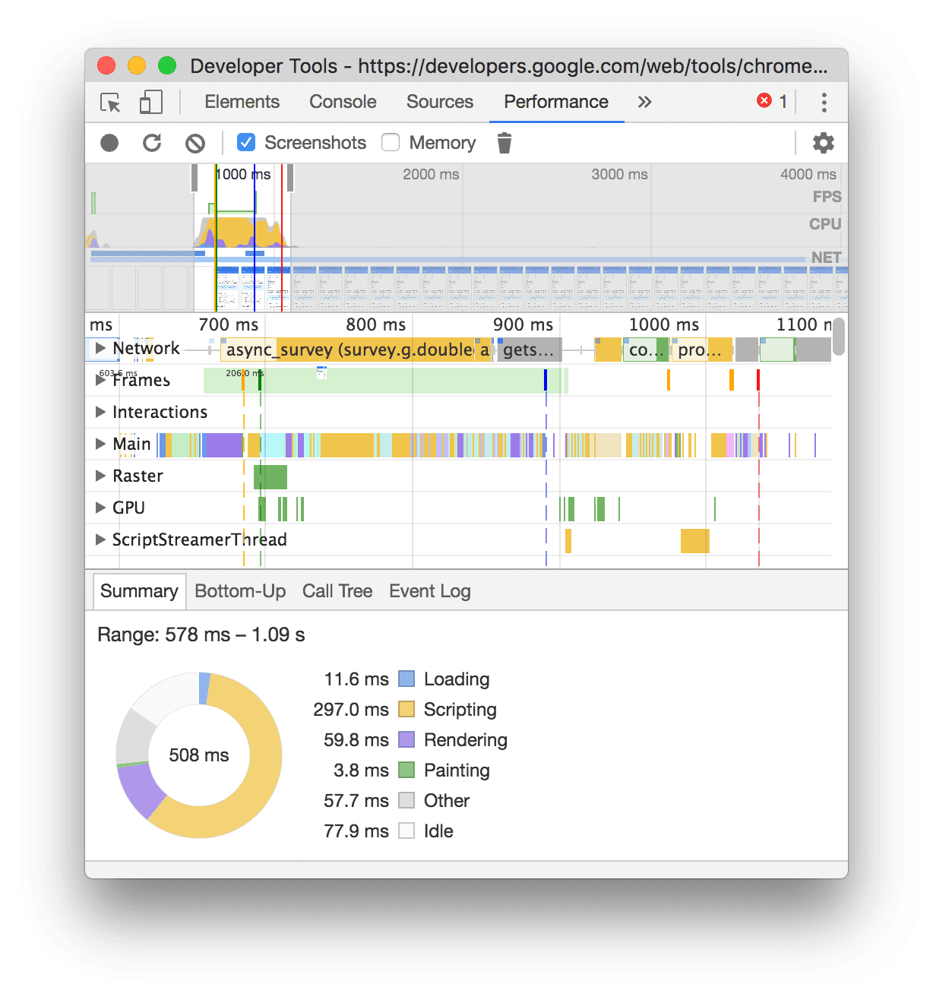

### 认识性能记录

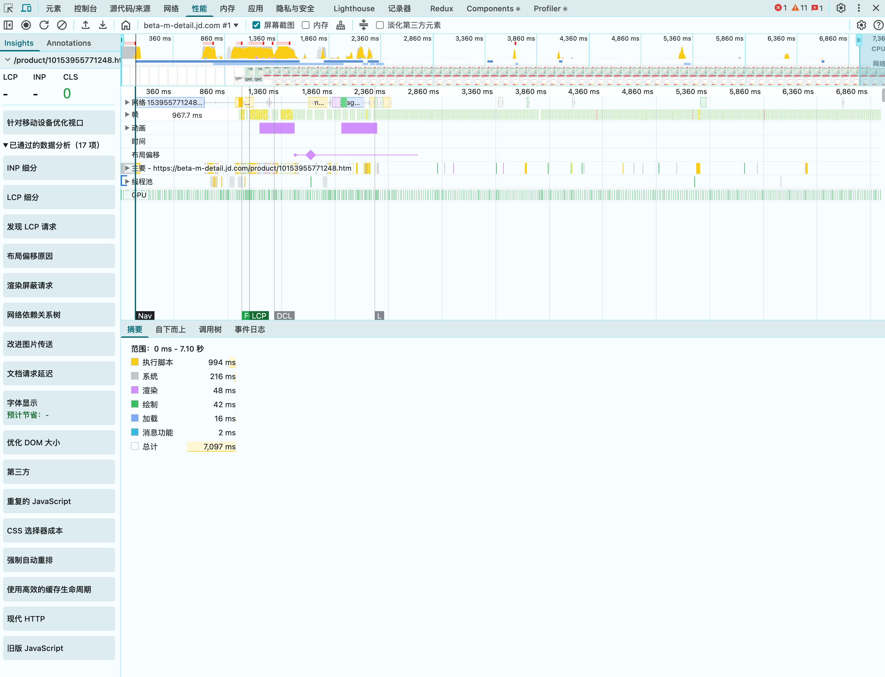
在左侧 Insights 标签页可以看到 LCP、INP、CLS 三个核心指标，下方展开的是可以优化的项目，已通过的数据分析会折叠起来。
右侧 Annotations 是做标记的，可以在 主要（main） 图表中为跟踪记录添加注释，也可以关联两个跟踪记录，方便他人查看。
右侧面板上有 Network、Frames、Animations、Timings、Layout shifts、Main、Thread pool、GPU。

#### Network

network 体现了网络下载情况，常常跟 Main、thread pool 一起分析具体情况。
一般情况下蓝色表示 html、黄色 js、紫色 css、绿色图片、灰色是请求。
每个请求有 4 个阶段：

1. 排队和连接：浏览器知道了要发请求，但它正忙着建立 Tcp 链接或别的事情，所以这个请求要先等一等。
2. 已发送请求等待处理：浏览器终于开始处理这个请求了。但是服务器正在忙着解析这个请求，这个过程浏览器一直在等待。
3. 内容下载：当前浏览器已经收到了服务器返回的数据，正在下载中。
4. 在主线程上等待处理：浏览器主线程收到了 worker 线程移交过来的解析结果，但主线程太忙，没有时间处理。

#### Frames

体现了渲染得帧率，反应了一个页面的流畅度，一个格子对应一帧。格子常见的有 4 种颜色：
绿色块：帧被完整渲染。
黄色块：没有完全渲染，只呈现了部分。
红色块：没有完成渲染，被浏览器丢弃。
空白：空闲帧，没有渲染任务。
**格子颜色与帧的时间长短无关。**

#### Animations

它主要反应了我们使用的 css animations 或 transition 的执行情况。 每个色块对应着一次正在运行的 animations 或 transition，并且点击这个色块，能在摘要面板（summary）中看到着一次执行的相关信息（特别是被执行的 DOM 节点会体现出来）

#### Timings

自定义计时，它主要反应了页面加载的关键时间节点，不过需要在代码种写上 performance.mark 和 console.time 来记录这些时间点。

#### Layout shifts

记录布局偏移情况，布局偏移是指页面上一个可见元素的位置发生了移动，就会被记录在这里。

#### Main

记录了主线程的执行情况，每个色块对应一个任务。
色块从上到下是包含关系，指的是：上一层的色块（任务）是由下一层的若干个子色块（子任务）组合而成的。
色块从左到右是并列关系，指的是：并列的若干个子色块，是从左到右执行的。（左边色块如果有子色块，那么会先把子色块执行完成后，再执行右边色块）。

#### Thread pool

指的是浏览器进程中用于执行各种后台任务的一组物理线程。这些任务通常包括图片解码、数据处理、垃圾回收、某些 Web Workers 的计算等，这些工作会被分配到这个线程池中，以避免阻塞主线程（Main Thread），从而保持网页界面的响应性和流畅。

#### GPU

查看 GPU 的使用情况，包括开始时间、总用时等。

### 分析性能记录

1. 在 Performance 面板中，你可以看到录制期间的性能数据，包括 FPS、CPU 使用率、内存使用情况等。
2. 你可以查看每个任务的执行时间、CPU 使用率等信息，从而找出性能瓶颈。

更详细可查看[分析性能记录](https://developer.chrome.com/docs/devtools/performance/reference?hl=zh-cn#analyze)
