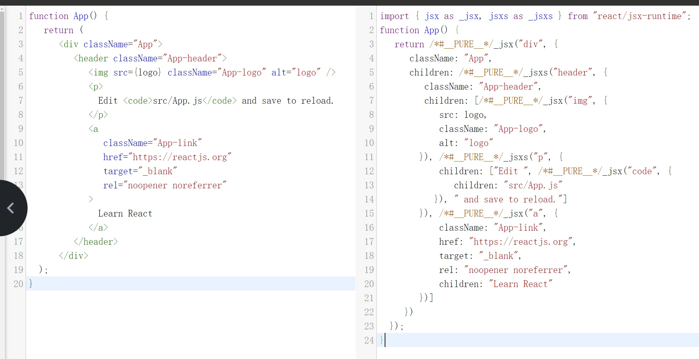
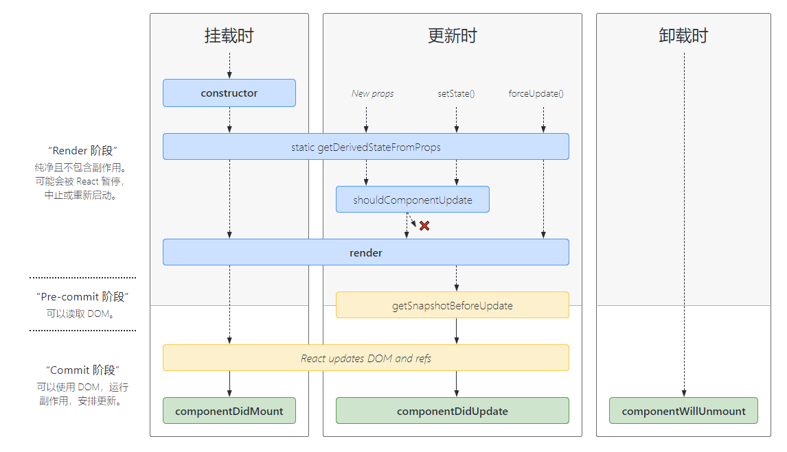

# React基础
React 相关学习内容 [【中文官网】](https://react.docschina.org/)

## 环境安装
### 安装淘宝镜像源
```bash
npm config set registry https://registry.npmmirror.com
```

### 环境查看
```bash
npm config get registry
```

or 

### Nvm 安装
[https://nvm.uihtm.com/](https://nvm.uihtm.com/)

### fnm 安装
[https://github.com/Schniz/fnm](https://github.com/Schniz/fnm)

### Github 无法访问
[https://zhuanlan.zhihu.com/p/358183268](https://zhuanlan.zhihu.com/p/358183268)

[https://gitee.com/inChoong/GitHub520](https://zhuanlan.zhihu.com/p/358183268)

### 安装 React
```bash
npx create-react-app my-app
cd my-app
npm run start
## 或者使用vite 
```

## 入口文件
index.js

```jsx
import React from 'react';
import ReactDOM from 'react-dom/client';
import './index.css';
import App from './App';
import reportWebVitals from './reportWebVitals';

const root = ReactDOM.createRoot(document.getElementById('root'));
root.render(
  <React.StrictMode>
    <App />
  </React.StrictMode>
);

// If you want to start measuring performance in your app, pass a function
// to log results (for example: reportWebVitals(console.log))
// or send to an analytics endpoint. Learn more: https://bit.ly/CRA-vitals
reportWebVitals();
```

### React 和 react-dom 的区别?
1. react：这是 react 的核心，它定义了 react 组件的创建和生命周期方法，以及 react 元素的概念，可以将它视为 react 的引擎。
2. React-dom：这个库提供了浏览器环境中使用 react 的方法，例如将 react 组件渲染到 Dom 中，或者在 Dom 中触发 React 组件的更新。可以将它视为 react 的驱动程序。

### reportWebVitals 是什么？
reportWebVitals 是 react 提供的一个性能分析相关的检测工具。

### React.StricMode 是什么？
它是开启 React 的严格模式。

### 严格模式的作用
1. 不安全的生命周期方法：某些生命周期在未来的 React 版本中被弃用。严格模式会警告这些不安全的方法。
2. 使用过时或遗留的API：严格模式会警告使用过时或遗留的API。
3. 意外的副作用：严格模式会发现组件中可能的意外副作用。
4. 与旧版本React不兼容的代码：严格模式会警告代码中可能与未来版本 React 不兼容的部分。

## JSX
JSX 浏览器是无法识别的，需要经过 [babel](https://babeljs.io/)来编译的。



## 组件
1. class 组件（已被官方推荐遗弃，但是需要学习，为了纯函数式组件做铺垫）
2. Function 纯函数（官方推荐这种 + Hooks）

### 生命周期


> 网址：https://projects.wojtekmaj.pl/react-lifecycle-methods-diagram/

#### react 的生命周期包括三个部分
#### 挂载时：组件实例被创建并插入 DOM 中时
    1. constructor：类的构造函数，挂载之前就执行
    2. getDerivedStateFromProps：它是一个静态方法，在使用它之前需要在构造函数中定义`this.state`。它会在 render 之前执行，在挂载时和更新时都会被调用。它返回一个对象来更新 state，如果返回 null 则不更新。所以也可以理解为这个是渲染之前的拦截，可以改变下一次渲染的 state 的内容。
    3. render：渲染函数
    4. componentDidMout：当组件挂载后（插入 DOM 树中）立即调用

```jsx
class App extends React.Component {
  // 构造函数
  constructor(props) {
    super(props);
    this.state = {
      count: 0
    };
    console.log('App constructor 构造函数');
  }

  // 获取派生状态
  static getDerivedStateFromProps(props, state) {
    console.log('App getDerivedStateFromProps 获取派生状态');
    // count本来每次加1，现在改成加2
    return { count: state.count + 1 };
  }

  // 组件挂载完成之后执行
  componentDidMount() {
    console.log('App componentDidMount 组件挂载完成之后执行');
  }

  // count + 1
  handleClick = () => {
    const { count } = this.state;
    this.setState({ count: count + 1 });
  };

  render() {
    console.log('App render 渲染函数');
    const { count } = this.state;

    return (
      <div>
        <div>{count}</div>
        <button onClick={this.handleClick}>加1</button>
      </div>
    );
  }
}
```

#### 更新时：当组件的 props 或 state 发生变化时会触发更新
    1. getDerivedStateFromProps
    2. shouldComponentUpdate：根据返回的布尔值决定是否更新，如果返回 false，它之后的所有更新方法将不再执行
    3. Render
    4. getSnapshotBeforeUpdate：它在 `render` 方法之后和实际的 DOM 更新之前执行。它有两个参数：`prevProps` 和 `prevState`, 一个是上一次渲染的 props，一个是上一次渲染的 state。它会返回一个值，这个值将是`componentDidUpdate`的第三个参数。它的主要使用场景是获取滚动位置或记录表单输入的当前状态。俗称获取快照
    5. componentDidUpdate：它是在真实 DOM 更新之后去执行，它有三个参数，一个上一次渲染的 props 一个 上次渲染的 state 和 `getSnapshotBeforeUpdate` 返回的值。

```jsx
class App extends React.Component {
  // 构造函数
  constructor(props) {
    super(props);
    this.state = {
      count: 0
    };
    console.log('App constructor 构造函数');
  }

  // 获取派生状态
  static getDerivedStateFromProps(props, state) {
    console.log('App getDerivedStateFromProps 获取派生状态');
    // count本来每次加1，现在改成加2
    return { count: state.count + 1 };
  }

  // 根据返回值来决定是否更新
  shouldComponentUpdate(nextProps, nextState) {
    console.log('App shouldComponentUpdate 是否需要更新');
    return false;
  }

  // count + 1
  handleClick = () => {
    const { count } = this.state;
    this.setState({ count: count + 1 });
  };

  // 获取快照
  getSnapshotBeforeUpdate(prevProps, prevState) {
    console.log('App getSnapshotBeforeUpdate 获取快照');
    return 123;
  }

  componentDidUpdate(prevProps, prevState, snapshot) {
    console.log('App componentDidUpdate 组件更新完成之后执行');
    console.log(snapshot);
  }

  render() {
    console.log('App render 渲染函数');
    const { count } = this.state;

    return (
      <div>
        <div>{count}</div>
        <button onClick={this.handleClick}>加1</button>
      </div>
    );
  }
}
```

#### 卸载时：当组件从 DOM 中移除时会调用
    1. componentWillUnmount：组件卸载之前执行。

```jsx
class Bpp extends React.Component {
  // 组件卸载之前执行
  componentWillUnmount() {
    console.log('Bpp componentWillUnmount 组件卸载之前执行');
  }

  render() {
    return <div>Bpp</div>;
  }
}

class App extends React.Component {
  // 构造函数
  constructor(props) {
    super(props);
    this.state = {
      bpp: true
    };
    console.log('App constructor 构造函数');
  }

  // count + 1
  handleClick = () => {
    this.setState({ bpp: false });
  };

  render() {
    console.log('App render 渲染函数');
    const { bpp } = this.state;

    return (
      <div>
        {bpp && <Bpp />}
        <button onClick={this.handleClick}>消失</button>
      </div>
    );
  }
}
```

## Hooks
### useEffect 
```jsx
import { useEffect } from 'react';

function App() {
  useEffect(() => {
    console.log('useEffect');

    return () => {
      console.log('组件卸载');
    };
  }, []);

  return (
    <div>
      <h1>Hello, World!</h1>
    </div>
  );
}
```

执行时机：

1. 它是异步调用，也就是 JS 修改DOM 之前去调用。它不会阻塞浏览器的绘制过程，因此适合处理副作用
2. 组件更新后去执行（执行时是在真实 DOM 渲染 完之后去执行）。

接收参数：

1. 回调函数返回值（函数）：
    1. 会在组件卸载的时候去执行
    2. 状态发生变化也会执行
    3. 应用场景：数据获取、订阅或手动更改 DOM 等操作
2. 数据依赖项：
    1. 传空数组：只会在挂载之后执行
    2. 什么都不传：挂载之后和更新之后都会执行
    3. 传有依赖项：挂载后和在依赖项发生了改变之后去执行

```jsx
import { useEffect, useState } from 'react';

function App() {
  const [count, setCount] = useState(0);

  useEffect(() => {
    console.log('useEffect');

    return () => {
      console.log('组件卸载');
    };
  }, [count]);

  const click = () => {
    setCount(count + 1);
  };

  return (
    <div>
      <h1>Hello, World!{count}</h1>
      <button onClick={click}>点击</button>
    </div>
  );
}
```

### useState
```jsx
import { useEffect, useState } from 'react';

function App() {
  const [count, setCount] = useState(0);

  return (
    <div>
      <h1>Hello, World!{count}</h1>
      <button onClick={() => setCount(count + 1)}>点击</button>
    </div>
  );
}
```

它就是用来定义组件状态，和修改组件状态。

```jsx
import { useEffect, useState } from 'react';

function App() {
  const [count, setCount] = useState(0);

  useEffect(() => {
    console.log('useEffect');

    return () => {
      console.log('组件卸载');
    };
  }, []);

  const click = () => {
    setCount(count + 1);
    console.log(count);
  };

  return (
    <div>
      <h1>Hello, World!{count}</h1>
      <button onClick={click}>点击</button>
    </div>
  );
}
```

此时点击按钮会打印 0，因为React 组件的状态更新是异步的队列，为了性能考虑。

### useLayoutEffect
执行时机：

1. 它会在浏览器重新绘制之前同步执行。它会阻塞浏览器的绘制，因此影响性能。
2. 所以它是在`useEffect`之前去执行。

应用场景：修正布局，获取 DOM 位置去计算。

```jsx
import { useEffect, useLayoutEffect, useState } from 'react';

function App() {
  const [count, setCount] = useState(0);

  useEffect(() => {
    console.log('useEffect');
  }, [count]);

  useLayoutEffect(() => {
    console.log('useLayoutEffect');
  }, []);

  const click = () => {
    setCount(count + 1);
  };

  return (
    <div>
      <h1>Hello, World!{count}</h1>
      <button onClick={click}>点击</button>
    </div>
  );
}
```

### useMemo
它是用于 react 渲染中的性能优化

使用场景：父组件要进行更新，子组件的重新 render 计算量比较大，而且结果可以复用。就可以用 useMemo 来提升父组件引起的不必要渲染。

```jsx
import { useMemo } from 'react';

function SumComponent({ numbers }) {
  // 使用 useMemo 来记忆化 sumNumbers 函数的计算结果
  const sum = useMemo(() => {
    // 计算数组的总和
    const total = numbers.reduce((acc, curr) => acc + curr, 0);
    return total;
  }, [numbers]); // 依赖数组 numbers，只有当 numbers 发生变化时才会重新计算

  return (
    <div>
      <p>The sum of the numbers is: {sum}</p>
    </div>
  );
}
```

### React.memo
可以阻止父组件更新引起的子组件更新。它本身是一个高阶组件（HOC），用于性能优化，如果 memo 包裹的子组件 props 没有发生改变，子组件就不会发生更新。

```jsx
import { memo } from 'react';

// 这是一个复杂的组件，它执行一些昂贵的操作
function ExpensiveComponent(props) {
  console.log('ExpensiveComponent is re-rendering');
  return <div>Expensive Component with props: {JSON.stringify(props)}</div>;
}

// 使用 memo 包装 ExpensiveComponent，使其成为记忆化的组件
const MemoizedExpensiveComponent = memo(ExpensiveComponent);

function App() {
  const [count, setCount] = React.useState(0);

  // 这个状态更新会导致 App 组件的重新渲染
  // 但是，如果传入的 props 没有变化，ExpensiveComponent 不会重新渲染
  return (
    <div>
      <button onClick={() => setCount(count + 1)}>
        Increment
      </button>
      <MemoizedExpensiveComponent
        someProp="someValue"
        anotherProp="anotherValue"
        />
      <p>Count: {count}</p>
    </div>
  );
}
```

### useCallback
useCallback 是用来缓存函数的，也是做性能优化的。

```jsx
function ParentComponent() {
  const [count, setCount] = React.useState(0);

  // 使用 useCallback 缓存回调函数
  const handleClick = useCallback(() => {
    setCount(count + 1);
  }, [count]); // 依赖项数组，只有 count 变化时才会重新创建 handleClick

  return (
    <div>
      <p>Count: {count}</p>
      <button onClick={handleClick}>Increment</button>
    </div>
  );
}
```

### useRef
可以获取组件中 DOM 的实例。

```jsx
import { useRef, useEffect } from 'react';

function App() {
  const inputRef = useRef(null);

  useEffect(() => {
    console.log('Input ref:', inputRef.current);
    inputRef.current.focus();
  }, []);

  return (
    <div>
      <input type="text" ref={inputRef} />
    </div>
  );
}
```

### React.forwardRef
实现 ref 的转发，使用 ref 将 DOM 节点暴露给父组件。父组件可以通过 useRef 去接收拿到子组件的 DOM实例。

```jsx
import { useEffect, useRef, forwardRef } from 'react';

const Bpp = forwardRef(function (props, ref) {
  return <input type="text" ref={ref} />;
});

function App() {
  const inputRef = useRef(null);

  useEffect(() => {
    console.log('Input ref:', inputRef);
    inputRef.current.focus();
  }, []);

  return (
    <div>
      <Bpp ref={inputRef} />
    </div>
  );
}
```

### useContext
它的作用是跨组件传值。需要配合 React.createContext 使用。使用之后父组件给孙子组件传值就不需要通过 props 一层一层往下去传递了。子组件必须用 context.provider 包裹。

```jsx
import { useContext, createContext } from 'react';

// 创建一个上下文
const MyContext = createContext(null);

const Cpp = () => {
  const context = useContext(MyContext);

  return <h1>{context} world!</h1>;
};

const Bpp = () => (
  <div>
    <Cpp />
  </div>
);

function App() {
  return (
    <div>
      <MyContext.Provider value="Hello">
        <Bpp />
      </MyContext.Provider>
    </div>
  );
}
```

### useTransition
它是一个在不阻塞 UI 的情况下更新状态的钩子。

用于性能，用于用户体验。React 真正比 Vue 厉害的地方。

特性：并发更新(fiber架构)，16.8以后才有。

目的：

1. `useTransition` 用于控制渲染时机，优化过渡和动画的性能。
2. 通过控制渲染时机来优化性能。

场景：更适合于动画和复杂的交互场景，需要平滑过渡。

```jsx
import { useState, useTransition, memo } from 'react';

function TabButton({ children, isActive, onClick }) {
  if (isActive) {
    return <b>{children}</b>;
  }
  return (
    <button
      onClick={() => {
        onClick();
      }}
      >
      {children}
    </button>
  );
}

function AboutTab() {
  return <p>Welcome to my profile!</p>;
}

function SlowPost({ index }) {
  let startTime = performance.now();
  while (performance.now() - startTime < 1) {
    // 每个 item 都等待 1 毫秒以模拟极慢的代码。
  }

  return <li className="item">Post #{index + 1}</li>;
}

const PostsTab = memo(function PostsTab() {
  // 打印一次。真正变慢的地方在 SlowPost 内。
  console.log('[ARTIFICIALLY SLOW] Rendering 500 <SlowPost />');

  let items = [];
  for (let i = 0; i < 500; i++) {
    items.push(<SlowPost key={i} index={i} />);
  }
  return <ul className="items">{items}</ul>;
});

function ContactTab() {
  return (
    <>
      <p>You can find me online here:</p>
      <ul>
        <li>admin@mysite.com</li>
        <li>+123456789</li>
      </ul>
    </>
  );
}

function App() {
  const [, startTransition] = useTransition();
  const [tab, setTab] = useState('about');

  function selectTab(nextTab) {
    startTransition(() => {
      setTab(nextTab);
    });
  }

  return (
    <>
      <TabButton isActive={tab === 'about'} onClick={() => selectTab('about')}>
        About
      </TabButton>
      <TabButton isActive={tab === 'posts'} onClick={() => selectTab('posts')}>
        Posts (slow)
      </TabButton>
      <TabButton isActive={tab === 'contact'} onClick={() => selectTab('contact')}>
        Contact
      </TabButton>
      <hr />
      {tab === 'about' && <AboutTab />}
      {tab === 'posts' && <PostsTab />}
      {tab === 'contact' && <ContactTab />}
    </>
  );
}
```

### useDefferdValue
它可以延迟更新 UI 的某些部分。它是采用低优先级任务的形式，让ui延迟不阻塞高优先级（用户事件：点击，滚动条，表单输入等）任务的执行。

目的：

1. `useDeferredValue` 用于推迟状态更新，避免渲染过程中的计算或同步操作。
2. 通过推迟渲染来避免当前渲染周期的性能瓶颈。

使用场景：更适合于处理那些可以稍后处理的状态更新，如数据加载或计算密集型操作。

```jsx
function App() {
  const [query, setQuery] = useState('');
  // 把这个状态引起的渲染 变成低优先级任务
  const deferredQuery = useDeferredValue(query);
  return (
    <>
      <label>
        Search albums:
        <input value={query} onChange={e => setQuery(e.target.value)} />
      </label>
      <Suspense fallback={<h2>Loading...</h2>}>
        <SearchResults query={deferredQuery} />
      </Suspense>
    </>
  );
}
```

### use
它只能在测试版本中使用，它可以去代替 useContext 或者 promise.then 和 catch。

并且它不需要写在顶层作用域。

### useDebugValue
用来配合调试工具使用的调试钩子。它需要在严格模式之下开启。

### useId
在 react 组件渲染过程中生成一个ID。

这个ID是根据 react 组件树的位置相关，不是随机的。每次生成的都一样。

为什么不能用随机数？

Node端去做服务端渲染的时候，需要确保Node端生成ID和浏览器的保持一致。

### useImperativeHandle
自定义 ref，通过 forwardRef 转发出去。

通过修改暴露出去的 ref，可以避免别人拿到 ref 去不合理的使用，所以可以对外暴露相对应的方法，供别人使用。

```jsx
import { useRef, forwardRef, useImperativeHandle } from 'react';

const AboutTab = forwardRef((props, ref) => {
  const inputRef = useRef(null);

  useImperativeHandle(ref, () => ({
    focus() {
      inputRef.current.focus();
    },
    getValue() {
      return inputRef.current.value;
    }
  }));

  return <input ref={inputRef} />;
});

function App() {
  const aboutTabRef = useRef(null);

  const handleFocus = () => {
    aboutTabRef.current.focus();
  };

  const handleGetValue = () => {
    const value = aboutTabRef.current.getValue();
    console.log(value);
  };

  return (
    <>
      <AboutTab ref={aboutTabRef} />
      <button onClick={handleFocus}>Focus</button>
      <button onClick={handleGetValue}>Get Value</button>
    </>
  );
}
```

### useInsertionEffect
它是给 **css-in-js 库的作者**去使用的。

使用场景: 如果需要使用 js 插入 style 标签，可以使用这个钩子。

### useSyncExternalStore
是给库的作者使用的。

解决 tearing，状态撕裂的问题。（react并发带来的问题）