# React源码分析
基于 react 18 版本
## 环境准备
新建一个项目

### 依赖
```json
{
  "name": "react-source",
  "version": "1.0.0",
  "main": "index.js",
  "scripts": {
    "dev": "webpack serve --config webpack.dev.js"
  },
  "keywords": [],
  "author": "",
  "license": "ISC",
  "description": "",
  "devDependencies": {
    "@types/react": "^18.3.3",
    "@types/react-dom": "^18.3.0",
    "html-webpack-plugin": "^5.6.0",
    "ts-loader": "^9.5.1",
    "webpack": "^5.92.1",
    "webpack-cli": "^5.1.4",
    "webpack-dev-server": "^5.0.4"
  },
  "dependencies": {
    "react": "^18.3.1",
    "react-dom": "^18.3.1"
  }
}
```

### 目录
<!-- 这是一张图片，ocr 内容为： -->
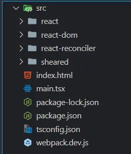

### webpack配置
```javascript
const path = require('path');
const HtmlWebpackPlugin = require('html-webpack-plugin');

module.exports = {
  mode: 'development',
  entry: 'main.tsx',
  output: {
    path: path.resolve(__dirname, 'dist'),
    filename: 'bundle.js'
  },
  devServer: {
    hot: true,
    port: 3000
  },
  devtool: 'cheap-module-source-map',
  resolve: {
    alias: {
      '@': path.resolve(__dirname, 'src')
    },
    extensions: ['.ts', '.tsx', '.js', '.jsx', '.json']
  },
  module: {
    rules: [
      {
        test: /\.tsx?$/,
        use: 'ts-loader',
        exclude: /node_modules/
      }
    ]
  },
  Plugins: [
    new HtmlWebpackPlugin({
      template: './index.html'
    })
  ]
};
```

### ts配置
```json
{
  "compileOnSave": true,
  "compilerOptions": {
    "target": "ESNext",
    "useDefineForClassFields": true,
    "module": "ESNext",
    "lib": ["ESNext", "DOM"],
    "moduleResolution": "node",
    "jsx": "react-jsx",
    "strict": true,
    "sourceMap": true,
    "resolveJsonModule": true,
    "isolatedModules": false,
    "esModuleInterop": true,
    "noEmit": false,
    "noUnusedLocals": false,
    "noUnusedParameters": false,
    "noImplicitReturns": false,
    "skipLibCheck": true,
    "baseUrl": "./",
    "paths": {
      "@/*": ["src/*"]
    }
  },
  "include": [
    "src/**/*.ts",
    "src/**/*.tsx",
    "src/**/*.d.ts",
    "src/**/*.js",
    "src/**/*.jsx",
    "src/**/*.json"
  ]
}
```

## React 中几种关键的数据结构
### Element 对象
Element 对象是对 UI 的描述。

react 的 jsx 方法就是用来生成 element 对象。

```jsx
function App() {
  return (
    <div className="App" id="div">
      <span id="span">1</span>
      <p id="p">2</p>
    </div>
  );
}

// 通过babel 编译之后的代码
import { jsx as _jsx, jsxs as _jsxs } from "react/jsx-runtime";
function App() {
  return /*#__PURE__*/_jsxs("div", {
    className: "App",
    id: "div",
    children: [/*#__PURE__*/_jsx("span", {
      id: "span",
      children: "1"
    }), /*#__PURE__*/_jsx("p", {
      id: "p",
      children: "2"
    })]
  });
}
```

其中 `/*#__PURE__*/`是用来帮 webpack 做 tree shaking 的。

**Element 对象是 _jsxs 方法执行之后的结果。**

打印 element

```jsx
// main.tsx
import React from 'react';
import ReactDom from 'react-dom/client';

function App() {
  return (
    <div className="App" id="div">
      <span id="span">1</span>
      <p id="p">2</p>
    </div>
  );
}

const app = App();

console.log('element', app);

const root = ReactDom.createRoot(document.getElementById('root')!);
root.render(<App />);
```

Element 对象实际是下面这样

```json
{
  "type": "div",
  "key": null,
  "ref": null,
  "props": {
    "className": "App",
    "id": "div",
    "children": [
      {
        "type": "span",
        "key": null,
        "ref": null,
        "props": {
          "id": "span",
          "children": "1"
        },
        "_owner": null,
        "_store": {}
      },
      {
        "type": "p",
        "key": null,
        "ref": null,
        "props": {
          "id": "p",
          "children": "2"
        },
        "_owner": null,
        "_store": {}
      }
    ]
  },
  "_owner": null,
  "_store": {}
}
```

其中 _owner

在 react 中 element 的类型生命文件

```tsx
export type Type = any;
export type Key = any;
export type Ref = any;
export type Props = any;
export type ElemnetType = any;

export interface ReactElement {
  // 元素类型 是一个 symbol 或者 数字
  $$typeof: symbol | number;
  // 元素的标签 div span 等
  type: ElemnetType;
  // 遍历中的 key 不加默认 index 
  key: Key;
  // 组件的 ref
  ref: Ref;
  //  组件的 props
  props: Props;
  // 记录负责创建此元素的组件
  _owner: any
}
```

### Fiber 对象
fiber 对象是对 react 执行过程中元素状态的描述，打上一些标记等等。

实际上就是对 element 对象的控制，用于控制 React 元素的渲染和更新过程。

<!-- 这是一张图片，ocr 内容为： -->
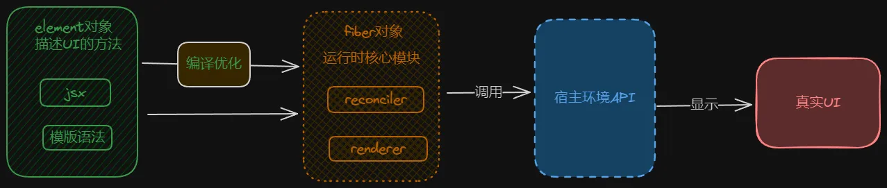

Fiber 对象

```typescript
// 函数组件
export const FunctionComponent = 0;
// 代表生成的中间空节点
export const HostRoot = 3;
// 原生节点 div span等
export const HostComponent = 5;
// 平台文本
export const HostText = 6;
// 对应上面的类型定义
type WorkTag = 0 | 3 | 5 | 6;

export const NoMode = /*                         */ 0b0000000;
export const ConcurrentMode = /*                 */ 0b0000001;
export const ProfileMode = /*                    */ 0b0000010;
export const DebugTracingMode = /*               */ 0b0000100;
export const StrictLegacyMode = /*               */ 0b0001000;
export const StrictEffectsMode = /*              */ 0b0010000;
export const ConcurrentUpdatesByDefaultMode = /* */ 0b0100000;
export const NoStrictPassiveEffectsMode = /*     */ 0b1000000;
// 对应上面的 modes
export type TypeOfMode = number;

export class FiberNode {
  // 构成该节点的基本信息，主要用于判断节点类型。
  // 组件的对象类型 目前一共有30个
  tag: WorkTag;
  // 用于在 diff 阶段能够快速跳过比较，常用于列表组件，普通组件可能没有该值。
  key: Key;
  // 节点类型，函数式组件就是函数本身 可能是 div span
  type: any;
  // 大多数和 type 一样，只有被 memo 包裹之后不一样
  elemtentType: any;
  // 组件实例、DOM 节点或其他 React 元素类型的类实例的引用
  stateNode: any;

  // 构建fiber tree
  // 父节点
  return: FiberNode | null;
  // 兄弟节点
  sibling: FiberNode | null;
  // 子节点
  child: FiberNode | null;
  // 在兄弟节点中的索引 表示当前节点是父元素的第几个子节点。
  index: number;

  // 存储状态与 hook
  // 当前组件的 ref，原生组件的 ref 指向真实 DOM，自定义组件的 ref 默认值为 null，
  // 可以通过 useImpretiveHandle 声明。
  ref: Ref;
  // 新传入的 props 对象
  penddingProps: Props;
  // 上一次的 props 对象
  memoizedProps: Props | null;
  // 它记录了组件在之前的渲染过程中所产生的状态信息。
  // 当组件需要进行更新时，React 会对比当前的状态和之前的 memoizedState，
  // 以确定是否需要重新渲染组件以及如何进行更新。
  memoizedState: any;
  // 链表结构，更新队列 用于存储状态更新、回调和 DOM 更新等操作
  updateQueue: unknown | null;
  // 在更新时使用，用于判断是否依赖了 ContextProvider 中的值
  dependencies: any;
  // 组件的模式 二进制数字表示模式
  mode: TypeOfMode;

  //  更新类型
  // 标记节点的更新类型，如果没有更新就是 noFlags
  flags: Flags;
  // 用于记录子树中发生的一些变化或需要执行的操作。
  // 这些标志可以帮助 React 在协调过程中确定如何处理子树以及是否需要进行特定的更新或操作
  subtreeFlags: Flags;
  // 存储要被删除的 Fiber 节点
  deletions: any;

  // 优先级
  // 任务的优先级，用 expirationTime 表示，优先级越高，数字越小。
  // 就是一堆二进制数字
  lanes: Lanes;
  // 子节点的优先级
  childLanes: Lanes;
  // 双缓存机制
  alternate: FiberNode | null;
}
```

fiber对象实际的样子：

<!-- 这是一张图片，ocr 内容为： -->
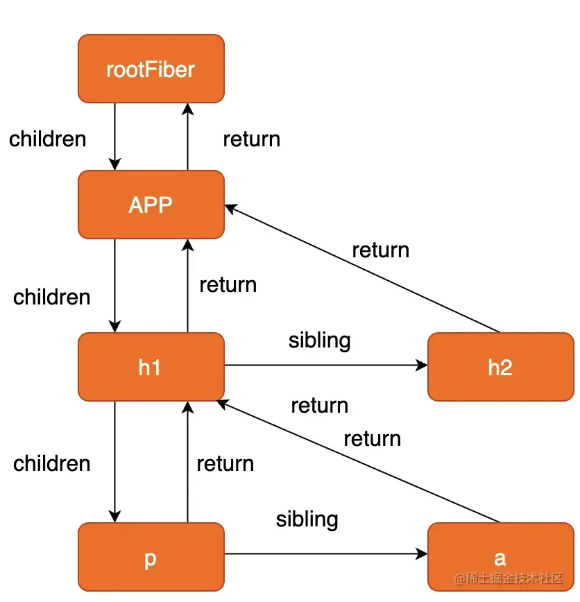

## 断点调试与学习技巧
通过 debugger 来进行调试。通过下一步下一步的调用执行栈就可以看到执行顺序了。

```jsx
import React from 'react';
import ReactDom from 'react-dom/client';

function App() {
  return (
    <div className="App" id="div">
      <span id="span">1</span>
      <p id="p">2</p>
    </div>
  );
}

const root = ReactDom.createRoot(document.getElementById('root')!);

debugger;
root.render(<App />);
```

## 挂载流程
1. 创建 hostRootFiber 和 RootFiberNode
2. 创建关联关系

### Render
```jsx
const root = ReactDom.createRoot(document.getElementById('root')!);
root.render(<App />);
```

### createRoot
```jsx
export function createRoot(container: Container) {
  // 代表 div#root
  const root = createContainer(container);
  // 返回了一个 render
  return {
    render(element: ReactElementType) {
      updateContainer(element, root);
    }
  };
}
```

### createContainer
```typescript
export function createContainer(container: Container) {
  // 创建根fiber节点，代表整个应用的根组件
  const hostRootFiber = new FiberNode(HostRoot, {}, null);
  // 给容器和 根节点 创建关联关系 此时 root 就是根节点了 代表了根组件
  const root = new FiberRootNode(container, hostRootFiber); 
  // 给根节点的更新队列创建一个共享的更新队列和指针
  hostRootFiber.updateQueue = reateUpdateQueue();
  // 返回创建好的根节点
  return root;
}
```

### FiberRootNode
```typescript
export class FiberRootNode {
  container: Container;
  current: FiberNode;
  finishedWork: FiberNode | null;

  constructor(container: Container, hostRootFiber: FiberNode) {
    // 绑定容器
    this.container = container;
    // 绑定 根节点
    this.current = hostRootFiber;
    // 将根节点绑定在根元素的 stateNode 上，说明根元素的实例是 根节点
    hostRootFiber.stateNode = this;
    // 工作状态
    this.finishedWork = null;
  }
}
```

### createUpdateQueue
```typescript
export const createUpdateQueue = <State>() => {
  return {
    // 共享的更新队列
    shared: {
      // 指针 指向即将输入的 update 队列
      pending: null
    }
  } as UpdateQueue<State>;
};
```

此时内存模型：

<!-- 这是一张图片，ocr 内容为： -->
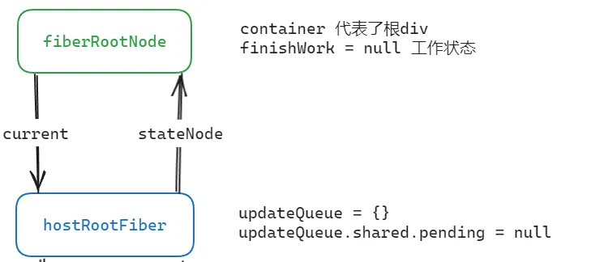

### Render
```typescript
render(element: ReactElementType) {
  // 调用更新
  updateContainer(element, root);
}
```

### updateContainer
```typescript
export function updateContainer(
  // App 组件
  element: ReactElementType | null,
  // 根 fiber tree
  root: FiberRootNode
) {
  // 取出 根节点 (fiberNode)
  const hostRootFiber = root.current;
  // 创建更新对象 接下来要更新的 element
  const update = createUpdate<ReactElementType | null>(element);

  // 将 update 对象添加到 更新队列里面
  enqueueUpdate(
    hostRootFiber.updateQueue as UpdateQueue<ReactElementType | null>,
    update
  );
  // 渲染的流程
  scheduleUpdateOnFiber(hostRootFiber);
  return element;
}
```

### createUpdate
```typescript
// 用来创建更新的对象 例如 更新类型、状态变更函数等
export const createUpdate = <State>(action: Action<State>): Update<State> => {
  return {
    action
  };
};
```

### enqueueUpdate
```typescript
// 将 即将更新的 update 对象 放入 pending 中
export const enqueueUpdate = <State>(
  updateQueue: UpdateQueue<State>,
  update: Update<State>
) => {
  // updateQueue 是更新队列
  // shared 是共享的更新队列
  // pendding 是指即将更新的对象 也可以理解为指针
  updateQueue.shared.pending = update;
};
```

此时内存中的状态：

<!-- 这是一张图片，ocr 内容为： -->
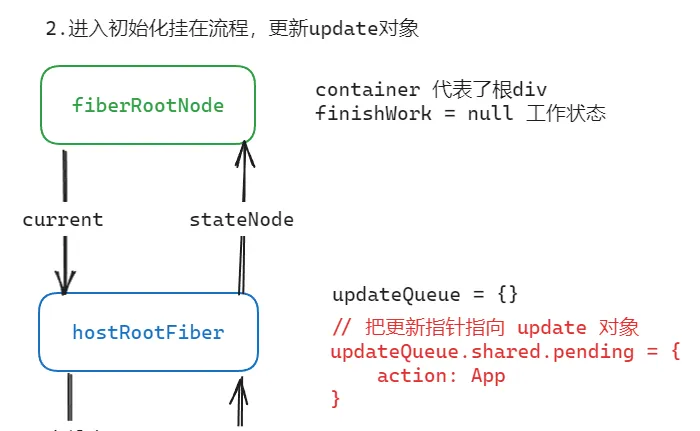

### scheduleUpdateOnFiber
```typescript
export function scheduleUpdateOnFiber(fiber: FiberNode) {
  // TODO 调度功能
  // fiberRootNode

  // 获取根节点
  const root = markUpdateFromFiberToRoot(fiber);
  renderRoot(root);
}
```

### markUpdateFromFiberToRoot
```typescript
function markUpdateFromFiberToRoot(fiber: FiberNode) {
  // 当前节点等于 根节点
  let node = fiber;
  // 父节点
  let parent = node.return;
  // 如果父节点不为空 代表不是根节点 就一直向上查找
  while (parent !== null) {
    node = parent;
    parent = node.return;
  }
  // 如果当前节点个是根节点 那么就返回它的真实 DOM
  if (node.tag === HostRoot) {
    return node.stateNode;
  }
  return null;
}
```

**scheduleUpdateOnFiber(hostRootFiber) 开始渲染，**

**调用 markUpdateFiberToRoot 递归的去找根节点**

**最后找到 root = fiberRootNode（根节点）**

### renderRoot
```typescript
function renderRoot(root: FiberRootNode) {
  // 初始化
  // 初始化wip 当前正在进行的工作
  prepareFreshStack(root);
  // 确保workloop会被执行下去
  do {
    try {
      // 当workloop执行完跳出
      workLoop();
      break;
    } catch (e) {
      console.warn('workLoop发生错误', e);

      workInProgress = null;
    }
  } while (true);
  // 递归完成之后 把 wip 挂载到 root节点上
  const finishedWork = root.current.alternate;
  root.finishedWork = finishedWork;

  // wip fiberNode树 树中的flags
  commitRoot(root);
}
```

### prepareFreshStack
```typescript
// 类似链表的指针，标记当前处理元素的位置，也就是当前正在进行的工作
let workInProgress: FiberNode | null = null;

function prepareFreshStack(root: FiberRootNode) {
  // root.current 根节点; {} 表示新传入的 props 对象
  // workInProgress初始化的时候复制根节点的所有属性
  // 将工作节点和根节点建立关系，方便下一次更新对比
  workInProgress = createWorkInProgress(root.current, {});
}
```

### createWorkInProgress
```typescript
export const createWorkInProgress = (
  current: FiberNode,  // 根节点
  pendingProps: Props
): FiberNode => {
  // 根节点目前 alternate 是 null
  // wip 是 workInProgress 的缩写
  let wip = current.alternate;

  // 初始化，挂载阶段 把根节点复制一遍到 wip 上
  if (wip === null) {
    // mount
    // 创建一个 fiber 节点 和 根节点是一样的
    wip = new FiberNode(current.tag, pendingProps, current.key);
    // 把 根节点的实例化对象也给到复制的对象
    wip.stateNode = current.stateNode;
    // 把当前的fiber节点复制给工作的fiber节点
    wip.alternate = current;
    // 把当前的工作节点也复制给初始的fiber节点
    current.alternate = wip;
  } else {
    // update 更新阶段
    // 复制 新传入的 prosp
    wip.pendingProps = pendingProps;
    // 赋值节点的更新类型
    wip.flags = NoFlags;
    // 赋值如何处理子树以及是否需要进行特定的更新或操作
    wip.subtreeFlags = NoFlags;
  }
  // 复制其他属性
  // 复制节点类型
  wip.type = current.type;
  // 复制节点的更新任务队列
  wip.updateQueue = current.updateQueue;
  // 复制子节点
  wip.child = current.child;
  // 复制上一次的 props
  wip.memoizedProps = current.memoizedProps;
  // 复制之前的渲染过程中所产生的状态信息
  wip.memoizedState = current.memoizedState;

  // 返回双当前的工作对象
  return wip;
};
```

:::warning
在 React Fiber 的初次渲染（挂载）过程中，`wip.alternate = current;` 这句话的作用是将当前已有的 Fiber 节点（`current`）赋值给工作进行中的 Fiber 节点（`wip`）的 `alternate` 属性，从而建立起两者之间的关联。

在初次渲染时，还没有旧的 Fiber 树（即上一次渲染的结果）。这里的 `current` 可能是一个初始的 Fiber 节点或者是其他相关的数据结构。通过将 `current` 赋值给 `wip.alternate`，可以为后续的更新和对比操作提供一个基础 。

在后续的更新过程中，`alternate` 属性会发挥重要作用。当组件状态发生变化需要再次渲染时，React 会创建新的 `wip` Fiber 树。通过比较新的 `wip` 树和之前存储在 `alternate` 中的旧树，React 可以确定哪些部分需要进行实际的 DOM 操作更新，从而实现高效的组件更新和状态管理。

:::

此时数据模型：

<!-- 这是一张图片，ocr 内容为： -->
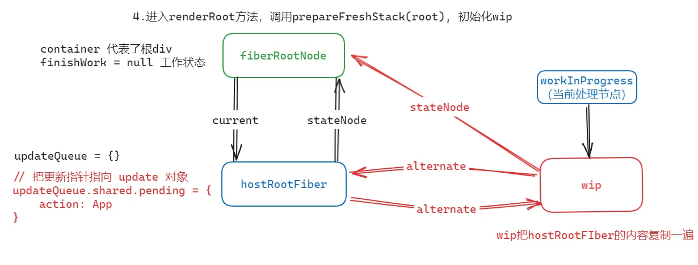

### workLoop
```typescript
function workLoop() {
  // 只要待执行的工作不为空就一直执行下去
  // 如果 内存中构建的 Fiber 树不等于空 也就是wip 就一直执行
  while (workInProgress !== null) {
    performUnitOfWork(workInProgress);
  }
}
```

### performUnitOfWork
```typescript
// 判断是否有子节点的递归
function performUnitOfWork(fiber: FiberNode) {
  // 子节点
  // 递
  const next = beginWork(fiber);
  // 将下一次的 props 赋值给 旧的 props
  fiber.memoizedProps = fiber.pendingProps;
  // 如果子节点存在就让指针指向下一个子节点
  if (next === null) {
    // fiber代表父
    // 归
    completeUnitOfWork(fiber);
  } else {
    workInProgress = next;
  }
}
```

**beginWork第一轮执行完之后， wip 和 h1 对应的 fiber 对象建立关联关系。**

**并且给 h1 fiber 打上 flags 标记**

此时的内存状态：

<!-- 这是一张图片，ocr 内容为： -->


### beginWork
大名鼎鼎“递”的过程。

递主要工作：

1. 建立父子节点及兄弟节点的关联关系
    1. 通过三个属性 Child return siblins
2. 给 Fiber 节点 打上 flags 标记

```typescript
export const beginWork = (wip: FiberNode) => {
  // 判断根节点的对象类型
  switch (wip.tag) {
      // 根节点
    case HostRoot:
      return updateHostRoot(wip);
      // 根组件
    case HostComponent:
      return updateHostComponent(wip);
      // 文本节点
    case HostText:
      return null;
      // 函数组件
    case FunctionComponent:
      return updateFunctionComponent(wip);
    default:
      console.warn('beginWork未实现的类型');
      break;
  }
  return null;
};
```

### updateHostRoot
```typescript
// 处理根节点的更新过程 包括获取相关数据、处理更新队列、根据更新内容调和子节点等
function updateHostRoot(wip: FiberNode) {
  // 之前的渲染过程中所产生的状态信息 此时不存在
  const baseState = wip.memoizedState;
  // 存储更新队列
  const updateQueue = wip.updateQueue as UpdateQueue<Element>;
  // 获取更新队列共享的即将更新的队列 也就是App组件
  const pending = updateQueue.shared.pending;
  // 然后将外部的也就是（wip）的即将更新的任务清空
  updateQueue.shared.pending = null;
  // 获取状态更新之后的值 也就是App对象
  const { memoizedState } = processUpdateQueue(baseState, pending);
  // 把App的信息给到wip保存
  wip.memoizedState = memoizedState;
  // 即将挂载或更新的子组件
  const nextChildren = wip.memoizedState;
  // 组装 wip 的 fiber 树，把子节点挂载到父节点上建立关联关系
  reconcileChildren(wip, nextChildren);
  return wip.child;
}
```

### processUpdateQueue
```typescript
// 处理状态的更新队列 完成状态更新
export const processUpdateQueue = <State>(
  // 初始状态
  baseState: State,
  // 待更新的状态
  pendingUpdate: Update<State> | null
): { memoizedState: State } => {
  // 创建一个对象来保存初始状态
  const result: ReturnType<typeof processUpdateQueue<State>> = {
    memoizedState: baseState
  };
  // 如果有待更新的状态
  if (pendingUpdate !== null) {
    const action = pendingUpdate.action;
    // 如果待更新的状态是一个函数就执行 也就是执行 App 方法
    if (action instanceof Function) {
      // baseState 1 update (x) => 4x -> memoizedState 4
      // 把 result 的状态信息改为 App 对象
      result.memoizedState = action(baseState);
    } else {
      // 否则直接将即将更新的任务赋值给 result
      // baseState 1 update 2 -> memoizedState 2
      result.memoizedState = action;
    }
  }
  // 返回 result
  return result;
};
```

**const { memoizedState } = processUpdateQueue(baseState, pending); **

**获取更新后的状态也就是app的element ****wip.memoizedState = memoizedState;**

**把app的Element 给到wip保存一份**

此时内存模型:

<!-- 这是一张图片，ocr 内容为： -->
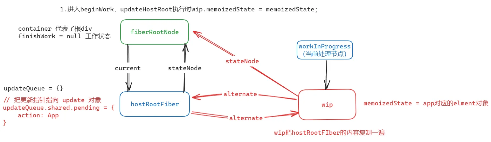

### reconcileChildren
```typescript
// 对比前一次渲染的子节点和新的子节点,然后组装成更新树更新组件树。
function reconcileChildren(wip: FiberNode, children?: ReactElementType) {
  // 获取根节点
  const current = wip.alternate;
  // 如果根节点存在 
  if (current !== null) {
    // update
    // wip代表父亲节点，用child指向自己的子节点
    wip.child = reconcileChildFibers(wip, current?.child, children);
  } else {
    // mount
    wip.child = mountChildFibers(wip, null, children);
  }
}
```

<font style="background-color:rgb(240,244,255);">为什么判断 </font>`<font style="background-color:rgb(240,244,255);">alternate</font>`<font style="background-color:rgb(240,244,255);">存在就走更新？</font>

<font style="background-color:rgb(240,244,255);">因为 wip 代表了要更新的节点，</font>`<font style="background-color:rgb(240,244,255);">hostRootFiber</font>`<font style="background-color:rgb(240,244,255);">代表了旧节点。</font>

<font style="background-color:rgb(240,244,255);">所以走更新还是走挂载就是看 </font>`<font style="background-color:rgb(240,244,255);">alternate</font>`<font style="background-color:rgb(240,244,255);">存在不存在，如果 </font>`<font style="background-color:rgb(240,244,255);">alternate</font>`<font style="background-color:rgb(240,244,255);">指向旧节点，</font>

<font style="background-color:rgb(240,244,255);">那就需要走更新的流程。</font>

### reconcileChildFibers
### mountChildFibers
他们的逻辑是一样的只是 shouldTrackEffects 的参数不一样，返回了一个新的函数。s

```typescript
export const reconcileChildFibers = ChildReconciler(true);
export const mountChildFibers = ChildReconciler(false);
```

### ChildReconciler
```typescript
// 把element创建为子节点，通过return属性和父fiber挂钩
function ChildReconciler(shouldTrackEffects: boolean) {
  function reconcileSingleElement(
    returnFiber: FiberNode,
    currentFiber: FiberNode | null,
    element: ReactElementType
  ) {
    // 根据element创建 fiber
    const fiber = createFiberFromElement(element);
    // 在这里给子节点挂的 return 和父 fiber 进行关联
    fiber.return = returnFiber;

    // 返回的是新子元素创建的fiber对象 也就是 h1
    return fiber;
  }
  // 创建文本节点
  function reconcileSingleTextNode(
    returnFiber: FiberNode,
    currentFiber: FiberNode | null,
    content: string | number
  ) {
    // 创建一个文本节点的 fiber
    const fiber = new FiberNode(HostText, { content }, null);
    fiber.return = returnFiber;
    return fiber;
  }

  function placeSingleChild(fiber: FiberNode) {

    // 如果老的节点没有，则标记为要更新
    if (shouldTrackEffects && fiber.alternate === null) {
      fiber.flags |= Placement;
    }
    return fiber;
  }

  // returnFiber 就是wip
  // currentFiber 是 hostRootFiber.child
  // newChild 是 app.children
  return function reconcileChildFibers(
    returnFiber: FiberNode,
    currentFiber: FiberNode | null,
    newChild?: ReactElementType
  ) {
    // 判断即将挂载的子组件 （子Fiber）
    if (typeof newChild === 'object' && newChild !== null) {
      switch (newChild.$$typeof) {
        case REACT_ELEMENT_TYPE:
          return placeSingleChild(
            // 用新 element 创建新fiber, reture 指向父级 fiber
            // 返回子元素 fiber 对象
            reconcileSingleElement(returnFiber, currentFiber, newChild)
          );
        default:
          console.warn('未实现的reconcile类型', newChild);
          break;
      }
    }
    // TODO 多节点的情况 ul> li*3

    // HostText 处理文本
    if (typeof newChild === 'string' || typeof newChild === 'number') {
      return placeSingleChild(
        reconcileSingleTextNode(returnFiber, currentFiber, newChild)
      );
    }

    console.warn('未实现的reconcile类型', newChild);

    return null;
  };
}
```

### createFiberFromElement
```typescript
// 如果是普通 html标签，就创建 fiber节点 然后返回
export function createFiberFromElement(element: ReactElementType): FiberNode {
  const { type, key, props } = element;
  let fiberTag: WorkTag = FunctionComponent;

  if (typeof type === 'string') {
    // <div/> type: 'div'
    fiberTag = HostComponent;
  } else if (typeof type !== 'function') {
    console.warn('未定义的type类型', element);
  }
  const fiber = new FiberNode(fiberTag, props, key);
  fiber.type = type;
  return fiber;
}
```

### updateHostComponent
```typescript
function updateHostComponent(wip: FiberNode) {
  // 下一次的 props 就是 h1 的 children
  const nextProps = wip.pendingProps;
  // 代表了 h1 的 childre h2
  const nextChildren = nextProps.children;

  // 建立父子组件关系
  // 对比前一次渲染的子节点和新的子节点,然后组装成更新树更新组件树。
  reconcileChildren(wip, nextChildren);

  // 返回子节点
  return wip.child;
}
```

**第二轮遍历走完此时的内存对象**：

<!-- 这是一张图片，ocr 内容为： -->
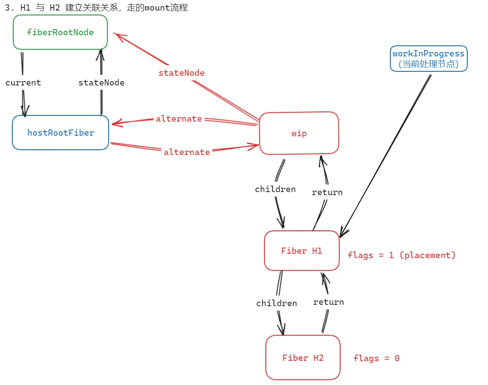

**第三轮走完 此时的内存对象：**

<!-- 这是一张图片，ocr 内容为： -->
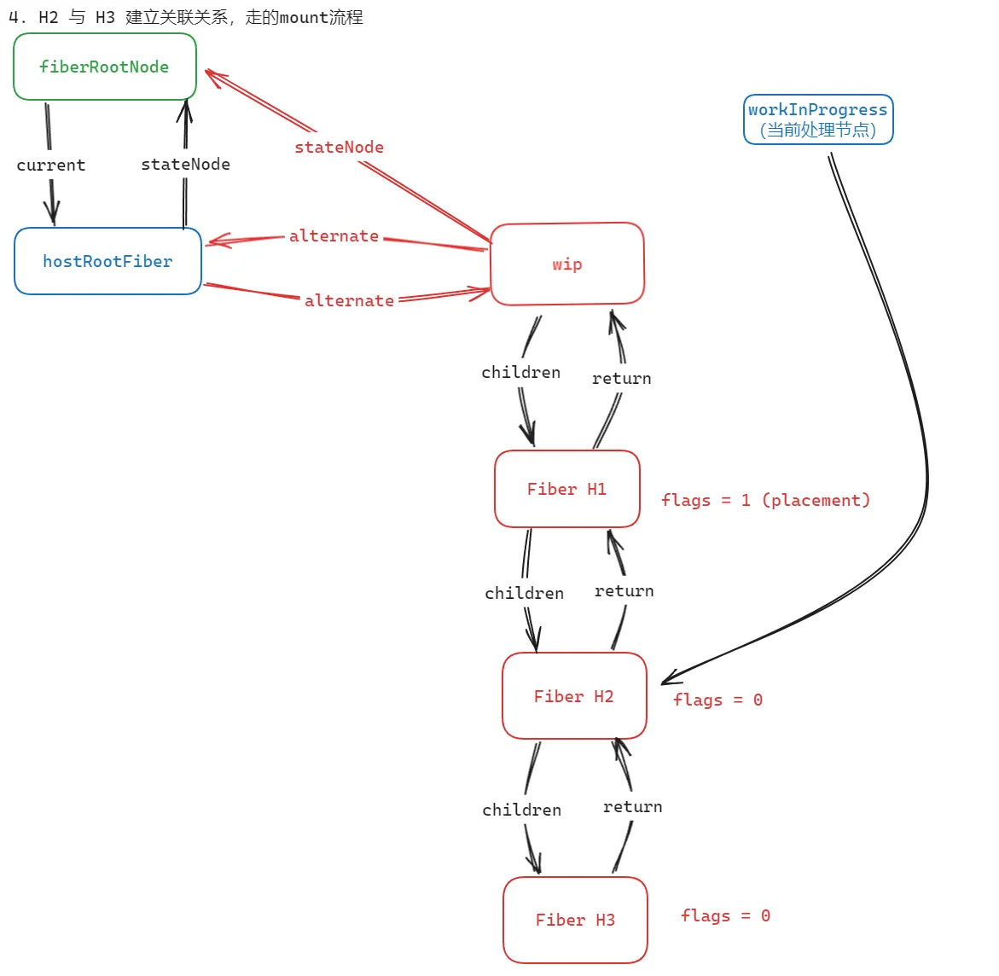

**第四轮走完 此时的内存对象：**

<!-- 这是一张图片，ocr 内容为： -->
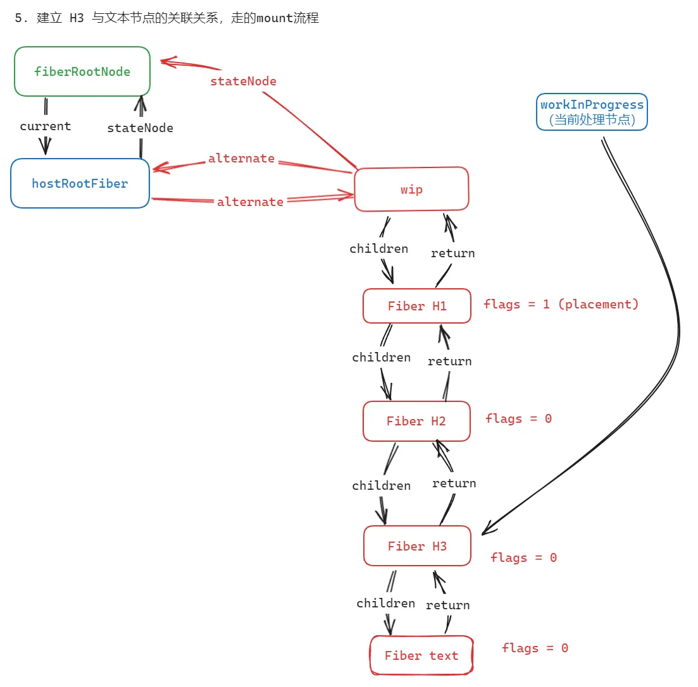

**第五轮走完，此时的内存对象：**

<!-- 这是一张图片，ocr 内容为： -->
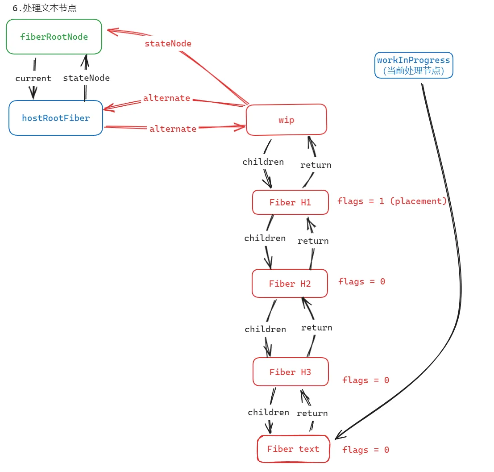

**<font style="background-color:rgb(254,255,240);">递阶段执行完了，该归的过程了。</font>**

### completeUnitOfWork
归的过程

```typescript
// 此时 fiber 就是 FIber text 它包含了它的父节点信息 保存在 return
function completeUnitOfWork(fiber: FiberNode) {
  let node: FiberNode | null = fiber;

  do {
    // 归的过程 创建真实 Dom 打标记
    completeWork(node);
    // 兄弟节点
    const sibling = node.sibling;
    // 如果兄弟节点不为空 指针 指向兄弟节点
    if (sibling !== null) {
      workInProgress = sibling;
      return;
    }
    // 指针指向父节点
    node = node.return;
    workInProgress = node;
  } while (node !== null);
}
```

### completeWork
实际上核心就是2个事情：

1. 创建真实的Dom节点，但是还在内存中，没有渲染到页面上
2. 处理 flags 合并为 subTreeFlags
3. 建立真实 Dom 之间的关系，把子节点的 Dom 插入到 父节点的 Dom 中（在内从中进行）

```typescript
export const completeWork = (wip: FiberNode) => {
  // 递归中的归

  // 即将更新的 props
  const newProps = wip.pendingProps;
  // 是null 因为目前只有根节点才会有 alternate
  const current = wip.alternate;

  switch (wip.tag) {
    case HostComponent:
      if (current !== null && wip.stateNode) {
        // update
      } else {
        // 1. 构建DOM 创建一个 Dom 标签
        // const instance = createInstance(wip.type, newProps);
        const instance = createInstance(wip.type);
        // 2. 将DOM插入到DOM树中
        appendAllChildren(instance, wip);
        wip.stateNode = instance;
      }
      // 合并 flags 
      bubbleProperties(wip);
      return null;
    case HostText:
      if (current !== null && wip.stateNode) {
        // update
      } else {
        // 1. 构建DOM 创建出来的真实 Dom 文本节点
        const instance = createTextInstance(newProps.content);
        wip.stateNode = instance;
      }
      bubbleProperties(wip);
      return null;
    case HostRoot:
      // 当是根节点 那就合并 flags
      bubbleProperties(wip);
      return null;

    case FunctionComponent:
      bubbleProperties(wip);
      return null;

    default:
      console.warn('未处理的completeWork情况', wip);
      break;
  }
};
```

### createTextInstance
```typescript
// 创建真实文本节点
export const createTextInstance = (content: string) => {
  return document.createTextNode(content);
};
```

### bubbleProperties
```typescript
// 处理 subtreeFlags  打标记
function bubbleProperties(wip: FiberNode) {
  // 初始值 0
  let subtreeFlags = NoFlags;
  let child = wip.child;
  // 把 节点的 flags 都 合并到 subtreeFlags 上
  while (child !== null) {
    subtreeFlags |= child.subtreeFlags;
    subtreeFlags |= child.flags;

    child.return = wip;
    child = child.sibling;
  }
  // 代表了子元素操作的合计
  wip.subtreeFlags  |= subtreeFlags;
}
```

### createInstance
```typescript
// 创建 Dom 标签
export const createInstance = (type: string): Instance => {
  // TODO 处理props
  const element = document.createElement(type);
  return element;
};
```

### appendAllChildren
```typescript
function appendAllChildren(parent: Container, wip: FiberNode) {
  let node = wip.child;

  while (node !== null) {
    if (node.tag === HostComponent || node.tag === HostText) {
      //  子节点 Dom 插入到父节点 Dom 中
      appendInitialChild(parent, node?.stateNode);
    } else if (node.child !== null) {
      node.child.return = node;
      node = node.child;
      continue;
    }

    if (node === wip) {
      return;
    }

    while (node.sibling === null) {
      if (node.return === null || node.return === wip) {
        return;
      }
      node = node?.return;
    }
    node.sibling.return = node.return;
    node = node.sibling;
  }
}
```

### appendInitialChild
```typescript
// 子节点 Dom 插入到父节点 Dom 中
export const appendInitialChild = (
  parent: Instance | Container,
  child: Instance
) => {
  parent.appendChild(child);
};
```

Flags 和 subtreeFlags的区别？

Flags 代表了自己的操作，subtreeFlags 代表了子元素操作的合计。

<font style="background-color:rgb(254,255,240);">递归阶段</font>

<font style="background-color:rgb(254,255,240);">递：建立 Fiber 之间的关系</font>

<font style="background-color:rgb(254,255,240);">归：建立真实 Dom 之间的关系</font>

**递归结束 内存状态如下：**

那么此时 只需要插入 H1 就可以了而不需要管其他的子元素，因为 H1 中包含了所有的子元素的真实Dom

<!-- 这是一张图片，ocr 内容为： -->


### commitRoot
1. 进行真实Dom的渲染

```typescript
function commitRoot(root: FiberRootNode) {
  const finishedWork = root.finishedWork;

  if (finishedWork === null) {
    return;
  }
  console.warn("commit阶段开始", finishedWork);
  // 重置
  root.finishedWork = null;

  // 判断是否存在3个子阶段需要执行的操作
  // root flags root subtreeFlags
  // 判断子 Fiber 数是否有需要执行的操作 和 根节点是否有需要执行的操作
  const subtreeHasEffect =
    (finishedWork.subtreeFlags & MutationMask) !== NoFlags;
  const rootHasEffect = (finishedWork.flags & MutationMask) !== NoFlags;

  if (subtreeHasEffect || rootHasEffect) {
    // beforeMutation
    // mutation Placement
    commitMutationEffects(finishedWork);
    // 交换指针
    root.current = finishedWork;

    // layout
  } else {
    root.current = finishedWork;
  }
}
```

**当执行完 commitMutationEffects 之后，将 Dom 渲染到页面中之后**

**current.root = finishedWork 断开和老节点之间的联系**

**节点此时内存模型：**

<!-- 这是一张图片，ocr 内容为： -->
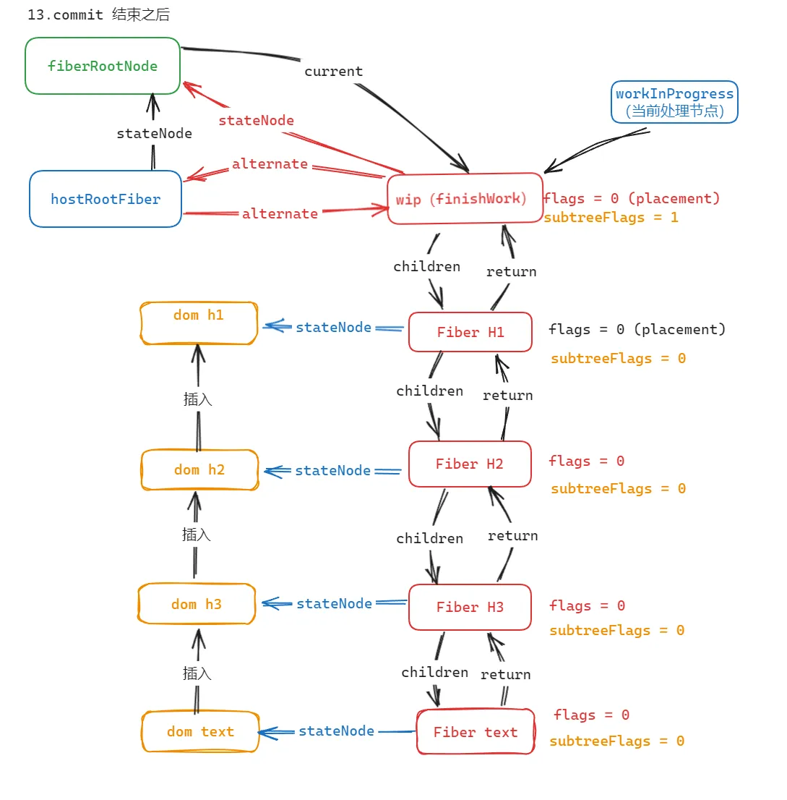

### commitMutationEffects
深度遍历

```typescript
let nextEffect: FiberNode | null = null;

export const commitMutationEffects = (finishedWork: FiberNode) => {
  // wip
  nextEffect = finishedWork;
  debugger
  // 遍历 fiber 树
  while (nextEffect !== null) {
    // 向下遍历
    const child: FiberNode | null = nextEffect.child;
    // 如果子节点有需要执行的操作 那么就让 nextEffect 指向 child
    // 如果没有就走 else
    if (
      (nextEffect.subtreeFlags & MutationMask) !== NoFlags &&
      child !== null
    ) {
      nextEffect = child;
    } else {
      // 向上遍历 DFS
      up: while (nextEffect !== null) {
        // 插入节点
        commitMutaitonEffectsOnFiber(nextEffect);
        const sibling: FiberNode | null = nextEffect.sibling;

        if (sibling !== null) {
          nextEffect = sibling;
          break up;
        }
        nextEffect = nextEffect.return;
      }
    }
  }
};
```

### commitMutationEffectsOnFiber
```typescript
const commitMutaitonEffectsOnFiber = (finishedWork: FiberNode) => {
  const flags = finishedWork.flags;
  // 如果自身有可执行的操作
  if ((flags & Placement) !== NoFlags) {
    commitPlacement(finishedWork);
    // 当处理完之后 就把 H1 的 flags 删除掉
    finishedWork.flags &= ~Placement;
  }
  // flags Update
  // flags ChildDeletion
};
```

当H1 真正插入到页面中时：

<!-- 这是一张图片，ocr 内容为： -->
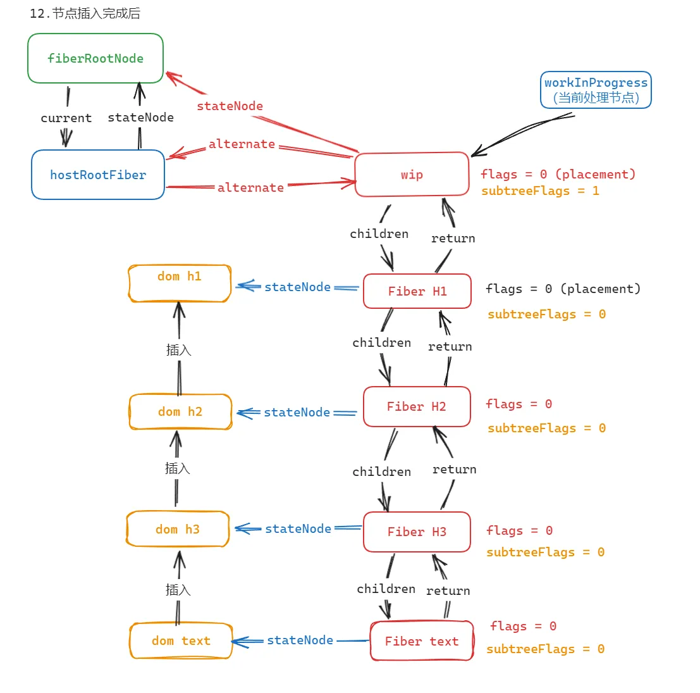

### commitPlacement
```typescript
const commitPlacement = (finishedWork: FiberNode) => {
  console.warn('执行Placement操作', finishedWork);
  // parent DOM 找到根节点
  const hostParent = getHostParent(finishedWork);
  // finishedWork ~~ DOM append parent DOM
  // 如果根节点不为空 那么就插入到 页面中
  if (hostParent !== null) {
    appendPlacementNodeIntoContainer(finishedWork, hostParent);
  }
};
```

### getHostParent
如果是 根节点那么就获取容器 `#root`

如果是

```typescript
function getHostParent(fiber: FiberNode): Container | null {
  let parent = fiber.return;

  while (parent) {
    const parentTag = parent.tag;
    // HostComponent HostRoot
    if (parentTag === HostComponent) {
      return parent.stateNode as Container;
    }
    // 如果是根节点 那么就获取容器 #root
    if (parentTag === HostRoot) {
      return (parent.stateNode as FiberRootNode).container;
    }
    parent = parent.return;
  }

  console.warn('未找到host parent');

  return null;
}
```

### appendPlacementNodeIntoContainer
```typescript
function appendPlacementNodeIntoContainer(
  finishedWork: FiberNode,
  hostParent: Container
) {
  // fiber host
  if (finishedWork.tag === HostComponent || finishedWork.tag === HostText) {
    appendChildToContainer(hostParent, finishedWork.stateNode);
    return;
  }
  const child = finishedWork.child;
  if (child !== null) {
    appendPlacementNodeIntoContainer(child, hostParent);
    let sibling = child.sibling;

    while (sibling !== null) {
      appendPlacementNodeIntoContainer(sibling, hostParent);
      sibling = sibling.sibling;
    }
  }
}
```

### appendChildToContainer
### appendInitialChild 
把 Fiber 树插入到 页面容器中

```typescript
export const appendChildToContainer = appendInitialChild;

export const appendInitialChild = (
  parent: Instance | Container,
  child: Instance
) => {
  parent.appendChild(child);
};
```

## 函数式组件 Hooks 渲染流程
```typescript
import { jsx } from './react/jsx'
import { ReactElementType } from '@/shared/ReactTypes';
import { useState } from '@/react';
function App() {
  const [num, setNum] = useState(3);
  window.setNum = setNum;
  return num === 3 ? <Child onClick={() => setNum(111)} /> : <div>{num}</div>;
}

function Child() {
  return <span>react</span>;
}
import ReactDom from '@/react-dom'
const root: any = document.querySelector('#root')

debugger
ReactDom.createRoot(root).render(<App />)
```

当进入 App Fiber 对象的 “递”阶段处理时：

beginWork 判断是 FunctionComponent

### updateFunctionComponent
```typescript
// wip 就是App 的Fiber对象
function updateFunctionComponent(wip: FiberNode) {
  // 处理函数式组件 返回子组件
  const nextChildren = renderWithHooks(wip);
  // 将子组件和 父组件绑定关联关系
  reconcileChildren(wip, nextChildren);
  return wip.child;
}
```

### renderWithHooks
函数式组件，实际上在“递”的时候是执行的这个方法

当 App 对象执行完 做重置操作

```typescript
// 当前处理的函数式组件
let currentlyRenderingFiber: FiberNode | null = null;
let workInProgressHook: Hook | null = null;
// 当前处理的 Hooks
let currentHook: Hook | null = null;

export function renderWithHooks(wip: FiberNode) {
  // 赋值操作 当前处理的函数式组件 是 App 本身
  currentlyRenderingFiber = wip;
  // 重置 hooks 链表
  wip.memoizedState = null;

  const current = wip.alternate;

  if (current !== null) {
    // update 更新流程
    currentDispatcher.current = HooksDispatcherOnUpdate;
  } else {
    // mount 挂载流程
    currentDispatcher.current = HooksDispatcherOnMount;
  }
  // 实际就是 App 函数
  const Component = wip.type;
  // props 暂时没有
  const props = wip.pendingProps;
  // FC render  App 函数的执行一定会返回子组件或者子元素的内容
  const children = Component(props);

  // 重置操作 因为无法在函数外部调用 hooks
  currentlyRenderingFiber = null;
  workInProgressHook = null;
  currentHook = null;
  // 返回子组件
  return children;
}
```

### HooksDispatcherOnMount
### HooksDispatcherOnUpdate
```typescript
const HooksDispatcherOnMount: Dispatcher = {
  useState: mountState
};

const HooksDispatcherOnUpdate: Dispatcher = {
  useState: updateState
};
```

### mountState
```typescript
function mountState<State>(
  initialState: (() => State) | State
): [State, Dispatch<State>] {
  // 找到当前 useState 对应的 hook 数据 创建了一个 hook 的链表对象
  const hook = mountWorkInProgresHook();
  let memoizedState;
  // 如果传入的参数就直接执行
  // 如果是值就直接赋值
  if (initialState instanceof Function) {
    memoizedState = initialState();
  } else {
    memoizedState = initialState;
  }
  // 创建更新队列
  const queue = createUpdateQueue<State>();
  // 把更新队列挂在到 hook上
  hook.updateQueue = queue;
  // 绑定初始状态 3
  hook.memoizedState = memoizedState;

  // @ts-ignore
  const dispatch = dispatchSetState.bind(null, currentlyRenderingFiber, queue);
  queue.dispatch = dispatch;
  //  返回 状态和 dispath
  return [memoizedState, dispatch];
}
```

### mountWorkInProgresHook
```typescript
function mountWorkInProgresHook(): Hook {
  const hook: Hook = {
    // 状态是什么
    memoizedState: null,
    // 接下来的状态是什么
    updateQueue: null,
    // 下一个 hook 是什么
    next: null
  };

  // 当前在处理的Hook
  if (workInProgressHook === null) {
    // mount时 第一个hook
    // 如果当前正在处理的函数式组件没有找到，那么就相当于在外部调用了 hooks
    // 需要抛出错误
    if (currentlyRenderingFiber === null) {
      throw new Error('请在函数组件内调用hook');
    } else {
      // 正确执行hook
      workInProgressHook = hook;
      currentlyRenderingFiber.memoizedState = workInProgressHook;
    }
  } else {
    // mount时 后续的hook
    workInProgressHook.next = hook;
    workInProgressHook = hook;
  }
  return workInProgressHook;
}
```

App 此时的执行状态

<!-- 这是一张图片，ocr 内容为： -->
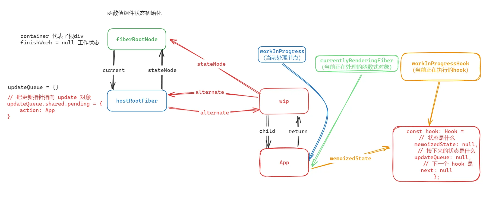

### createUpdateQueue
```typescript
// 创建一个更新队列
export const createUpdateQueue = <State>() => {
  return {
    shared: {
      pending: null
    },
    dispatch: null
  } as UpdateQueue<State>;
};
```

### dispatchSetState
创建一个 update 对象 调用 scheduleUpdateOnFiber 传入Fiber

```typescript
function dispatchSetState<State>(
  fiber: FiberNode,
  updateQueue: UpdateQueue<State>,
  action: Action<State>
) {
  // 创建一个更新的对象
  const update = createUpdate(action);
  //  即将更新的 update 对象 放入 pending 中
  enqueueUpdate(updateQueue, update);
  debugger

  // 好熟悉的感觉
  // 进入页面的 渲染流程
  scheduleUpdateOnFiber(fiber);
}
```

## 合成事件
为什么要做事件合成？

1. 统一各个浏览器的表现，就是为了兼容各个浏览器
2. React 支持的不仅有浏览器，还有 React Native等，为了事件进行统一

### initEvent 
```typescript
const validEventTypeList = ['click']; // 事件白名单

export function initEvent(container: Container, eventType: string) {
  // 事件是否合法
  if(!validEventTypeList.includes(eventType)) {
    console.warn('当前不支持', eventType, '事件');
    return
  }
  console.log('初始化事件：', eventType);

  // 在 react 中，事件都绑定在根节点 #root
  container.addEventListener(eventType, (e) => {
    dispatchEvent(container, eventType, e);
  });
}
```

### dispatchEvent
```typescript
export function dispatchEvent(
  container: Container,
  eventType: sting,
  e: Event
) {
  const targetElement = e.target;

  if (targetElement === null) {
    console.warn('事件不存在target', e);
    return;
  }

  // 1. 收集沿途的事件
  const { bubble, capture } = collectPaths(
    targetElement as DOMElement, 
    container, 
    eventType
  );

  // 2. 构造合成事件
  const se = cerateSyntheticEvent(e);

  // 3. 遍历 capture
  triggerEventFlow(capture, se);

  // 4. 遍历bubble
  if (!se.__stopPropagation) {
    triggerEventFlow(bubble, se);
  }

}
```

### collectPaths
```typescript
const elementPropskey = '__props';

export function collectPaths(
  targetElement: DOMElement,
  container: Container,
  eventType: string
) {
  const paths = {
    // 冒泡事件
    capture: [],
    // 捕获事件
    bubble: []
  }

  while (targetElement && targetElement !== container) {
    // 收集
    // 这里可以获取真是 dom 对应的 props
    const elementProps = targetElement[elementPropskey];
    if (elementProps) {
      // 获取绑定的事件名 比如 ['onclick', 'onclickCapture']
      const callbackNameList = getEventCallbackNameFromEventType(eventType);

      console.log('callbackNameList:', callbackNameList);

      if (callbackNameList) {
        callbackNameList.forEach((callbackName, i) => {
          // 拿到绑定的事件
          const eventCallback = elementProps[callbackName];

          if(eventCallback) {
            if(i === 0) {
              // 如果是捕获 就放到队头 因为捕获是从上到下去执行的
              paths.capture.unshift(eventCallback);
            } else {
              // 如果是冒泡 就放在队尾
              paths.bubble.push(eventCallback);
            }
          }
        });
      }
    }
    //  把 targetElement 指向父级节点 继续去执行收集
    targetElement = targetElement.parentNode as DOMElement;
  }

  console.log('paths', paths);
  return paths;
}
```

### cerateSyntheticEvent
```typescript
function cerateSyntheticEvent(e: Event){
  const syntheticEvent = e as SyntheticEvent;
  // 是否阻止冒泡 默认不阻止
  syntheticEvent.__stopPropagation = false;
  // 存储原生阻止冒泡
  const originStopPropagation = e.stopPropagation;

  // 修改冒泡事件
  syntheticEvent.stopPropagation = () => {
    // 阻止冒泡设置为 true  然后调用原生阻止冒泡事件来阻止冒泡
    syntheticEvent.__stopPropagation = true;
    if(originStopPropagation) {
      originStopPropagation();
    }
  };

  return syntheticEvent;
}
```

### triggerEventFlow
```typescript
// 对数组上的事件进行执行 如果阻止冒泡就 跳出循环
function triggerEventFlow(paths: EventCallback[], se: SyntheticEvent) {
  for (let i = 0; i < paths.length; i++) {
    const callback = paths[i];
    callback.call(null, se);

    if (se.__stopPropagation) {
      break;
    }
  }
}
```

## 兄弟节点的处理
<font style="background-color:rgb(255,245,235);">React 的遍历是深度优先遍历 DFS</font>

<!-- 这是一张图片，ocr 内容为： -->
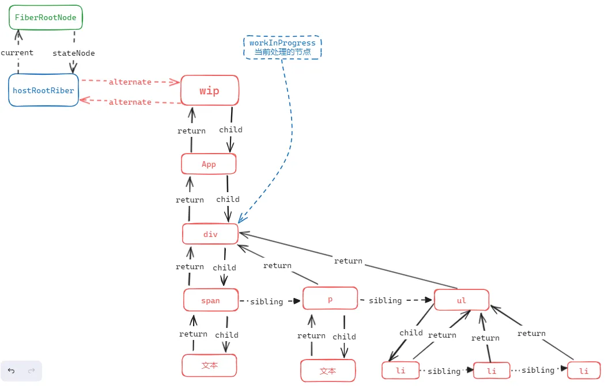

## Diff 算法
比较元素的三大原则

1. 我希望你，更新前后层级一致
2. 更新前后，类型一致
3. 更新前后，key相同(没有加key 默认index 就是key）

```typescript
function reconcileChildren(wip: FiberNode, children?: ReactElementType) {
 
  const current = wip.alternate;

  if (current !== null) {
    // update
    wip.child = reconcileChildFibers(wip, current?.child, children);
  } else {
    // mount
    wip.child = mountChildFibers(wip, null, children);
  }
}
```

wip 的 alternate 存在就走更新流程。

### 移动
**123 -> 231 的过程**

遍历是从左到右

Index 0 = 2

遍历到谁，谁就是最右的元素。

2 = 老 index 1

3 = 老 index 2

1 = 老 index 0

0 比 2 小所以需要移动，所以就给 1 fiber 打上需要移动的标记

### 删除
**123 -> 32 的过程**

map结构中保存着老的数据，每遍历一下，就会把map中来的删掉，最后map中剩下的元素就是要删掉的。

### 新增
**123 -> 3214 的过程**

遍历新的，发现老的没有，创建 


### 引用
1. 初始化
    1. 当组件状态发生变化时，React 会生成新的虚拟 DOM 树（称为新树）。
    2. React 会将新树与之前渲染的虚拟 DOM 树（称为旧树）进行比较。
2. Render 阶段
    1. React 会调用对应的组件函数或类方法来生成新的虚拟 DOM 树。
    2. 这个过程完全是基于内存的操作，并不会直接对实际 DOM 进行任何操作。
3. Reconciliation 阶段
    1. 一旦新的虚拟 DOM 树创建完成，React 开始执行 Diff 算法。
    2. Diff 算法的核心在于找出新旧虚拟 DOM 树之间的差异，并生成最小化的更新指令。
    3. Diff 算法流程
+ 根节点比较：
    - React 从根节点开始，递归地遍历新旧虚拟 DOM 树。
    - 如果根节点相同，继续比较其子节点。
    - 如果根节点不同，整个子树会被替换。
+ 子节点比较：
    - 对于每个节点，React 会检查其类型、属性和子节点。
    - 如果类型相同，则继续比较属性和子节点。
    - 如果类型不同，则旧的子树会被替换为新的子树。
+ 属性比较：
    - 对于每个属性，React 会检查是否有变化。
    - 如果有变化，React 会在 Commit 阶段更新这些属性。
+ 子节点处理：
    - 对于子节点，React 会按照顺序比较新旧虚拟 DOM 子节点。
    - React 会尝试复用相同的子节点，以减少 DOM 更新。
+ 关键点：
    - Key 的使用：React 使用 `key` 来识别哪些子节点需要被移动、添加或删除。
    - 跨层级移动：React 会尽量避免跨层级移动节点，因为这通常会导致更复杂的 DOM 更新。
    - 批量更新：React 将多个状态更新合并成一次渲染，以减少不必要的 DOM 操作。
+ 特殊处理：
    - 删除操作：React 会标记需要删除的节点，并在 Commit 阶段执行删除操作。
    - 更新操作：React 会记录需要更新的节点及其属性，并在 Commit 阶段应用这些更新。
    - 添加操作：React 会记录需要添加的新节点，并在 Commit 阶段插入这些节点。
1. Commit 阶段
    1. 在 Diff 算法完成后，React 进入 Commit 阶段，这时会应用所有必要的 DOM 更新。
    2. React 会按顺序执行删除、更新和添加操作。
2. 并发渲染
    1. React 18 引入了新的调度机制，支持并发渲染。
    2. 如果在 Diff 或 Commit 过程中浏览器需要处理其他任务，React 可以暂停并稍后恢复渲染。
    3. 这种机制使得 React 能够在长时间的渲染过程中保持应用的响应性。
3. 示例说明

假设我们有两个虚拟 DOM 树：

旧树:

```html
<div>
  <p key="a"Hello</p>
  <p key="b"World</p>
</div>
```

新树:

```html
<div>
  <p key="a"Hi</p>
  <p key="b"Earth</p>
  <p key="c"!</p>
</div>
```

Diff 流程:

1. 根节点比较：根节点类型相同，继续比较子节点。
2. 子节点比较：
    1. 第一个子节点类型相同，比较属性（`key="a"`，内容由 "Hello" 变为 "Hi"）。
    2. 第二个子节点类型相同，比较属性（`key="b"`，内容由 "World" 变为 "Earth"）。
    3. 新树中有一个额外的子节点 `<p key="c">!</p>`。
3. 关键点：
    1. 由于子节点都具有唯一的 `key`，React 能够准确地识别哪些节点需要更新。
    2. 新的子节点 `<p key="c">!</p>` 需要被添加。
4. 特殊处理：
    1. `<p key="a">Hello</p>` 更新为 `<p key="a">Hi</p>`。
    2. `<p key="b">World</p>` 更新为 `<p key="b">Earth</p>`。
    3. `<p key="c">!</p>` 需要被添加。

Commit 阶段:

+ 执行上述更新操作，包括更新文本内容和添加新的节点。

通过这样的流程，React 能够高效地更新 DOM，同时尽量减少不必要的操作。

React 18 的 diff 算法流程是 React 团队为了提高性能而进行的一系列优化。以下是 React 18 diff 算法的具体流程和关键点：

### 1. **组件比较**
+ **类型比较**：首先，React 会检查新旧组件的类型是否相同。如果类型不同，React 会销毁旧组件并创建新组件。
+ **key 比较**：如果类型相同，React 会检查组件的 `<font style="background-color:rgb(187,191,196);">key</font>` 属性。如果 `<font style="background-color:rgb(187,191,196);">key</font>` 发生变化，React 也会销毁旧组件并创建新组件。

### 2. **属性比较**
+ 如果组件类型和 `<font style="background-color:rgb(187,191,196);">key</font>` 都相同，React 会进行属性比较。React 会检查新的属性与旧的属性是否一致，如果不一致，会更新相应的属性。

### 3. **子节点比较**
+ **递归比较**：React 会递归地比较新旧子节点。对于每个子节点，React 会重复上述的组件比较和属性比较过程。
+ **列表比较**：对于列表，React 会使用一种优化的算法来最小化 DOM 操作。这包括使用 `<font style="background-color:rgb(187,191,196);">key</font>` 来识别哪些元素是相同的，哪些是新的，哪些是被删除的。

### 4. **DOM 更新**
+ 根据比较结果，React 会生成一个最小的更新计划，然后应用这些更新到实际的 DOM 上。这可能包括添加、删除或移动 DOM 元素。

### 5. **批量更新**
+ React 18 引入了自动批处理（Auto-batching），这意味着 React 会将多个状态更新合并为单个重渲染周期，从而减少重渲染次数。

### 6. **新的树比较算法**
+ React 18 对于树比较算法进行了优化，特别是在处理大型列表时。新的算法减少了不必要的 DOM 操作，提高了性能。

### 7. **新的调度策略**
+ React 18 引入了新的调度策略，允许 React 更智能地决定何时进行重渲染，减少不必要的渲染。

### 举例说明：
假设我们有一个列表组件，列表中的每个项目都有一个唯一的 `<font style="background-color:rgb(187,191,196);">key</font>`。当状态更新导致列表更新时，React 18 的 diff 算法流程如下：

1. **组件类型和 key 比较**：React 检查列表组件是否需要重新创建。
2. **属性比较**：如果组件类型和 key 相同，React 检查列表的属性是否有变化。
3. **子节点比较**：React 比较新旧列表的子节点，使用 `<font style="background-color:rgb(187,191,196);">key</font>` 来识别哪些项目是相同的，哪些是新增的，哪些是被删除的。
4. **DOM 更新**：根据比较结果，React 更新 DOM，只对实际变化的部分进行操作。
5. **批量更新**：如果有多个状态更新，React 将它们合并为一个重渲染周期。

这个过程确保了 React 以最高效的方式更新 DOM，减少了不必要的渲染和 DOM 操作，从而提高了应用的性能。

React 18 的 Diff 算法主要用于比较新旧虚拟 DOM 之间的差异，以确定需要进行哪些最小的更新操作来保持用户界面的一致性。其具体流程如下：

1. 遍历新节点：从新虚拟 DOM 中的第一个节点开始遍历。
2. 与旧节点对比：将新节点与旧的 Fiber 节点（表示虚拟 DOM 中的节点）进行比较。
3. 类型和 key 判断：
    1. 若新节点和旧节点的 type（节点类型）和 key 都相同，表示可以复用该节点，接着往下递归比较子节点。
    2. 若 key 不同，对于单个元素，直接舍弃旧节点并创建新的 Fiber 节点；若是数字型的元素，则查找其是否移动了位置，若没找到，也创建新节点。
    3. 若 type 不一样，则直接舍弃掉旧的 Fiber 节点，创建新的 Fiber 节点。
4. 处理单个 Fiber 节点：若是单个 Fiber 节点，则直接返回。
5. 处理并列多个元素的 Fiber 节点：若存在并列多个元素的 Fiber 节点，这里会形成单向链表，然后返回头指针（该链表最前面的那个 Fiber 节点）。
6. 建立映射表：如果在对比过程中发现节点的 key 相同但顺序不同，会将旧节点加入到一个映射表中，键为 key 值，值为旧的 Fiber 节点，同时记录最后找到节点的索引位置（lastIndex）。
7. 继续遍历新节点：在后续的遍历中，对于每个新节点，从映射表中查找是否存在对应的旧节点。
    1. 若索引小于 lastIndex，标记新的 Fiber 节点为移动。
    2. 若未在映射表中找到，标记为新增，更新 lastIndex。
    3. 若索引大于 lastIndex，复用该节点并保持其在原地。
8. 删除或移动真实 DOM 节点：根据标记，删除真实 DOM 节点中需要删除的节点，并进行节点的移动操作。

例如，对于以下新旧节点的变化：

旧节点：abcdeqfg

新节点：abecdhfg

具体的 Diff 过程如下：

首先，a、b 节点的 type 和 key 相同，复用老的 fiber 去创建新的 fiber 节点。

接着，发现 e 和 c 不同，跳出循环，将 c 之后包括 c 的旧节点加入映射表中。继续遍历新节点，e 可在映射表中找到，设置 lastIndex 为 4（e 在旧节点中的索引）。

c 从映射表中找到，其索引 2 小于 lastIndex 4，新的 fiber 节点标记移动。

d 从映射表中找到，索引 3 等于 lastIndex 3，新的 fiber 节点标记移动。

h 从映射表中找，没有找到，更新 lastIndex 为 5，标记新增。

f 从映射表中找，索引 6 大于 lastIndex 5，复用且保持在原地。

g 同理，复用且保持在原地。

最后，删除真实 DOM 节点中要移动和删除的节点，展示变为 abefg。

开始移动操作，c 节点在新节点中的索引为 3，mountIndex 也为 3，发现 3 在 abefg 中有元素 f，使用 insertBefore 将 c 插入到 f 前，变为 abecfg。

d 节点在新节点中的索引为 4，mountIndex 为 3，同样将 d 插入到 f 前，变为 abecdhfg，完成更新。

通过这种方式，React 18 的 Diff 算法可以高效地找出新旧虚拟 DOM 之间的差异，并尽量复用已有的节点，减少不必要的创建和删除操作，从而提高性能。在开发中，需注意尽量避免节点的大量越级操作，以及不随意修改节点的 key 和 type 类型，以减少不必要的节点重建。

## 批处理
```typescript
const handleClick = () => {
  setState((count)=> count+ 1);
  setState((count)=> count+ 1);
  setState((count)=> count+ 1);
}
```

<!-- 这是一张图片，ocr 内容为： -->
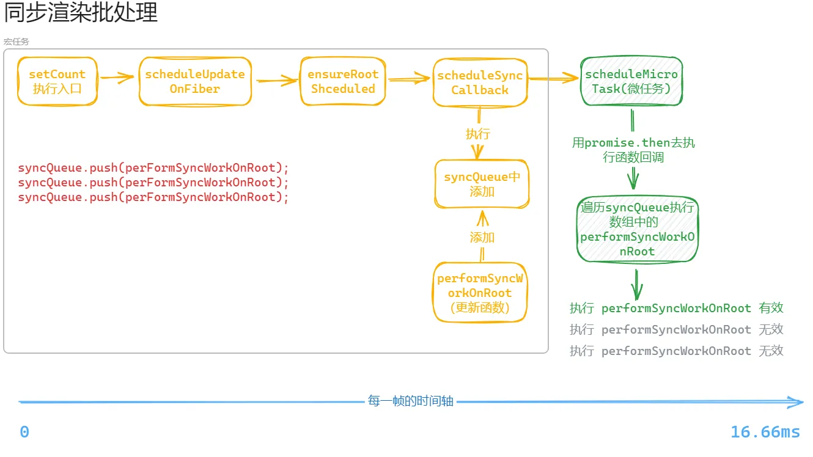

:::warning
总结：在 react 同步渲染模式下，react 也是异步执行的，在微任务中

:::

## React 的更新队列是双端环状链表
a -> b -> c -> a

```typescript
export const processUpdateQueue = <State>(
  baseState: State,
  pendingUpdate: Update<State> | null,
  renderLane: Lane
): { memoizedState: State } => {
  const result: ReturnType<typeof processUpdateQueue<State>> = {
    memoizedState: baseState
  };

  if (pendingUpdate !== null) {
    // 第一个update
    const first = pendingUpdate.next;
    let pending = pendingUpdate.next as Update<any>;
    // 当遍历走到了开头 就代表了链表的环走完了
    do {
      const updateLane = pending.lane;
      if (updateLane === renderLane) {
        const action = pending.action;
        if (action instanceof Function) {
          // baseState 1 update (x) => 4x -> memoizedState 4
          baseState = action(baseState);
        } else {
          // baseState 1 update 2 -> memoizedState 2
          baseState = action;
        }
      } else {

        console.error('不应该进入updateLane !== renderLane逻辑');

      }
      pending = pending.next as Update<any>;
    } while (pending !== first);
  }
  result.memoizedState = baseState;
  return result;
};
```

<!-- 这是一张图片，ocr 内容为： -->
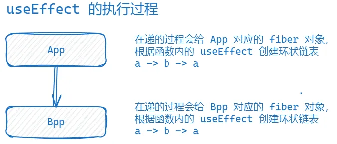

useEffect回调的执行过程

执行阶段：commit（同步执行，页面的更新）

执行时机：commit的前面，但是通过宏任务异步执行的

<!-- 这是一张图片，ocr 内容为： -->
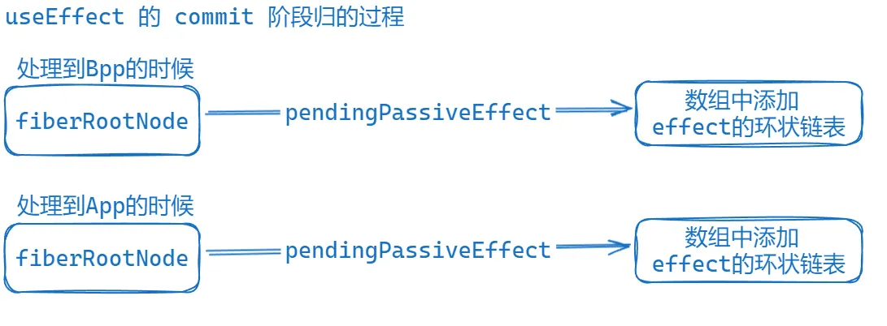

它会优先处理Bpp 再处理App，然后执行的时候会先执行bpp的环状链表，再去执行app的环状链表。

## React的并发更新
可中断渲染的挂念：

高优先级任务可以打断低优先级的任务，在低优先级任务执行的过程中，如果此时插入了高优先级的任务，高优先级会优先处理，高优先级处理完之后再接着处理低优先级任务。

### 相同优先级
<!-- 这是一张图片，ocr 内容为： -->
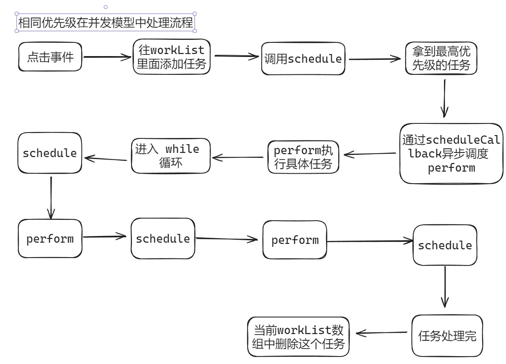

### 高优先级打断
<!-- 这是一张图片，ocr 内容为： -->
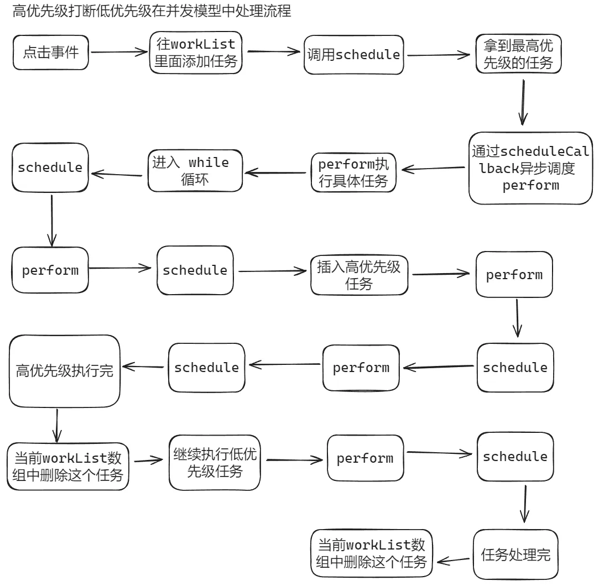

# 二、图解 react 各个模块设计思想
### 挂载
<!-- 这是一张图片，ocr 内容为： -->


<!-- 这是一张图片，ocr 内容为： -->
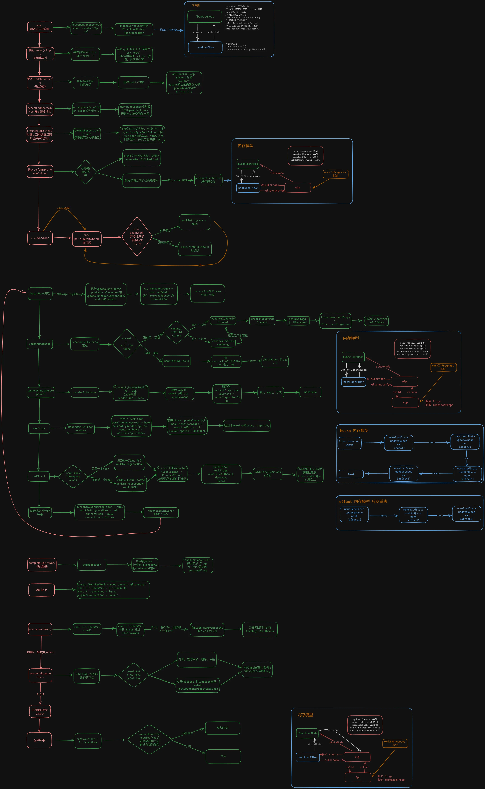

<!-- 这是一张图片，ocr 内容为： -->
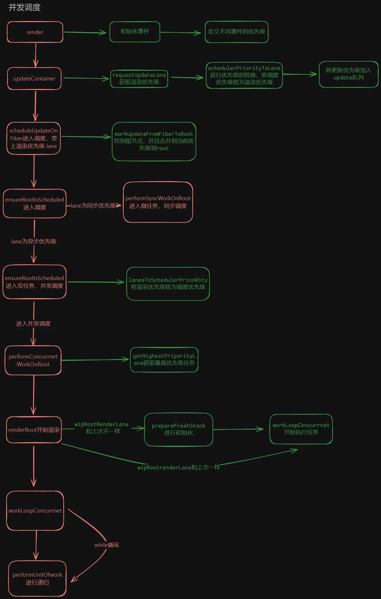

