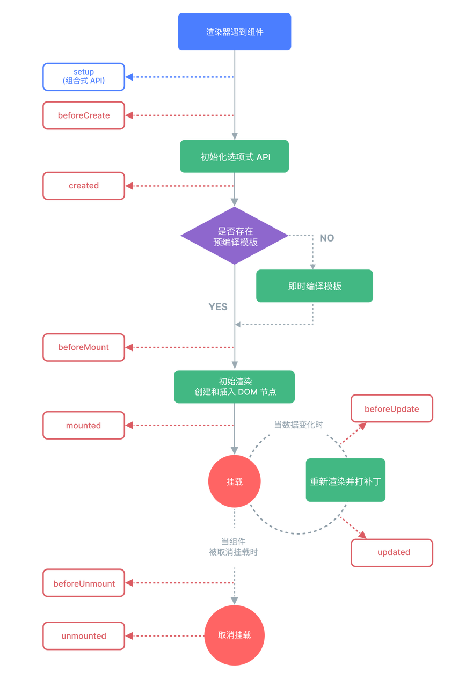

# Vue 基础用法

Vue 是什么？
[中文官网](https://cn.vuejs.org/)

Vue 有什么优点？

1. 易于上手：Vue 的 API 设计简洁直观，学习曲线相对平缓。
2. 灵活性：Vue 可以作为一个库被集成到任何项目中，也可以作为一个全功能的前端框架使用。
3. 组件化：Vue 采用组件化开发模式，使得代码更加模块化，易于管理和复用。
4. 响应式数据绑定：Vue 的数据绑定机制可以自动将数据状态同步到视图，提高开发效率。
5. 虚拟DOM：Vue 使用虚拟DOM来提高性能和效率，只在必要时才更新DOM。
6. 单向数据流：Vue 采用单向数据流，使得状态管理更加清晰和可预测。
7. 丰富的生态系统：Vue 拥有丰富的插件和工具链，如 pinia 状态管理和 Vue Router 路由管理。
8. 社区活跃：Vue 有一个活跃的开发者社区，提供了大量的教程、论坛讨论和第三方库。
9. 良好的文档：Vue 的官方文档详尽且易于理解，为开发者提供了很好的学习资源。

## 举个例子

```vue
<template>
  <h1>{{ msg }}</h1>

  <div class="card">
    <button type="button" @click="count++">count is {{ count }}</button>
    <p>
      Edit
      <code>components/HelloWorld.vue</code> to test HMR
    </p>
  </div>

  <p>
    Check out
    <a href="https://vuejs.org/guide/quick-start.html#local" target="_blank"
      >create-vue</a
    >, the official Vue + Vite starter
  </p>
  <p>
    Learn more about IDE Support for Vue in the
    <a
      href="https://vuejs.org/guide/scaling-up/tooling.html#ide-support"
      target="_blank"
      >Vue Docs Scaling up Guide</a
    >.
  </p>
  <p class="read-the-docs">Click on the Vite and Vue logos to learn more</p>
</template>

<script setup>
import { ref } from "vue";

defineProps({
  msg: String,
});

const count = ref(0);
</script>

<style scoped>
.read-the-docs {
  color: #888;
}
</style>
```

## 文本插值

```vue
<template>
  <h2>{{ message }}</h2>
  <div>{{ number + 1 }}</div>
  <div>{{ ok ? "YES" : "NO" }}</div>
  <div>{{ message.split("").reverse().join("") }}</div>
  <div>{{ formatDate(date) }}</div>
</template>
```

## 属性绑定

```vue
<template>
  <div v-bind:id="dynamicId"></div>
  <div :id="dynamicId"></div>
  <a :href="https://www.baidu.com">百度</a>

  // 同名简写
  <div :id></div>
  <!-- 这也同样有效 -->
  <div v-bind:id></div>

  <button :disabled="isButtonDisabled">Button</button>

  <div v-bind="objectOfAttrs"></div>
  <div :id="`list-${id}`"></div>
</template>

<script>
const objectOfAttrs = {
  id: "container",
  class: "wrapper",
};
</script>
```

## 判断

```vue
<template>
  <p v-if="seen">now you see me</p>
  <button @click="seen = !seen">toogel</button>

  <p v-show="seen2">now you see me</p>
  <button @click="seen2 = !seen2">toogel2</button>
</template>
```

区别：v-if 是对 DOM 的删除或添加， v-show 是对 DOM 的 style 进行 display: none，其实 DOM 还存在。

## 点击事件

```vue
<template>
  <a v-on:click="doSomething"> ... </a>

  <!-- 简写 -->
  <a @click="doSomething"> ... </a>
</template>
```

## 响应式

### ref

```vue
<script>
const count = ref(0);

console.log(count); // { value: 0 }
console.log(count.value); // 0

count.value++;
console.log(count.value); // 1
</script>
<template>
  <button type="button" @click="count++">count is {{ count }}</button>
</template>
```

**注意：在模版中使用响应式不需要 .value，ref 会自动解包**

### Reactive

```vue
<script>
const state = reactive({ count: 0 });
</script>
<template>
  <button @click="state.count++">
    {{ state.count }}
  </button>
</template>
```

以下情况失效:

```js
let state = reactive({ count: 0 });

// 上面的 ({ count: 0 }) 引用将不再被追踪
// (响应性连接已丢失！)
state = reactive({ count: 1 });
```

```js
const state = reactive({ count: 0 });

// 当解构时，count 已经与 state.count 断开连接
let { count } = state;
// 不会影响原始的 state
count++;
```

总结：ref 适用于基础数据类型，而 reactive 适用于对象和数组，但是 reactive 不能解构，更不能直接替换整个对象。

## 计算属性

计算属性是基于它们的依赖进行缓存的，只有当依赖发生变化时，计算属性才会重新计算。
计算属性非常适合用于执行昂贵的计算或观察多个数据源。

```vue
<script setup>
const author = reactive({
  name: "John Doe",
  books: [
    "Vue 2 - Advanced Guide",
    "Vue 3 - Basic Guide",
    "Vue 4 - The Mystery",
  ],
});
</script>
<template>
  <p>Has published books:</p>
  <span>{{ author.books.length > 0 ? "Yes" : "No" }}</span>
</template>
```

```vue
<script setup>
import { reactive, computed } from "vue";

const author = reactive({
  name: "John Doe",
  books: [
    "Vue 2 - Advanced Guide",
    "Vue 3 - Basic Guide",
    "Vue 4 - The Mystery",
  ],
});

// 一个计算属性 ref
const publishedBooksMessage = computed(() => {
  return author.books.length > 0 ? "Yes" : "No";
});
</script>

<template>
  <p>Has published books:</p>
  <span>{{ publishedBooksMessage }}</span>
</template>
```

```vue
<template>
  <div>
    <h1>商品价格计算器</h1>
    <p>原始价格: {{ originalPrice }}</p>
    <input type="number" v-model="originalPrice" placeholder="输入原始价格" />
    <p>折扣率 (%): {{ discountRate }}</p>
    <input type="number" v-model="discountRate" placeholder="输入折扣率" />
    <p>最终价格: {{ finalPrice }}</p>
  </div>
</template>

<script>
import { ref, computed } from "vue";

// 定义响应式数据
const originalPrice = ref(100); // 假设原始价格是100
const discountRate = ref(10); // 假设折扣率是10%

// 使用计算属性来派生最终价格
const finalPrice = computed(() => {
  const discount = originalPrice.value * (discountRate.value / 100);
  return originalPrice.value - discount;
});
</script>
```

## 绑定样式

### class

```vue
<template>
  <div :class="{ active: isActive }"></div>

  <div
    class="static"
    :class="{ active: isActive, 'text-danger': hasError }"
  ></div>

  const classObject = reactive({ active: true, 'text-danger': false })

  <div :class="classObject"></div>

  <div :class="[activeClass, errorClass]"></div>

  <div :class="[isActive ? activeClass : '', errorClass]"></div>
</template>
```

## Style

```vue
<script>
const activeColor = ref("red");
const fontSize = ref(30);
</script>
<template>
  <div :style="{ color: activeColor, fontSize: fontSize + 'px' }"></div>

  <div :style="{ 'font-size': fontSize + 'px' }"></div>
  <template></template>
</template>
```

```vue
<script>
const styleObject = reactive({
  color: "red",
  fontSize: "30px",
});
</script>
<template>
  <div :style="styleObject"></div>

  <div :style="[baseStyles, overridingStyles]"></div>
</template>
```

## 条件渲染

```vue
<template>
  <button @click="awesome = !awesome">Toggle</button>

  <h1 v-if="awesome">Vue is awesome!</h1>
  <h1 v-else>Oh no 😢</h1>
</template>
```

```vue
<template>
  <div v-if="type === 'A'">A</div>
  <div v-else-if="type === 'B'">B</div>
  <div v-else-if="type === 'C'">C</div>
  <div v-else>Not A/B/C</div>
</template>
```

## 列表渲染

```vue
<script>
const items = ref([{ message: "Foo" }, { message: "Bar" }]);
</script>
<template>
  <li v-for="item in items">
    {{ item.message }}
  </li>

  <li v-for="(item, index) in items">
    {{ parentMessage }} - {{ index }} - {{ item.message }}
  </li>
  <template></template>
</template>
```

```vue
<script>
const myObject = reactive({
  title: "How to do lists in Vue",
  author: "Jane Doe",
  publishedAt: "2016-04-10",
});
</script>
<template>
  <ul>
    <li v-for="value in myObject">
      {{ value }}
    </li>
  </ul>

  <li v-for="(value, key) in myObject">{{ key }}: {{ value }}</li>

  <li v-for="(value, key, index) in myObject">
    {{ index }}. {{ key }}: {{ value }}
  </li>
</template>
```

## 事件处理

```vue
<script>
const count = ref(0);
</script>
<template>
  <button @click="count++">Add 1</button>

  <p>Count is: {{ count }}</p>
</template>
```

```vue
<script type="text/javascript">
const name = ref('Vue.js')

function greet(event) {=
    console.log(`Hello ${name.value}!`)

    // `event` 是 DOM 原生事件
    if (event && event.target) {
        try {
            console.log(event.target.tagName)
        } catch (error) {
            console.error('Error accessing event target:', error)
        }
    }
}
</script>

<template>
  <button @click="greet($event)">Greet</button>
</template>
```

```vue
<script>
function say(message) {
  alert(message);
}
</script>

<template>
  <button @click="say('hello')">Say hello</button>
  <button @click="say('bye')">Say bye</button>
</template>
```

```vue
<template>
  <!-- 使用特殊的 $event 变量 -->
  <button @click="handleClick">Submit</button>

  <!-- 使用内联箭头函数 -->
  <button @click="(event) => handleClick(event)">Submit</button>
</template>

<script>
function warn(message, event) {
  // 这里可以访问原生事件
  if (event) {
    event.preventDefault();
  }
  // 使用更安全的方式显示消息，避免XSS风险
  console.warn(message);
  // 或者使用自定义模态框组件替代alert
}

function handleClick(event) {
  const message = "Form cannot be submitted yet.";
  warn(message, event);
}
</script>
```

## 修饰符

- .preventDefault
- .stop：
- .prevent
- .self
- .capture
- .once
- .passive

```
<a @click.preventDefault="doThis"></a>
```

## 表单输入

```vue
<template>
  <!-- Text Input -->
  <div class="form-section">
    <h3>Text Input</h3>
    <p>Message is: {{ message }}</p>
    <input v-model="message" placeholder="edit me" />
  </div>

  <!-- Textarea -->
  <div class="form-section">
    <h3>Textarea</h3>
    <span>Multiline message is:</span>
    <p style="white-space: pre-line;">{{ message }}</p>
    <textarea v-model="message" placeholder="add multiple lines"></textarea>
  </div>

  <!-- Single Checkbox -->
  <div class="form-section">
    <h3>Checkbox</h3>
    <input type="checkbox" id="checkbox" v-model="checked" />
    <label for="checkbox">{{ checked }}</label>
  </div>

  <!-- Multiple Checkboxes -->
  <div class="form-section">
    <h3>Multiple Checkboxes</h3>
    <div>Checked names: {{ checkedNames }}</div>
    <input type="checkbox" id="jack" value="Jack" v-model="checkedNames" />
    <label for="jack">Jack</label>

    <input type="checkbox" id="john" value="John" v-model="checkedNames" />
    <label for="john">John</label>

    <input type="checkbox" id="mike" value="Mike" v-model="checkedNames" />
    <label for="mike">Mike</label>
  </div>

  <!-- Radio Buttons -->
  <div class="form-section">
    <h3>Radio</h3>
    <div>Picked: {{ picked }}</div>

    <input type="radio" id="one" value="One" v-model="picked" />
    <label for="one">One</label>

    <input type="radio" id="two" value="Two" v-model="picked" />
    <label for="two">Two</label>
  </div>

  <!-- Select with Static Options -->
  <div class="form-section">
    <h3>Select (Static)</h3>
    <div>Selected: {{ selected }}</div>
    <select v-model="selected">
      <option disabled value="">Please select one</option>
      <option>A</option>
      <option>B</option>
      <option>C</option>
    </select>
  </div>

  <!-- Select with Dynamic Options -->
  <div class="form-section">
    <h3>Select (Dynamic)</h3>
    <div>Selected: {{ selectedDynamic }}</div>
    <select v-model="selectedDynamic">
      <option
        v-for="option in options"
        :key="option.value"
        :value="option.value"
      >
        {{ option.text }}
      </option>
    </select>
  </div>
</template>

<script setup>
import { ref } from "vue";

// 响应式数据声明
const message = ref("");
const checked = ref(false);
const checkedNames = ref([]);
const picked = ref("");
const selected = ref("A");
const selectedDynamic = ref("A");
const options = ref([
  { text: "One", value: "A" },
  { text: "Two", value: "B" },
  { text: "Three", value: "C" },
]);
</script>

<style scoped>
.form-section {
  margin-bottom: 2rem;
  padding: 1rem;
  border: 1px solid #ccc;
  border-radius: 4px;
}
</style>
```

## 生命周期

什么是生命周期？
生命周期是一个网页或者组件从创建或加载直到销毁的全部过程。这些过程里面又被分为了几个步骤。


## setup

setup() 是组合式 API 的入口点，通常用于初始化组件的状态和逻辑。

```js
import { ref, onMounted } from "vue";

export default {
  setup() {
    const count = ref(0); // 响应式状态

    function increment() {
      count.value++;
    }

    return { count, increment };
  },
};
```

## onBeforeMount() 和 onMounted()

这两个钩子分别在组件挂载前后调用。

```js
import { onBeforeMount, onMounted } from "vue";

onBeforeMount(() => {
  console.log(
    "组件即将挂载，此时组件的模板已经被编译，但是还没有挂载到 DOM 上。",
  );
});

onMounted(() => {
  console.log(
    "组件已经挂载，此时可以执行 DOM 相关的操作，比如直接访问 DOM 元素。",
  );
});
```

## onBeforeUpdate() 和 onUpdated()

这两个钩子分别在组件更新前后调用

```js
import { onBeforeUpdate, onUpdated } from "vue";

const count = ref(0);

onBeforeUpdate(() => {
  console.log("组件即将更新，此时组件的状态已经更新，但是 DOM 还未重新渲染。");
});

onUpdated(() => {
  console.log(
    "组件已经更新，此时 DOM 已经更新，可以执行依赖于更新后 DOM 的操作。",
  );
});
```

## onBeforeUnmount() 和 onUnmounted()

这两个钩子分别在组件卸载前和卸载后调用。

```js
import { onBeforeUnmount, onUnmounted } from "vue";

onBeforeUnmount(() => {
  console.log("组件即将卸载，此时组件实例仍然存在。");
});

onUnmounted(() => {
  console.log("组件已经卸载，此时组件实例已经被销毁。");
});
```

## 侦听器

### Watch

它允许你观察和响应 Vue 组件中数据的变化。当被观察的数据发生变化时，你可以执行一些操作，比如执行异步请求、执行复杂的逻辑处理或者简单地打印日志。

```js
const x = ref(0);
const y = ref(0);

// 单个 ref
watch(x, (newX) => {
  console.log(`x is ${newX}`);
});

// getter 函数
watch(
  () => x.value + y.value,
  (sum) => {
    console.log(`sum of x + y is: ${sum}`);
  },
);

// 多个来源组成的数组
watch([x, () => y.value], ([newX, newY]) => {
  console.log(`x is ${newX} and y is ${newY}`);
});
```

```js
const obj = reactive({ count: 0 });

// 错误，因为 watch() 得到的参数是一个 number
watch(obj.count, (count) => {
  console.log(`Count is: ${count}`);
});

// 提供一个 getter 函数
watch(
  () => obj.count,
  (count) => {
    console.log(`Count is: ${count}`);
  },
);

watch(obj, (newValue, oldValue) => {
  // 在嵌套的属性变更时触发
  // 注意：`newValue` 此处和 `oldValue` 是相等的
  // 因为它们是同一个对象！
});

obj.count++;
```

```js
import { reactive, watch } from "vue";

// 创建一个响应式对象
const state = reactive({
  count: 0,
  text: "Hello",
});

// 监听整个响应式对象
watch(
  () => state,
  (newValue, oldValue) => {
    console.log(`state 已更新:`, newValue);
    console.log(`从:`, oldValue);
  },
  { deep: true }, // 确保可以监听到内部属性的变化
);

// 用于测试的函数，用于更改 state 的值
function increment() {
  state.count++;
  state.text = "Updated";
}
```

```js
import { ref, watch } from "vue";

// 定义一个响应式引用
const firstName = ref("John");
const lastName = ref("Doe");

// 使用 watch 来观察 firstName 和 lastName 的变化
watch(
  () => firstName.value + " " + lastName.value,
  (newValue, oldValue) => {
    console.log(`名字从 "${oldValue}" 变为 "${newValue}"`);
  },
);

// 用于测试的函数，用于更改 firstName 和 lastName 的值
function updateName() {
  firstName.value = "Jane";
  lastName.value = "Smith";
}
```

### watchEffect

用于自动追踪副作用函数中使用的响应式引用，回调函数在 watchEffect 被调用时立即执行一次，之后每当函数内部使用的响应式状态发生变化时，该函数都会被重新执行。

```js
watchEffect(async () => {
  const response = await fetch(
    `https://jsonplaceholder.typicode.com/todos/${todoId.value}`,
  );
  data.value = await response.json();
});
```

### watch和 watchEffect 区别

1. 触发方式:

- watch: 允许你指定一个或多个具体的响应式引用或源作为观察目标。只有当这些指定的源变化时，注册的回调函数才会被触发。
- watchEffect: 自动追踪其回调函数中使用的所有响应式状态。当这些状态中的任何一个发生变化时，副作用函数会被重新执行。

2. 使用场景:

- watch: 更适合于你需要对特定的响应式状态进行细粒度控制时使用，例如，你可能只关心 count 变量的变化，而不关心其他变量。
- watchEffect: 更适合于副作用逻辑依赖于多个响应式状态，并且你希望自动重新执行副作用逻辑，而不需要手动指定依赖的场景。

3. 执行时机:

- watch: 回调函数会在指定的源变化后执行，并且你可以选择是否立即执行（通过 immediate: true 选项）。
- watchEffect: 副作用函数会在被创建时立即执行一次，之后每当其追踪的响应式状态变化时都会重新执行。

4. 副作用处理:

- watch: 回调函数本身可以包含副作用逻辑，但你需要手动管理这些副作用，例如在组件卸载时清理。
- watchEffect: 由于是基于效果的 API，Vue 会自动运行副作用逻辑，并在不再需要时停止副作用，例如组件卸载时。

5. 清理机制:

- watch: 你可以在回调函数中返回一个清理函数，用于在组件卸载或不再需要观察时执行清理操作。
- watchEffect: 由于副作用函数会在响应式状态变化时自动重新执行，通常不需要手动清理，Vue 会处理这些逻辑。

6. 复杂度和易用性:

- watch: 可能需要更多的手动设置，例如指定观察的源和处理清理逻辑，但它提供了更多的控制。
- watchEffect: 提供了一种更简洁和自动的方式来处理副作用，减少了手动管理的需要。

## 模版引用（DOM访问）

```vue
<script setup>
import { ref, onMounted } from "vue";

// 声明一个 ref 来存放该元素的引用
// 必须和模板里的 ref 同名
const input = ref(null);

onMounted(() => {
  input.value.focus();
});
</script>

<template>
  <input ref="input" />
</template>
```

```vue
<script setup>
import { ref, onMounted } from "vue";
import Child from "./Child.vue";

const child = ref(null);

onMounted(() => {
  // child.value 是 <Child /> 组件的实例
});
</script>

<template>
  <Child ref="child" />
</template>
```

### Hooks

Vue 3 引入了组合式 API（Composition API），带来了一个强大而灵活的工具——自定义 Hooks。自定义 Hooks 让我们可以轻松地在不同组件之间共享逻辑，它让开发者的代码具有更高的复用度且更加清晰、易于维护。
说白了就是：集成定义一些可复用的方法。

### 例子

```vue
<script setup>
import { useMouse } from "./mouse.js";

const { x, y } = useMouse();
</script>

<template>Mouse position is at: {{ x }}, {{ y }}</template>
```

```js
// mouse.js
import { ref, onMounted, onUnmounted } from "vue";

// 按照惯例，组合式函数名以“use”开头
export function useMouse() {
  // 被组合式函数封装和管理的状态
  const x = ref(0);
  const y = ref(0);

  // 组合式函数可以随时更改其状态。
  function update(event) {
    x.value = event.pageX;
    y.value = event.pageY;
  }

  // 一个组合式函数也可以挂靠在所属组件的生命周期上
  // 来启动和卸载副作用
  onMounted(() => window.addEventListener("mousemove", update));
  onUnmounted(() => window.removeEventListener("mousemove", update));

  // 通过返回值暴露所管理的状态
  return { x, y };
}
```

### 规范、约定和使用方式

#### 命名约定

- 自定义 Hooks 通常以 use 开头，比如 useCounter、useFetchData 等。
- 命名应简洁明了，能够反映 Hook 的功能。
  #### 使用约定
- 自定义 Hooks 应该是纯函数，即不直接修改外部状态，只通过返回值暴露必要的状态和方法。
- 避免在 Hook 中引入副作用操作，比如直接操作 DOM 或使用全局变量。
- 在 Hook 内部处理错误，不要把错误抛出到外部，否则会增加 Hook 的使用成本。
- Hook 是单一功能的，不要给一个 Hook 设计过多功能。
  #### 使用方式
  在组件中使用自定义 Hook 时，需要在 setup 函数中调用 Hook，并将返回值解构赋值给组件的局部变量，从而在模板中使用。

```js
// 加法功能-Hook
import { ref, watch } from "vue";
const useAdd = ({ num1, num2 }) => {
  const addNum = ref(0);

  watch([num1, num2], ([num1, num2]) => {
    addFn(num1, num2);
  });

  const addFn = (num1, num2) => {
    addNum.value = num1 + num2;
  };

  return {
    addNum,
    addFn,
  };
};
export default useAdd;
```

```js
//减法功能-Hook
import { ref, watch } from "vue";
export function useSub({ num1, num2 }) {
  const subNum = ref(0);

  watch([num1, num2], ([num1, num2]) => {
    subFn(num1, num2);
  });

  const subFn = (num1, num2) => {
    subNum.value = num1 - num2;
  };

  return {
    subNum,
    subFn,
  };
}
```

```vue
<template>
     
  <div>
          num1:<input v-model.number="num1" style="width:100px" />        <br />
          num2:<input v-model.number="num2" style="width:100px" />    
  </div>
     <span>加法等于:{{ addNum }}</span>    <br />
     <span>减法等于:{{ subNum }}</span>
</template>
​
<script setup>
import { ref } from 'vue'
import useAdd from './useAdd.js'     //引入自动hook
import { useSub } from './useSub.js' //引入自动hook
​
const num1 = ref(2)
const num2 = ref(1)
//加法功能-自定义Hook（将响应式变量或者方法形式暴露出来）
const { addNum, addFn } = useAdd({ num1, num2 })
addFn(num1.value, num2.value)
//减法功能-自定义Hook (将响应式变量或者方法形式暴露出来)
const { subNum, subFn } = useSub({ num1, num2 })
subFn(num1.value, num2.value)
</script>
```

## vueHook

[官方网址](https://vueuse.org/)